- [Введение](#введение)
  - [Ранжирование](#ранжирование)
    - [Общий рейтинг зарплат:](#общий-рейтинг-зарплат)
    - [Рейтинг зарплат по департаментам:](#рейтинг-зарплат-по-департаментам)
    - [Группы по зарплате:](#группы-по-зарплате)
    - [Самые "дорогие" коллеги](#самые-дорогие-коллеги)
  - [Сравнение со смещением](#сравнение-со-смещением)
    - [Разница по зарплате с предыдущим](#разница-по-зарплате-с-предыдущим)
    - [Диапазон зарплат в департаменте](#диапазон-зарплат-в-департаменте)
  - [Агрегация](#агрегация)
    - [Сравнение с фондом оплаты труда](#сравнение-с-фондом-оплаты-труда)
    - [Сравнение со средней зарплатой](#сравнение-со-средней-зарплатой)
  - [Скользящие агрегаты](#скользящие-агрегаты)
    - [Скользящее среднее по расходам](#скользящее-среднее-по-расходам)
    - [Прибыль нарастающим итогом](#прибыль-нарастающим-итогом)
- [Окна и функции](#окна-и-функции)
  - [Ранжирование](#ранжирование-1)
    - [Сортировка окна и сортировка результатов](#сортировка-окна-и-сортировка-результатов)
    - [Однозначность сортировки](#однозначность-сортировки)
    - [Несколько окон](#несколько-окон)
    - [Рейтинг зарплат по департаментам](#рейтинг-зарплат-по-департаментам-1)
    - [Группы по зарплате](#группы-по-зарплате-1)
    - [Функция ранжирования](#функция-ранжирования)
  - [Смещение](#смещение)
    - [Сравнение со смещением](#сравнение-со-смещением-1)
    - [Разница по зарплате с предыдущим](#разница-по-зарплате-с-предыдущим-1)
    - [Диапазон зарплат в департаменте](#диапазон-зарплат-в-департаменте-1)
    - [Окно, секция, фрейм](#окно-секция-фрейм)
    - [Диапазон зарплат в департаменте, окончание](#диапазон-зарплат-в-департаменте-окончание)
    - [Функции смещения](#функции-смещения)
  - [Агрегация](#агрегация-1)
    - [Сравнение с фондом оплаты труда](#сравнение-с-фондом-оплаты-труда-1)
    - [Фильтрация и порядок выполнения](#фильтрация-и-порядок-выполнения)
    - [Описание окна](#описание-окна)
    - [Функции агрегации](#функции-агрегации)
  - [Скользящие агрегаты](#скользящие-агрегаты-1)
    - [Скользящее среднее по расходам](#скользящее-среднее-по-расходам-1)
    - [Фрейм](#фрейм)
    - [Прибыль нарастающим итогом](#прибыль-нарастающим-итогом-1)
    - [Фрейм по умолчанию](#фрейм-по-умолчанию)
    - [Функции для скользящих агрегатов](#функции-для-скользящих-агрегатов)
  - [Статистика](#статистика)
    - [cume\_dist()](#cume_dist)
    - [percent\_rank()](#percent_rank)
    - [Сводные значения](#сводные-значения)
    - [Медиана](#медиана)
    - [Процентили](#процентили)
    - [Процентиль как оконная функция](#процентиль-как-оконная-функция)
    - [Статистические функции](#статистические-функции)
  - [Резюме](#резюме)
    - [Функции ранжирования](#функции-ранжирования)
    - [Функции смещения](#функции-смещения-1)
    - [Функции агрегации](#функции-агрегации-1)
          - [Функции статистики](#функции-статистики)
- [Фреймы](#фреймы)
  - [ROWS и GROUPS](#rows-и-groups)
    - [ROWS-фреймы](#rows-фреймы)
    - [GROUPS-фреймы](#groups-фреймы)
    - [Резюме](#резюме-1)
  - [RANGE](#range)
    - [RANGE-фреймы](#range-фреймы)
    - [Границы фрейма](#границы-фрейма)
    - [Фрейм по умолчанию](#фрейм-по-умолчанию-1)
  - [EXCLUDE](#exclude)
    - [Виды исключений](#виды-исключений)
    - [EXCLUDE GROUP / TIES](#exclude-group--ties)
    - [Тип фрейма и вид исключения](#тип-фрейма-и-вид-исключения)
  - [FILTER](#filter)
    - [CASE как альтернатива FILTER](#case-как-альтернатива-filter)
  - [Резюме](#резюме-2)
- [Практика](#практика)
  - [Финансы](#финансы)
    - [Сначала агрегация, затем окна](#сначала-агрегация-затем-окна)
    - [Сначала окна, затем отсев](#сначала-окна-затем-отсев)
    - [Агрегация и NULL](#агрегация-и-null)
  - [Кластеризация](#кластеризация)
    - [Идентифицируем острова](#идентифицируем-острова)

# Введение

Оконные функции помогают делать аналитические отчеты без участия экселя. Опишем основные возможности на примере таблицы:

```
┌────┬──────────┬────────┬────────────┬────────┐
│ id │   name   │  city  │ department │ salary │
├────┼──────────┼────────┼────────────┼────────┤
│ 11 │ Дарья    │ Самара │ hr         │ 70     │
│ 12 │ Борис    │ Самара │ hr         │ 78     │
│ 21 │ Елена    │ Самара │ it         │ 84     │
│ 22 │ Ксения   │ Москва │ it         │ 90     │
│ 23 │ Леонид   │ Самара │ it         │ 104    │
│ 24 │ Марина   │ Москва │ it         │ 104    │
│ 25 │ Иван     │ Москва │ it         │ 120    │
│ 31 │ Вероника │ Москва │ sales      │ 96     │
│ 32 │ Григорий │ Самара │ sales      │ 96     │
│ 33 │ Анна     │ Москва │ sales      │ 100    │
└────┴──────────┴────────┴────────────┴────────┘
```

## Ранжирование

### Общий рейтинг зарплат:

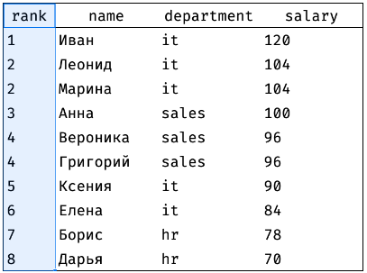

У некоторых сотрудников одинаковые зарплаты - поэтому они получили один и тот же ранг.

### Рейтинг зарплат по департаментам:

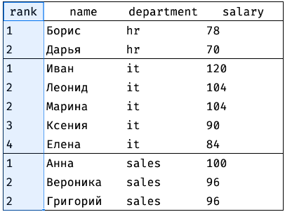

### Группы по зарплате:

Разобьем сотрудников на три группы в зависимости от размера зарплаты: высокооплачиваемые, средние, низкооплачиваемые.

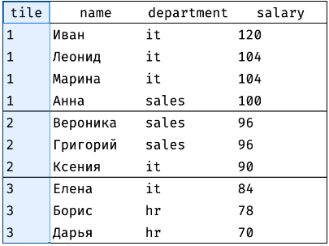

### Самые "дорогие" коллеги

Найдем самых высокооплачиваемых людей по каждому департаменту:

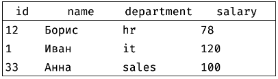

## Сравнение со смещением

Сравнение со смещением - это когда мы смотрим, в чем разница между соседними значениями. Например, сравниваем страны, которые занимают 5 и 6 место в мировом рейтинге ВВП - сильно ли отличаются? А если сравнить 1 и 6 место?

Сюда же попадают задачи, в которых мы сравниваем значение из набора с границами набора. Например, есть 100 лучших теннисисток мира. Мария Саккари занимает в рейтинге 20 место. Как ее показатели соотносятся с Эшли Бартли, которая занимает 1 место? А с Лин Чжоу, которая занимает 100 место?

### Разница по зарплате с предыдущим

Упорядочим сотрудников по возрастанию зарплаты и проверим, велик ли разрыв между соседями:


Столбец `diff` показывает, на сколько процентов зарплата сотрудника отличается от предыдущего коллеги.

### Диапазон зарплат в департаменте

Посмотрим, как зарплата сотрудника соотносится с минимальной и максимальной зарплатой в его департаменте:

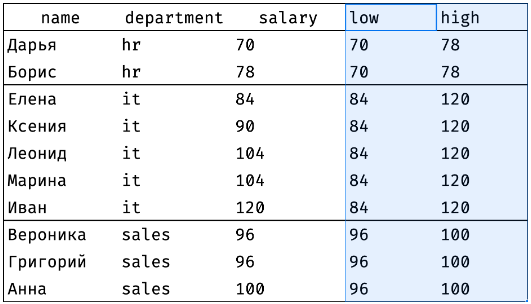

Для каждого сотрудника столбец `low` показывает минимальную зарплату родного департамента, а столбец `high` - максимальную.

## Агрегация

Агрегация - подсчет суммарных или средних показателей. Например, средняя зарплата по каждому региону или количество золотых медалей у каждой страны в зачете Олимпийских игр.

### Сравнение с фондом оплаты труда

У каждого департамента есть фонд оплаты труда - денежная сумма, которая ежемесячно уходит на выплату зарплат сотрудникам. Посмотрим, какой процент от этого фонда составляет зарплата каждого сотрудника:

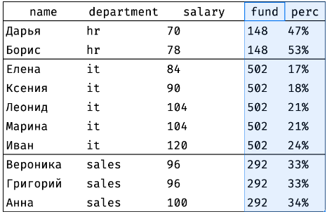

Столбец `fund` показывает фонд оплаты труда отдела, а `perc` - долю зарплаты сотрудника от этого фонда.

### Сравнение со средней зарплатой

Интересно, велик ли разброс зарплат в департаментах. Чтобы узнать это, необходимо посчитать отклонение зарплаты каждого сотрудника от средней по департаменту:

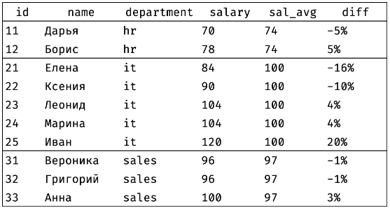

## Скользящие агрегаты

Скользящие агрегаты - те же сумма и среднее, только рассчитывают их не по всем элементам набора, а более хитрым способом.

Для примера возьмем таблицу с доходами и расходами одного сотрудника (пусть Марины) за 9 месяцев:

```
┌──────┬───────┬────────┬─────────┐
│ year │ month │ income │ expense │
├──────┼───────┼────────┼─────────┤
│ 2020 │ 1     │ 94     │ 82      │
│ 2020 │ 2     │ 94     │ 75      │
│ 2020 │ 3     │ 94     │ 104     │
│ 2020 │ 4     │ 100    │ 94      │
│ 2020 │ 5     │ 100    │ 99      │
│ 2020 │ 6     │ 100    │ 105     │
│ 2020 │ 7     │ 100    │ 95      │
│ 2020 │ 8     │ 100    │ 110     │
│ 2020 │ 9     │ 104    │ 104     │
└──────┴───────┴────────┴─────────┘
```

### Скользящее среднее по расходам

Судя по данным, доходы у Марины растут: 94К в январе → 104К в сентябре. А вот растут ли расходы? Сходу сложно сказать, месяц на месяц не приходится. Чтобы сгладить эти скачки, используют «скользящее среднее» — для каждого месяца рассчитывают средний расход с учетом предыдущего и следующего месяца. Например:

- скользящее среднее за февраль = (январь + февраль + март) / 3;
- за март = (февраль + март + апрель) / 3;
- за апрель = (март + апрель + май) / 3;
- и так далее.

Скользящее среднее по всем месяцам:

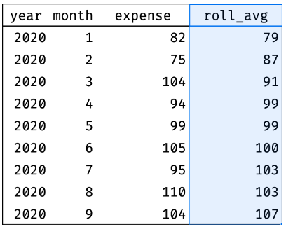

Отсюда видно, что расходы растут.

### Прибыль нарастающим итогом

Благодаря скользящему среднему, мы выяснили, что растут и доходы, и расходы. А как они соотносятся друг с другом? Хочется понять, находится ли человек «в плюсе» или «в минусе» с учетом всех заработанных и потраченных денег.

Причем важно понимать не на конец года, а на каждый месяц. Потому что если по итогам года у Марины все ОК, а в июне ушла в минус — это потенциальная проблема (у компаний такую ситуацию называют «кассовым разрывом»).

Поэтому посчитаем доходы и расходы по месяцам нарастающим итогом (кумулятивно):

- кумулятивный доход за январь = январь;
- за февраль = январь + февраль;
- за март = январь + февраль + март;
- за апрель = январь + февраль + март + апрель;
- и так далее.

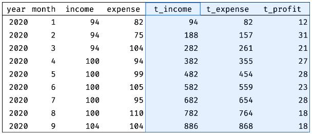

Теперь видно, что дела у Марины идут неплохо. В некоторых месяцах расходы превышают доходы, но благодаря накоплениям кассового разрыва не происходит.

# Окна и функции

## Ранжирование

Составим рейтинг сотрудников по размеру зп:


Сотрудники с одинаковой зарплатой получили один и тот же ранг. 

Переход от было к стало:

1. Отсортируем таблицу по убыванию зарплаты

```sql
select null as rank,
       name,
       department,
       salary
from employees
order by salary desc, id;
```

```
┌──────┬──────────┬────────────┬────────┐
│ rank │   name   │ department │ salary │
├──────┼──────────┼────────────┼────────┤
│      │ Иван     │ it         │ 120    │
│      │ Леонид   │ it         │ 104    │
│      │ Марина   │ it         │ 104    │
│      │ Анна     │ sales      │ 100    │
│      │ Вероника │ sales      │ 96     │
│      │ Григорий │ sales      │ 96     │
│      │ Ксения   │ it         │ 90     │
│      │ Елена    │ it         │ 84     │
│      │ Борис    │ hr         │ 78     │
│      │ Дарья    │ hr         │ 70     │
└──────┴──────────┴────────────┴────────┘
```

2. Пройдем от первой строки до последней и проставим ранг каждой записи. Начнем с 1 и будем увеличивать на 1 каждый раз, когда значение `salary` меньше, чем у предыдущей записи:

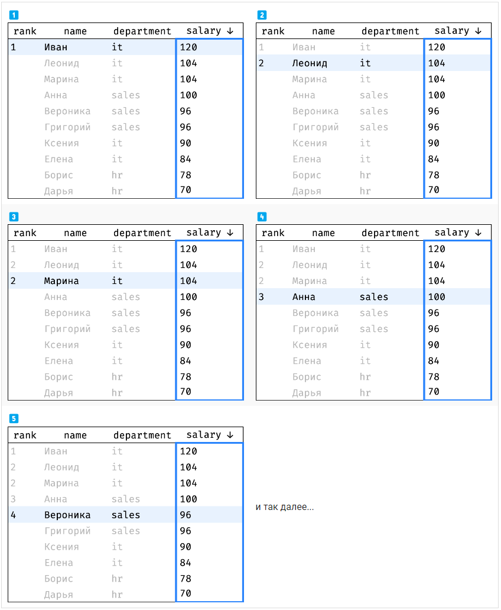

Чтобы проставить ранг, достаточно на каждом шаге смотреть только на значение `salary` , выделенные синей рамкой. Назовем эти значения *окном*.

Опишем содержимое окна словами:

- это значения столбца `salary`

- упорядоченные от большего к меньшему

То же самое на SQL выглядит так:

```sql
window w as (order by salary desc)
```

- `window` - ключевое слово, которое показывает, что дальше будет определение окна

- `w` - название окна (может быть любым)

- `(order by salary desc)` - описание окна (значения столбца `salary упорядоченные по убыванию`)

Задача - посчитать ранг по окну `w`. На SQL это записывается как `dense_rank() over w`. 

`dense_rank()` - *оконная функция*, которая считает ранг по указанному *окну*. Логика `dense_rank()` такая же, как была у нас при ручном подсчете - начать с 1 и увеличивать ранг каждый раз, когда очередное значение из окна отличается от предыдущего.

Добавим окно и оконную функцию в исходный запрос:

```sql
select
  dense_rank() over w as rank,
  name, department, salary
from employees
window w as (order by salary desc)
order by rank, id;
```

```
┌──────┬──────────┬────────────┬────────┐
│ rank │   name   │ department │ salary │
├──────┼──────────┼────────────┼────────┤
│ 1    │ Иван     │ it         │ 120    │
│ 2    │ Леонид   │ it         │ 104    │
│ 2    │ Марина   │ it         │ 104    │
│ 3    │ Анна     │ sales      │ 100    │
│ 4    │ Вероника │ sales      │ 96     │
│ 4    │ Григорий │ sales      │ 96     │
│ 5    │ Ксения   │ it         │ 90     │
│ 6    │ Елена    │ it         │ 84     │
│ 7    │ Борис    │ hr         │ 78     │
│ 8    │ Дарья    │ hr         │ 70     │
└──────┴──────────┴────────────┴────────┘
```

Вот как движок выполняет такой запрос:

1. Берет таблицу, указанную в `from`

2. Выбирает из нее все записи

3. Для каждой записи рассчитывает значение `dense_rank()` с помощью окна `w`

4. Сортирует результат как указано в `order by`

Конструкция `window` сама по себе ничего не делает с результатами запроса. Она только определяет окно, которое можно использовать в запросе. Если убрать вызов `dense_rank()`, запрос отработает, как будто нет никаких окон. Окно начинает работать только тогда, когда в `select` появляется оконная функция, которая его использует.

**В некоторых СУБД (Oracle и MS SQL Server) не поддерживается конструкция `window`, в них "окно" указывается внутри `over`.**

### Сортировка окна и сортировка результатов

Если из запроса:

```sql
select dense_rank() over w as rank,
       name,
       department,
       salary
from employees
    window w as (order by salary desc)
order by rank, id;
```

убрать `order by`, но оставить в окне:

```sql
select dense_rank() over w as rank,
       name,
       department,
       salary
from employees
    window w as (order by salary desc);
```

то ничего не изменится. Но убирать его просто так нельзя, потому что `order by` в окне задает сортировку окна, а `order by` в запросе - сортировку результатов уже после того, как отработало и окно, и все прочие результаты запроса (`join, where, group by`). 

Допустим, мы хотим проставить ранг по убыванию зарплаты, а отсортировать - наоборот, по возрастанию:

```sql
select dense_rank() over w as rank,
       name,
       department,
       salary
from employees
    window w as (order by salary desc)
order by salary asc;
```

```
┌──────┬──────────┬────────────┬────────┐
│ rank │   name   │ department │ salary │
├──────┼──────────┼────────────┼────────┤
│ 8    │ Дарья    │ hr         │ 70     │
│ 7    │ Борис    │ hr         │ 78     │
│ 6    │ Елена    │ it         │ 84     │
│ 5    │ Ксения   │ it         │ 90     │
│ 4    │ Вероника │ sales      │ 96     │
│ 4    │ Григорий │ sales      │ 96     │
│ 3    │ Анна     │ sales      │ 100    │
│ 2    │ Леонид   │ it         │ 104    │
│ 2    │ Марина   │ it         │ 104    │
│ 1    │ Иван     │ it         │ 120    │
└──────┴──────────┴────────────┴────────┘
```

Видно, что ранг проставился по сортировке окна (`salary desc`), а результат упорядочен по сортировке основного запроса (`salary asc`).

Если вообще не указать `order by` запроса — порядок записей будет не определен.

### Однозначность сортировки

В запросе было указано `order by rank, id`, но зачем нужен `id`? Он нужен для того, чтобы знать, как сортировать сотрудников с одинаковым рангом. Без `id` порядок записей не определен, и СУБД может расположить их в любом порядке. А с `id` все однозначно - внутри одного ранга порядок будет по `id`.

### Несколько окон

Что делать, если необходимо использовать несколько окон в запросе? Можно перечислить их через запятую в разделе `window`:

```sql
select ...
from ...
where ...
window
  w1 as (...),
  w2 as (...),
  w3 as (...);
```

Пример:

Отранжируем сотрудников по зарплате в прямом и обратом порядке:

```sql
select dense_rank() over w1 as r_asc,
       dense_rank() over w2 as r_desc,
       name,
       salary
from employees
    window
        w1 as (order by salary asc),
        w2 as (order by salary desc)
order by salary, id;ary, id;
```

```
┌───────┬────────┬──────────┬────────┐
│ r_asc │ r_desc │   name   │ salary │
├───────┼────────┼──────────┼────────┤
│ 1     │ 8      │ Дарья    │ 70     │
│ 2     │ 7      │ Борис    │ 78     │
│ 3     │ 6      │ Елена    │ 84     │
│ 4     │ 5      │ Ксения   │ 90     │
│ 5     │ 4      │ Вероника │ 96     │
│ 5     │ 4      │ Григорий │ 96     │
│ 6     │ 3      │ Анна     │ 100    │
│ 7     │ 2      │ Леонид   │ 104    │
│ 7     │ 2      │ Марина   │ 104    │
│ 8     │ 1      │ Иван     │ 120    │
└───────┴────────┴──────────┴────────┘
```

### Рейтинг зарплат по департаментам

Составим рейтинг сотрудников по размеру заработной платы независимо по каждому департаменту:

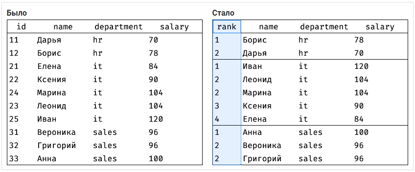

Переход от было к стало:

1. Сортируем таблицу по департаментам, а внутри департамента - по убыванию зарплаты

```sql
select null as rank,
       name,
       department,
       salary
from employees
order by department, salary desc, id;
```

```
┌──────┬──────────┬────────────┬────────┐
│ rank │   name   │ department │ salary │
├──────┼──────────┼────────────┼────────┤
│      │ Борис    │ hr         │ 78     │
│      │ Дарья    │ hr         │ 70     │
│      │ Иван     │ it         │ 120    │
│      │ Леонид   │ it         │ 104    │
│      │ Марина   │ it         │ 104    │
│      │ Ксения   │ it         │ 90     │
│      │ Елена    │ it         │ 84     │
│      │ Анна     │ sales      │ 100    │
│      │ Вероника │ sales      │ 96     │
│      │ Григорий │ sales      │ 96     │
└──────┴──────────┴────────────┴────────┘
```

Теперь пройдем от первой строчки до последней и проставим ранг каждой записи. Начнем с 1 и будем увеличивать ранг каждый раз, когда значение `salary` меньше, чем у предыдущей записи. При переходе от департамента к департаменту будем сбрасывать ранг обратно на 1:

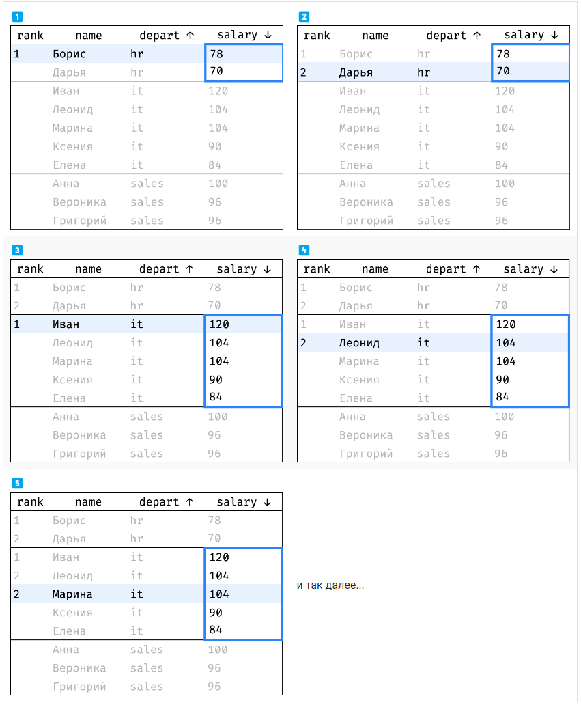

Чтобы проставить ранг, достаточно на каждом шаге смотреть только на значения из столбца `salary`, выделенные синей рамкой. Это и есть *окно* в данном случае.

Видно, что окно меняется в зависимости от того, к какому департаменту относится текущая запись. Опишем словами:

1. Окно разбито на несколько независимых секций - по одной на департамент

2. Внутри секции записи упорядочены по убыванию зарплаты

То же самое на SQL:

```sql
window w as(
    portition by department
    order by salary desc
)
```

- `partition by department` указывает на то, что окно разбивается на секции в соответствии с департаментом

- `order by salary desc` задает сортировку внутри секции

Функция расчета ранга остается прежней - `dense_rank()`.

Добавим окно и оконную функцию в исходный запрос:

```sql
select dense_rank() over w as rank,
       name,
       department,
       salary
from employees
    window w as (
        partition by department
        order by salary desc
        )
order by department, rank, id;
```

```
┌──────┬──────────┬────────────┬────────┐
│ rank │   name   │ department │ salary │
├──────┼──────────┼────────────┼────────┤
│ 1    │ Борис    │ hr         │ 78     │
│ 2    │ Дарья    │ hr         │ 70     │
├──────┼──────────┼────────────┼────────┤
│ 1    │ Иван     │ it         │ 120    │
│ 2    │ Леонид   │ it         │ 104    │
│ 2    │ Марина   │ it         │ 104    │
│ 3    │ Ксения   │ it         │ 90     │
│ 4    │ Елена    │ it         │ 84     │
├──────┼──────────┼────────────┼────────┤
│ 1    │ Анна     │ sales      │ 100    │
│ 2    │ Вероника │ sales      │ 96     │
│ 2    │ Григорий │ sales      │ 96     │
└──────┴──────────┴────────────┴────────┘
```

Вот как движок рассчитывает ранг для каждой записи:

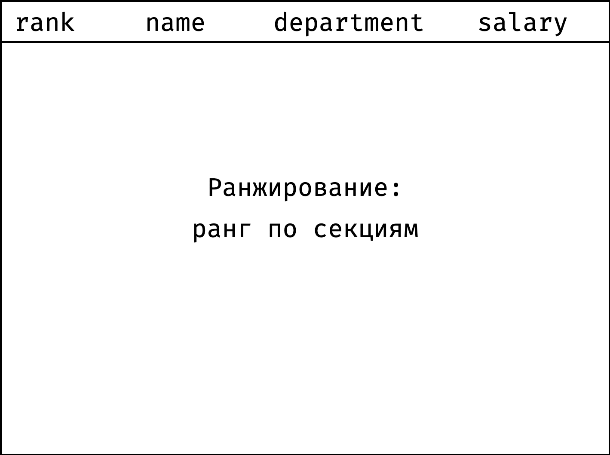

### Группы по зарплате

Разобьем сотрудников на три группы в зависимости от размера зарплаты:

- Высокооплачиваемые

- средние

- низкооплачиваемые

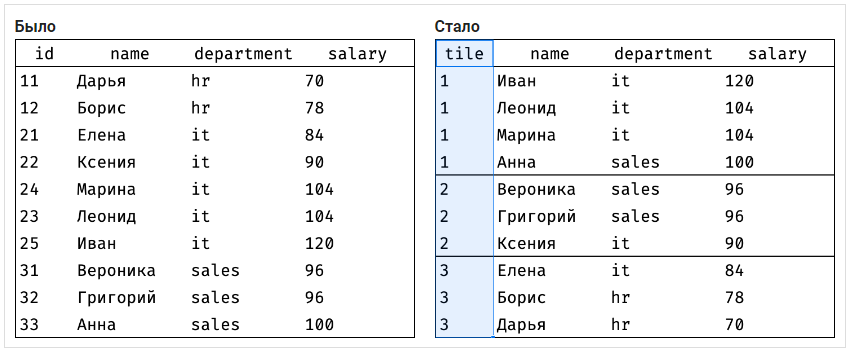

Переход от было к стало:

1. Отсортируем таблицу по убыванию зарплаты

```sql
select null as tile,
       name,
       department,
       salary
from employees
order by salary desc, id;
```

```
┌──────┬──────────┬────────────┬────────┐
│ tile │   name   │ department │ salary │
├──────┼──────────┼────────────┼────────┤
│      │ Иван     │ it         │ 120    │
│      │ Леонид   │ it         │ 104    │
│      │ Марина   │ it         │ 104    │
│      │ Анна     │ sales      │ 100    │
│      │ Вероника │ sales      │ 96     │
│      │ Григорий │ sales      │ 96     │
│      │ Ксения   │ it         │ 90     │
│      │ Елена    │ it         │ 84     │
│      │ Борис    │ hr         │ 78     │
│      │ Дарья    │ hr         │ 70     │
└──────┴──────────┴────────────┴────────┘
```

Всего 10 записей, 3 группы — значит, две группы по 3 записи и одна 4 записи. Например, так:

```
┌──────┬──────────┬────────────┬────────┐
│ tile │   name   │ department │ salary │
├──────┼──────────┼────────────┼────────┤
│      │ Иван     │ it         │ 120    │
│      │ Леонид   │ it         │ 104    │
│      │ Марина   │ it         │ 104    │
│      │ Анна     │ sales      │ 100    │
├──────┼──────────┼────────────┼────────┤
│      │ Вероника │ sales      │ 96     │
│      │ Григорий │ sales      │ 96     │
│      │ Ксения   │ it         │ 90     │
├──────┼──────────┼────────────┼────────┤
│      │ Елена    │ it         │ 84     │
│      │ Борис    │ hr         │ 78     │
│      │ Дарья    │ hr         │ 70     │
└──────┴──────────┴────────────┴────────┘
```

Чтобы провести границы между группами, придется анализировать все зарплаты, отсортированные по убиванию. Поэтому окно будет таким:

```sql
window w as (order by salary desc)
```

А функция потребуется другая - `ntile(n)`, где `n` - количество групп. В нашем случае:

```sql
select ntile(3) over w as tile,
       name,
       department,
       salary
from employees
    window w as (order by salary desc)
order by
    salary desc,
    id;
```

```
┌──────┬──────────┬────────────┬────────┐
│ tile │   name   │ department │ salary │
├──────┼──────────┼────────────┼────────┤
│ 1    │ Иван     │ it         │ 120    │
│ 1    │ Леонид   │ it         │ 104    │
│ 1    │ Марина   │ it         │ 104    │
│ 1    │ Анна     │ sales      │ 100    │
├──────┼──────────┼────────────┼────────┤
│ 2    │ Вероника │ sales      │ 96     │
│ 2    │ Григорий │ sales      │ 96     │
│ 2    │ Ксения   │ it         │ 90     │
├──────┼──────────┼────────────┼────────┤
│ 3    │ Елена    │ it         │ 84     │
│ 3    │ Борис    │ hr         │ 78     │
│ 3    │ Дарья    │ hr         │ 70     │
└──────┴──────────┴────────────┴────────┘
```

`ntile(n)` разбивает все записи на `n` групп и возвращает номер группы для каждой записи. Если общее количество записей (у нас 10) не делится на размер группы (мы указали 3), то в первых **K** групп из **N**, где **N** параметр `ntile()` будет ровно на 1 строку больше, если количество строк не делится на **N** и дает остаток **K**)

`ntile(n)` всегда старается разбить данные так, чтобы группы были одинакового размера. Поэтому записи с одинаковым значением могут попасть в соседние группы:

```sql
select ntile(2) over w as tile,
       name,
       department,
       salary
from employees
    window w as (order by salary desc, id)
order by
    salary desc,
    tile;
```

```
┌──────┬──────────┬────────────┬────────┐
│ tile │   name   │ department │ salary │
├──────┼──────────┼────────────┼────────┤
│ 1    │ Иван     │ it         │ 120    │
│ ...                                   │
│ 1    │ Вероника │ sales      │ 96     │ <--
├──────┼──────────┼────────────┼────────┤
│ 2    │ Григорий │ sales      │ 96     │ <--
│ ...                                   │
│ 2    │ Дарья    │ hr         │ 70     │
└──────┴──────────┴────────────┴────────┘
```

### Функция ранжирования

Оконные функции ранжирования:

| Функция        | Описание                                                                             |
| -------------- | ------------------------------------------------------------------------------------ |
| `row_number()` | порядковый номер строки в секции окна                                                |
| `dense_rank()` | ранг строки                                                                          |
| `rank()`       | тоже ранг, но с пропусками                                                           |
| `ntile(n)`     | разбивает все строки на `n` групп и возвращает номер группы, в которую попала строка |

`row_number()` нумерует строки в порядке, указанном в `order by`.

`rank()` похож на `dense_rank()` разница в том, что `rank()` может пропускать номера:


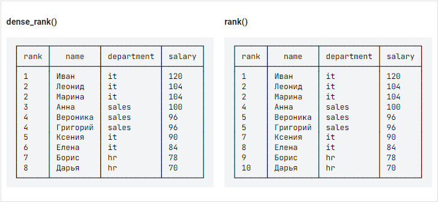

`dense_rank()` назначает Анне третье место, а `rank()` — четвертое, потому что второе-третье уже заняты Леонидом и Мариной. Аналогично с Ксенией после Вероники и Григория.

## Смещение

### Сравнение со смещением

Сравнение со смещением - это когда смотрят на разницу между соседними значениями. Сюда же попадают задачи, в которых мы сравниваем значение из набора с границами набора.

### Разница по зарплате с предыдущим

Упорядочим сотрудников по возрастанию зарплаты и проверим, велик ли разрыв между соседями:

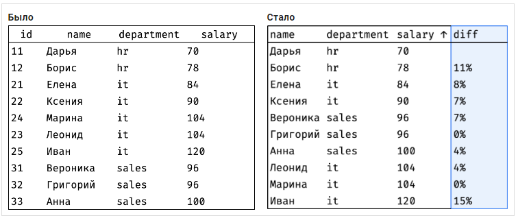

Столбец `diff` показывает, на сколько процентов зарплата сотрудника отличается от предыдущего коллеги.

Переход от было к стало:

1. Сортируем таблицу по возрастанию зарплаты

```sql
select name,
       department,
       salary,
       null as prev
from employees
order by
    salary,
    id;
```

```
┌──────────┬────────────┬────────┬──────┐
│   name   │ department │ salary │ prev │
├──────────┼────────────┼────────┼──────┤
│ Дарья    │ hr         │ 70     │      │
│ Борис    │ hr         │ 78     │      │
│ Елена    │ it         │ 84     │      │
│ Ксения   │ it         │ 90     │      │
│ Вероника │ sales      │ 96     │      │
│ Григорий │ sales      │ 96     │      │
│ Анна     │ sales      │ 100    │      │
│ Леонид   │ it         │ 104    │      │
│ Марина   │ it         │ 104    │      │
│ Иван     │ it         │ 120    │      │
└──────────┴────────────┴────────┴──────┘
```

Теперь пройдем от первой строки до последней, на каждом шаге подтягивая зарплату предыдущего сотрудника:

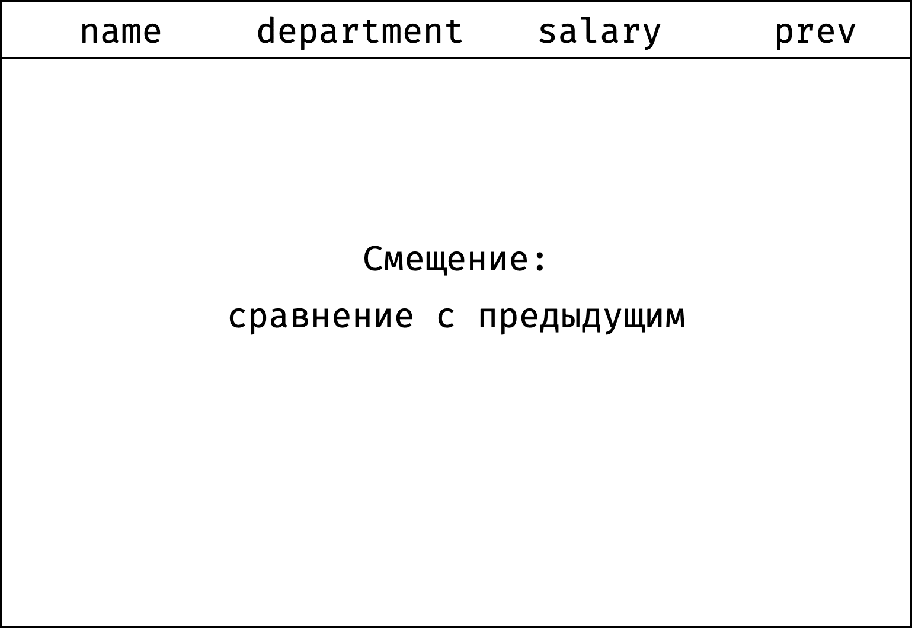

Видно, что в данном случае окно скользит. Но у такого окна сложный синтаксис, поэтому оно рассматривается дальше.

Вместо этого возьмем просто окно - все записи, упорядоченные по возрастанию `salary`.

```sql
window w as (order by salary)
```

А чтобы на каждом шаге подтягивать зарплату предыдущего сотрудника, будем использовать оконную функцию `lag(attribute, n)`. Функция `lag()` возвращает значение из указанного столбца, отстоящее от текущего на указанное количество записей назад.

Добавляем окно и оконную функцию в исходный запрос:

```sql
select id,
       name,
       department,
       salary,
       lag(salary, 1) over w as prev
from employees
    window w as (order by salary, id)
order by
    salary,
    id;
```

```
┌────┬──────────┬────────────┬────────┬──────┐
│ id │   name   │ department │ salary │ prev │
├────┼──────────┼────────────┼────────┼──────┤
│ 11 │ Дарья    │ hr         │ 70     │      │
│ 12 │ Борис    │ hr         │ 78     │ 70   │
│ 21 │ Елена    │ it         │ 84     │ 78   │
│ 22 │ Ксения   │ it         │ 90     │ 84   │
│ 31 │ Вероника │ sales      │ 96     │ 90   │
│ 32 │ Григорий │ sales      │ 96     │ 96   │
│ 33 │ Анна     │ sales      │ 100    │ 96   │
│ 23 │ Леонид   │ it         │ 104    │ 100  │
│ 24 │ Марина   │ it         │ 104    │ 104  │
│ 25 │ Иван     │ it         │ 120    │ 104  │
└────┴──────────┴────────────┴────────┴──────┘
```

Теперь остается посчитать разницу между `prev` и `salary` в процентах:

```sql
with emp as (select id,
                    name,
                    department,
                    salary,
                    lag(salary, 1) over w as prev
             from employees
                 window w as (order by salary, id))
select name,
       department,
       salary,
       round((salary - prev) * 100.0 / prev) as diff
from emp
order by
    salary,
    id;salary, id;
```

```
┌──────────┬────────────┬────────┬──────┐
│   name   │ department │ salary │ diff │
├──────────┼────────────┼────────┼──────┤
│ Дарья    │ hr         │ 70     │      │
│ Борис    │ hr         │ 78     │ 11.0 │
│ Елена    │ it         │ 84     │ 8.0  │
│ Ксения   │ it         │ 90     │ 7.0  │
│ Вероника │ sales      │ 96     │ 7.0  │
│ Григорий │ sales      │ 96     │ 0.0  │
│ Анна     │ sales      │ 100    │ 4.0  │
│ Леонид   │ it         │ 104    │ 4.0  │
│ Марина   │ it         │ 104    │ 0.0  │
│ Иван     │ it         │ 120    │ 15.0 │
└──────────┴────────────┴────────┴──────┘
```

Можно избавиться от промежуточной таблицы `emp`, подставив вместо `prev` вызов оконной функции:

```sql
select name,
       department,
       salary,
       round(
               (salary - lag(salary, 1) over w) * 100.0 / lag(salary, 1) over w
           ) as diff
from employees
    window w as (order by salary, id)
order by
    salary,
    id;
```

Здесь мы заменили `prev` → `lag(salary, 1) over w`. Конструкцию вида `function_name(...) over window_name` движок заменяет на конкретное значение, которое вернула функция. Так что оконную функцию можно вызывать прямо внутри вычислений, и вы не раз встретите такие запросы в документации и примерах.

### Диапазон зарплат в департаменте

Посмотрим, как зарплата сотрудника соотносится с минимальной и максимальной зарплатой в его департаменте:

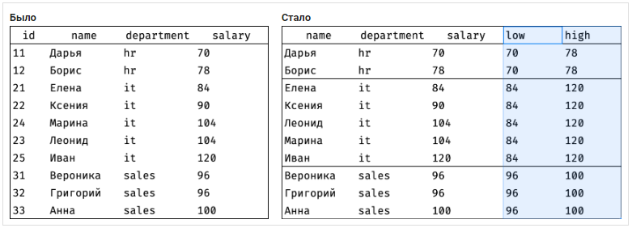

Для каждого сотрудника столбец `low` показывает минимальную зарплату родного департамента, а столбец `high` — максимальную.

Переход от было к стало:

1. Сортируем таблицу по департаментам, а внутри каждого департамента - по возрастанию зарплаты

```sql
select name,
       department,
       salary,
       null as low,
       null as high
from employees
order by
    department,
    salary,
    id;
```

```
┌──────────┬────────────┬────────┬─────┬──────┐
│   name   │ department │ salary │ low │ high │
├──────────┼────────────┼────────┼─────┼──────┤
│ Дарья    │ hr         │ 70     │     │      │
│ Борис    │ hr         │ 78     │     │      │
│ Елена    │ it         │ 84     │     │      │
│ Ксения   │ it         │ 90     │     │      │
│ Леонид   │ it         │ 104    │     │      │
│ Марина   │ it         │ 104    │     │      │
│ Иван     │ it         │ 120    │     │      │
│ Вероника │ sales      │ 96     │     │      │
│ Григорий │ sales      │ 96     │     │      │
│ Анна     │ sales      │ 100    │     │      │
└──────────┴────────────┴────────┴─────┴──────┘
```

Теперь пройдем от первой строчки до последней, на каждом шаге «подтягивая» наименьшую и наибольшую зарплаты в отделе:

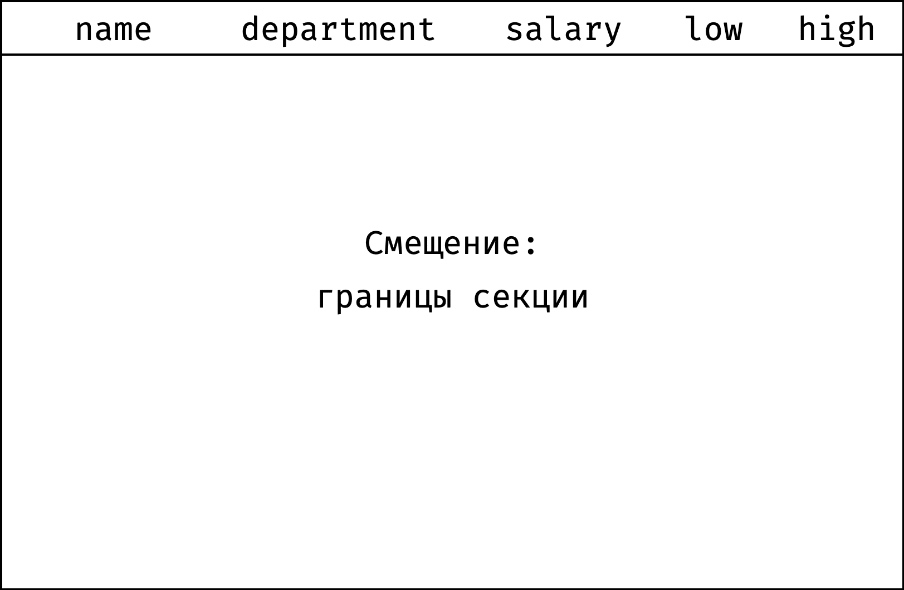

Окно состоит из трех секций. Секция на каждом шаге охватывает весь департамент сотрудника. Записи упорядочены по возрастанию зарплаты внутри департамента, чтобы минимальная и максимальная зарплаты всегда находились на границах секции:

```sql
window w as (
  partition by department
  order by salary
)
```

`lag()` и `lead()` в данном случае не подойдут, потому что они заглядывают на определенное количество записей назад или вперед. 

Нам же нужны такие параметры:

- `low` - зарплата первого сотрудника, входящего в секцию окна

- `high` - зарплата последнего сотрудника, входящего в секцию окна

Для них можно воспользоваться специальным оконными функциями:

```sql
first_value(salary) over w as low,
last_value(salary) over w as high
```

Добавляем окно и оконную функцию в исходный запрос:

```sql
select name,
       department,
       salary,
       first_value(salary) over w as low,
       last_value(salary) over w  as high
from employees
    window w as (
        partition by department
        order by salary
        )
order by
    department,
    salary,
    id;
```

```
┌──────────┬────────────┬────────┬─────┬──────┐
│   name   │ department │ salary │ low │ high │
├──────────┼────────────┼────────┼─────┼──────┤
│ Дарья    │ hr         │ 70     │ 70  │ 70   │
│ Борис    │ hr         │ 78     │ 70  │ 78   │
├──────────┼────────────┼────────┼─────┼──────┤
│ Елена    │ it         │ 84     │ 84  │ 84   │
│ Ксения   │ it         │ 90     │ 84  │ 90   │
│ Леонид   │ it         │ 104    │ 84  │ 104  │
│ Марина   │ it         │ 104    │ 84  │ 104  │
│ Иван     │ it         │ 120    │ 84  │ 120  │
├──────────┼────────────┼────────┼─────┼──────┤
│ Вероника │ sales      │ 96     │ 96  │ 96   │
│ Григорий │ sales      │ 96     │ 96  │ 96   │
│ Анна     │ sales      │ 100    │ 96  │ 100  │
└──────────┴────────────┴────────┴─────┴──────┘
```

Для `low` все отработало как нужно, а для `high` нет. Ниже разбор почему так.

### Окно, секция, фрейм

До сих пор все было логично:

- есть окно, которое состоит из одной или нескольких секций

- внутри секции записи упорядочены по конкретному столбцу

На предыдущем шаге мы разделили окно на три секции - по департаментам, и упорядочили записи в секциях по зарплате:

```sql
window w as (
  partition by department
  order by salary
)
```

Допустим, движок выполняет запрос, и текущая запись — Леонид из it-отдела. Мы ожидаем, что `first_value()` вернет первую запись it-секции (`salary = 84`), а `last_value()` — последнюю (`salary = 120`):

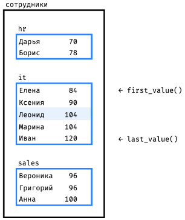

Вместо этого `last_value()` возвращает `salary = 104`:

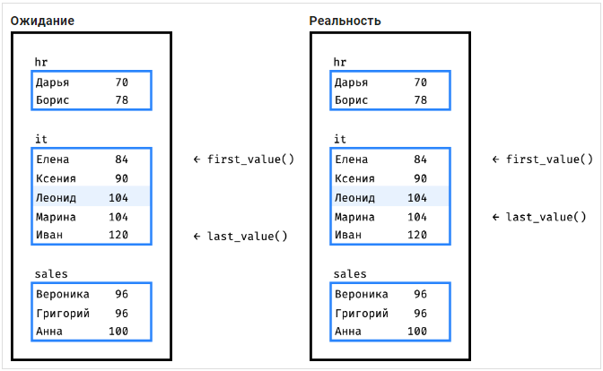

Дело в том, что функции `first_value()` и `last_value()` работают не просто с секцией окна, они работают с **фреймом** внутри секции:

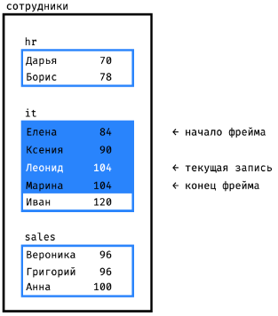

Фрейм находится в той же секции, где текущая запись (Леонид):

- начало фрейма = начало секции (Елена)

- конец фрейма = последняя запись со значением `salary`, равным текущей записи (Марина)

Секция фиксирована, фрейм же зависит от текущей записи и постоянно меняется:

**Секция**


**Фрейм**

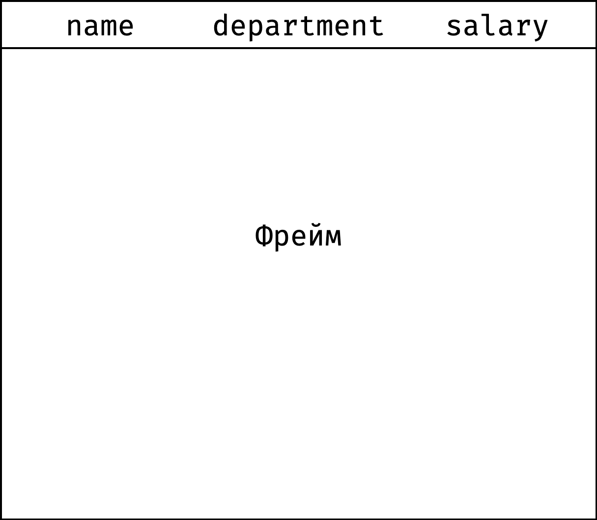

`first_value()` возвращает первую строчку фрейма, а не секции. Но поскольку начало фрейма совпадает с началом секции, функция отрабатывает как мы ожидали.

`last_value()` возвращает последнюю строчку фрейма, а не секции. Именно поэтому в нашем запросе она вернула не максимальную зарплату для каждого отдела, а какую-то ерунду.

Чтобы `last_value()` работала как мы ожидаем, придется «прибить» границы фрейма к границам секции. Тогда для каждой секции фрейм будет в точности совпадать с ней:

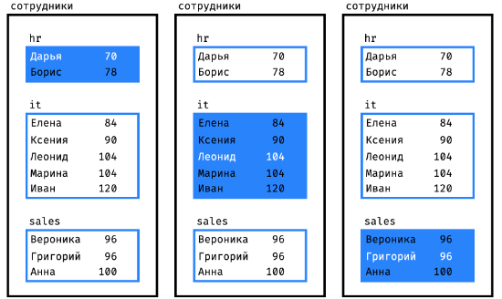

Подытожим принцип, по которому работают `first_value()` и `last_value()`:

1. Есть *окно*, которое состоит из одной или нескольких *секций* (`partition by department`).
2. Внутри секции записи упорядочены по конкретному столбцу (`order by salary`).
3. У каждой записи в секции свой *фрейм*. По умолчанию начало фрейма совпадает с началом секции, а конец для каждой записи свой.
4. Конец фрейма можно приклеить к концу секции, чтобы фрейм в точности совпадал с секцией.
5. Функция `first_value()` возвращает значение из первой строки фрейма.
6. Функция `last_value()` возвращает значение из последней строки фрейма.

Теперь разберемся, как прибить фрейм к окну — и закончим с запросом по диапазону зарплат в департаментах.

### Диапазон зарплат в департаменте, окончание

Чтобы фрейм в точности совпадал с секцией (департаментом) нужно изменить определение окна так:

```sql
window w as (
  partition by department
  order by salary
  rows between unbounded preceding and unbounded following
)
```

Благодаря конструкции `rows between` фрейм совпадает с секцией. Подробнее эта конструкция рассматривается позже.

Окончательный вид нашего запроса:

```sql
select name,
       department,
       salary,
       first_value(salary) over w as low,
       last_value(salary) over w  as high
from employees
    window w as (
        partition by department
        order by salary
        rows between unbounded preceding and unbounded following
        )
order by
    department,
    salary,
    id;
```

```
┌──────────┬────────────┬────────┬─────┬──────┐
│   name   │ department │ salary │ low │ high │
├──────────┼────────────┼────────┼─────┼──────┤
│ Дарья    │ hr         │ 70     │ 70  │ 78   │
│ Борис    │ hr         │ 78     │ 70  │ 78   │
├──────────┼────────────┼────────┼─────┼──────┤
│ Елена    │ it         │ 84     │ 84  │ 120  │
│ Ксения   │ it         │ 90     │ 84  │ 120  │
│ Леонид   │ it         │ 104    │ 84  │ 120  │
│ Марина   │ it         │ 104    │ 84  │ 120  │
│ Иван     │ it         │ 120    │ 84  │ 120  │
├──────────┼────────────┼────────┼─────┼──────┤
│ Вероника │ sales      │ 96     │ 96  │ 100  │
│ Григорий │ sales      │ 96     │ 96  │ 100  │
│ Анна     │ sales      │ 100    │ 96  │ 100  │
└──────────┴────────────┴────────┴─────┴──────┘
```

### Функции смещения

| Функция               | Описание                                                              |
| --------------------- | --------------------------------------------------------------------- |
| `lag(value, offset)`  | значение value из строки, отстоящей на offset строк назад от текущей  |
| `lead(value, offset)` | значение value из строки, отстоящей на offset строк вперед от текущей |
| `first_value(value)`  | значение value из первой строки фрейма                                |
| `last_value(value)`   | значение value из последней строки фрейма                             |
| `nth_value(value, n)` | значение value из `n`-й строки фрейма                                 |

## Агрегация

Агрегация - подсчет суммарных или средних показателей. Например средняя зарплата по региону.

### Сравнение с фондом оплаты труда

У каждого департамента есть фонд оплаты труда — денежная сумма, которая ежемесячно уходит на выплату зарплат сотрудникам. Посмотрим, какой процент от этого фонда составляет зарплата каждого сотрудника:

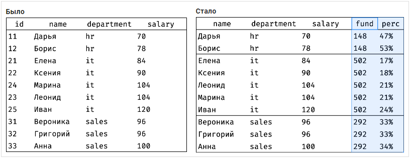

Столбец `fund` показывает фонд оплаты труда отдела, а `perc` — долю зарплаты сотрудника от этого фонда.

Переход от было к стало:

1. Отсортируем таблицу по департаментам

```sql
select name,
       department,
       salary,
       null as fund,
       null as perc
from employees
order by
    department,
    salary,
    id;
```

```
┌──────────┬────────────┬────────┬──────┬──────┐
│   name   │ department │ salary │ fund │ perc │
├──────────┼────────────┼────────┼──────┼──────┤
│ Дарья    │ hr         │ 70     │      │      │
│ Борис    │ hr         │ 78     │      │      │
│ Елена    │ it         │ 84     │      │      │
│ Ксения   │ it         │ 90     │      │      │
│ Леонид   │ it         │ 104    │      │      │
│ Марина   │ it         │ 104    │      │      │
│ Иван     │ it         │ 120    │      │      │
│ Вероника │ sales      │ 96     │      │      │
│ Григорий │ sales      │ 96     │      │      │
│ Анна     │ sales      │ 100    │      │      │
└──────────┴────────────┴────────┴──────┴──────┘
```

2. Проходим от первой строки до последней и считаем:
- `fund` - сумма зарплат по департаменту в целом (одинакова для всех сотрудников департамента)

- `perc` - доля зарплаты сотрудника от ФОТ


Окно состоит из секций по департаментам. При этом порядок записей в секции неважен: мы считаем сумму значений `salary`, а она не зависит от порядка.

```sql
window w as (
  partition by department
)
```

Для расчета `fund` подойдет обычная функция `sum()` — ее можно использовать поверх окна. А `perc` посчитаем как `salary / fund`:

```sql
select name,
       department,
       salary,
       sum(salary) over w                         as fund,
       round(salary * 100.0 / sum(salary) over w) as perc
from employees
    window w as (partition by department)
order by
    department,
    salary,
    id;
```

```
┌──────────┬────────────┬────────┬──────┬──────┐
│   name   │ department │ salary │ fund │ perc │
├──────────┼────────────┼────────┼──────┼──────┤
│ Дарья    │ hr         │ 70     │ 148  │ 47.0 │
│ Борис    │ hr         │ 78     │ 148  │ 53.0 │
├──────────┼────────────┼────────┼──────┼──────┤
│ Елена    │ it         │ 84     │ 502  │ 17.0 │
│ Ксения   │ it         │ 90     │ 502  │ 18.0 │
│ Леонид   │ it         │ 104    │ 502  │ 21.0 │
│ Марина   │ it         │ 104    │ 502  │ 21.0 │
│ Иван     │ it         │ 120    │ 502  │ 24.0 │
├──────────┼────────────┼────────┼──────┼──────┤
│ Вероника │ sales      │ 96     │ 292  │ 33.0 │
│ Григорий │ sales      │ 96     │ 292  │ 33.0 │
│ Анна     │ sales      │ 100    │ 292  │ 34.0 │
└──────────┴────────────┴────────┴──────┴──────┘
```

Функция `sum()` считает сумму значений по всей секции, которой принадлежит текущая строка.

### Фильтрация и порядок выполнения

Вернемся к запросу, который считал фонд оплаты труда по департаменту:

```sql
select name,
       department,
       salary,
       sum(salary) over w as fund
from employees
    window w as (partition by department)
order by
    department,
    salary,
    id;
```

```
┌──────────┬────────────┬────────┬──────┐
│   name   │ department │ salary │ fund │
├──────────┼────────────┼────────┼──────┤
│ Дарья    │ hr         │ 70     │ 148  │
│ Борис    │ hr         │ 78     │ 148  │
│ Елена    │ it         │ 84     │ 502  │
│ Ксения   │ it         │ 90     │ 502  │
│ Леонид   │ it         │ 104    │ 502  │
│ Марина   │ it         │ 104    │ 502  │
│ Иван     │ it         │ 120    │ 502  │
│ Вероника │ sales      │ 96     │ 292  │
│ Григорий │ sales      │ 96     │ 292  │
│ Анна     │ sales      │ 100    │ 292  │
└──────────┴────────────┴────────┴──────┘
```

Допустим, мы хотим оставить в отчете только самарских сотрудников. Добавим фильтр:

```sql
select name,
       department,
       salary,
       sum(salary) over w as fund
from employees 
where
    city = 'Самара'
    window w as (partition by department)
order by
    department,
    salary,
    id;
```

```
┌──────────┬────────┬──────┐
│   name   │ salary │ fund │
├──────────┼────────┼──────┤
│ Дарья    │ 70     │ 148  │
│ Борис    │ 78     │ 148  │
│ Елена    │ 84     │ 188  │
│ Леонид   │ 104    │ 188  │
│ Григорий │ 96     │ 96   │
└──────────┴────────┴──────┘
```

Фильтр сработал. Вот только значения `fund` отличаются от ожидаемых:

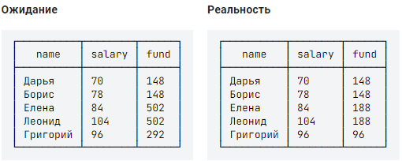

Все дело в порядке выполнения операций. Вот в какой последовательности действует движок, когда выполняет запрос:

1. Взять нужные таблицы (`from`) и соединить их при необходимости (`join`).
2. Отфильтровать строки (`where`).
3. Сгруппировать строки (`group by`).
4. Отфильтровать результат группировки (`having`).
5. Взять конкретные столбцы из результата (`select`).
6. **Рассчитать значения оконных функций** (`function() over window`).
7. Отсортировать то, что получилось (`order by`).

Таким образом, окна отрабатывают предпоследним шагом, уже после фильтрации и группировки результатов. Поэтому в нашем запросе `fund` отражает не сумму всех зарплат по департаменту, а сумму только по самарским сотрудникам.

Решение — использовать подзапрос с окном и фильтровать его в основном запросе:

```sql
with emp as (select name,
                    city,
                    salary,
                    sum(salary) over w as fund
             from employees
                 window w as (partition by department)
             order by department, salary, id)
select name, salary, fund
from emp
where city = 'Самара';
```

```
┌──────────┬────────┬──────┐
│   name   │ salary │ fund │
├──────────┼────────┼──────┤
│ Дарья    │ 70     │ 148  │
│ Борис    │ 78     │ 148  │
│ Елена    │ 84     │ 502  │
│ Леонид   │ 104    │ 502  │
│ Григорий │ 96     │ 292  │
└──────────┴────────┴──────┘
```

### Описание окна

До сих пор мы описывали окно в блоке `window` и ссылались на него в выражении `over`:

```sql
select name,
       department,
       salary,
       count(*) over w    as emp_count,
       sum(salary) over w as fund
from employees
    window w as (partition by department)
order by
    department,
    salary,
    id;
```

```
┌──────────┬────────────┬────────┬───────────┬──────┐
│   name   │ department │ salary │ emp_count │ fund │
├──────────┼────────────┼────────┼───────────┼──────┤
│ Дарья    │ hr         │ 70     │ 2         │ 148  │
│ Борис    │ hr         │ 78     │ 2         │ 148  │
│ Елена    │ it         │ 84     │ 5         │ 502  │
│ Ксения   │ it         │ 90     │ 5         │ 502  │
│ Леонид   │ it         │ 104    │ 5         │ 502  │
│ Марина   │ it         │ 104    │ 5         │ 502  │
│ Иван     │ it         │ 120    │ 5         │ 502  │
│ Вероника │ sales      │ 96     │ 3         │ 292  │
│ Григорий │ sales      │ 96     │ 3         │ 292  │
│ Анна     │ sales      │ 100    │ 3         │ 292  │
└──────────┴────────────┴────────┴───────────┴──────┘
```

Это не единственный способ. SQL разрешает вообще не использовать `window` и описывать окно прямо внутри `over`:

```sql
select name,
       department,
       salary,
       count(*) over (partition by department)    as emp_count,
       sum(salary) over (partition by department) as fund
from employees
order by
    department,
    salary,
    id;
```

Вариант с `window` легче читается и окно более явно переиспользуется.

Определение окна также может быть пустым:

```sql
select name,
       department,
       salary,
       count(*) over ()    as emp_count,
       sum(salary) over () as fund
from employees
order by
    department,
    salary,
    id;
```

Такое окно включает все строки, так что `emp_count` покажет общее количество сотрудников, а `fund` — общий фонд оплаты труда по всем записям `employees`.

### Функции агрегации

| Функция                          | Описание                                                                                                 |
| -------------------------------- | -------------------------------------------------------------------------------------------------------- |
| `min(value)`                     | минимальное `value` среди строк, входящих в окно                                                         |
| `max(value)`                     | максимальное `value`                                                                                     |
| `count(value)`                   | количество `value`, не равных `null`                                                                     |
| `avg(value)`                     | среднее значение по всем `value`                                                                         |
| `sum(value)`                     | сумма значений `value`                                                                                   |
| `group_concat(value, separator)` | строка, которая соединяет значения `value` через разделитель `separator` поддерживается в SQLite и MySQL |
| `string_agg(value, separator)`   | аналог `group_concat()` в PostgreSQL и MS SQL                                                            |

## Скользящие агрегаты

Скользящие агрегаты — это те же сумма и среднее, только скользящие (sic!).

### Скользящее среднее по расходам

Рассчитаем скользящее среднее по расходам:

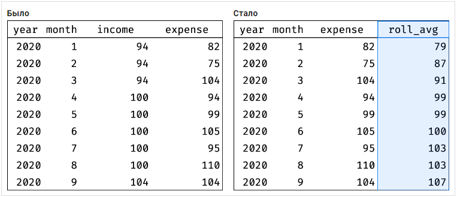

Столбец `roll_avg` показывает скользящее среднее по расходам за три месяца (предыдущий, текущий, следующий).

Переход от было к стало:

1. Отсортируем таблицу по месяцам

```sql
select year,
       month,
       expense,
       null as roll_avg
from expenses
order by
    year,
    month;
```

```
┌──────┬───────┬─────────┬──────────┐
│ year │ month │ expense │ roll_avg │
├──────┼───────┼─────────┼──────────┤
│ 2020 │ 1     │ 82      │          │
│ 2020 │ 2     │ 75      │          │
│ 2020 │ 3     │ 104     │          │
│ 2020 │ 4     │ 94      │          │
│ 2020 │ 5     │ 99      │          │
│ 2020 │ 6     │ 105     │          │
│ 2020 │ 7     │ 95      │          │
│ 2020 │ 8     │ 110     │          │
│ 2020 │ 9     │ 104     │          │
└──────┴───────┴─────────┴──────────┘
```

2. Теперь пройдем от первой строчки до последней. На каждом шаге будем считать среднее по предыдущему, текущему и следующему значению из столбца `expense`:

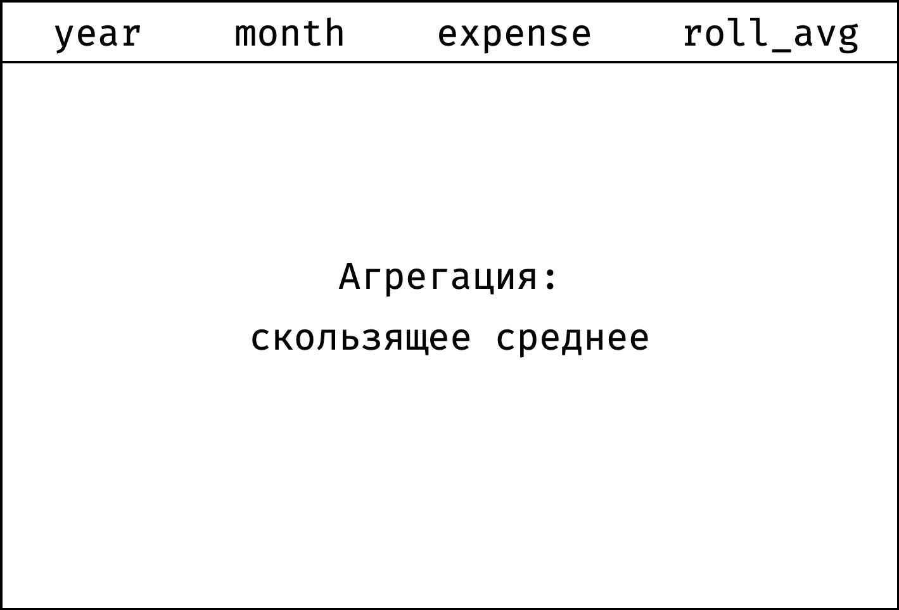

Рамка на каждом шаге сдвигается вниз, скользит — так и получается скользящее среднее. Чтобы описать на SQL, придется вспомнить концепцию фреймов, с которой мы познакомились на уроке о смещении:

1. Окно состоит из одной или нескольких секций (в нашем случае секция одна — все записи `expenses`).

2. Внутри секции записи упорядочены по конкретным столбцам (`order by year, month`).

3. У каждой записи свой фрейм.

Фрейм на каждом шаге охватывает три записи — текущую, предыдущую и следующую. Вот как это записать в SQL:

```sql
window w as (
  order by year, month
  rows between 1 preceding and 1 following
)
```

Вторая строчка - это определение фрейма: «выбрать строки от 1 предыдущей до 1 следующей». 

Для средней по расходам используем `avg()`:

```sql
avg(expense) over w
```

3. Добавляем округление и используем окно в исходном запросе:

```sql
select year,
       month,
       expense,
       round(avg(expense) over w) as roll_avg
from expenses
    window w as (
        order by year, month
        rows between 1 preceding and 1 following
        )
order by
    year,
    month;
```

```
┌──────┬───────┬─────────┬──────────┐
│ year │ month │ expense │ roll_avg │
├──────┼───────┼─────────┼──────────┤
│ 2020 │ 1     │ 82      │ 79.0     │
│ 2020 │ 2     │ 75      │ 87.0     │
│ 2020 │ 3     │ 104     │ 91.0     │
│ 2020 │ 4     │ 94      │ 99.0     │
│ 2020 │ 5     │ 99      │ 99.0     │
│ 2020 │ 6     │ 105     │ 100.0    │
│ 2020 │ 7     │ 95      │ 103.0    │
│ 2020 │ 8     │ 110     │ 103.0    │
│ 2020 │ 9     │ 104     │ 107.0    │
└──────┴───────┴─────────┴──────────┘
```

Скользящее среднее по расходам готово.

### Фрейм

В общем случае определение фрейма выглядит так:

```sql
rows between X preceding and Y following
```

где `X` - количество строк перед текущей, а `Y` - количество строк после текущей.

Если вместо `X` или `Y` указать `unbounded` - это будет значить, что нужно брать фрейм по размеру секции.

Также вместо `X preceding` или `Y following` можно указать `current row` - тогда фрейм будет ограничен текущей записью.

Фрейм никогда не выходит за границы секции, если столкнулся с ней - обрезается.

### Прибыль нарастающим итогом

Благодаря скользящему среднему мы выяснили, что в таблице `expenses` растут и доходы, и расходы. Теперь посчитаем доходы и расходы по месяцам нарастающим итогом (кумулятивно).

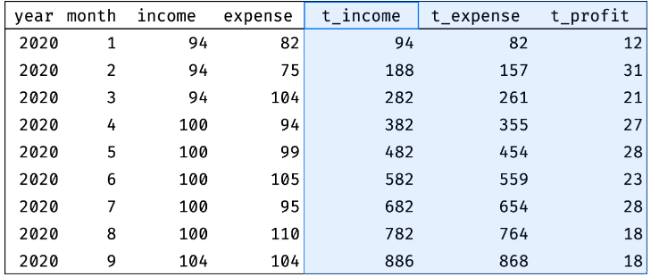

`t_income` показывает доходы нарастающим итогом, `t_expense` - расходы, а `t_profit` - прибыль

$$
t_{profit} = t_{income} - t_{expense}
$$

1. Отсортируем таблицу по месяцам

```sql
select year,
       month,
       income,
       expense,
       null as t_income,
       null as t_expense,
       null as t_profit
from expenses
order by
    year,
    month;
```

2. Пройдем от первой строчки до последней. На каждом шаге будем считать суммарные показатели от начала таблицы до текущей строки


Фрейм такого типа выглядит следующим образом:

```sql
window w as (
    order by year, month
    rows between unbounded preceding and current row
)
```

3. Все вместе:

```sql
select year,
       month,
       income,
       expense,
       sum(income) over w                           as t_income,
       sum(expense) over w                          as t_expense,
       (sum(income) over w) - (sum(expense) over w) as t_profit
from expenses
    window w as (
        order by year, month
        rows between unbounded preceding and current row
        )
order by
    year,
    month;
```

```
┌──────┬───────┬────────┬─────────┬──────────┬───────────┬──────────┐
│ year │ month │ income │ expense │ t_income │ t_expense │ t_profit │
├──────┼───────┼────────┼─────────┼──────────┼───────────┼──────────┤
│ 2020 │ 1     │ 94     │ 82      │ 94       │ 82        │ 12       │
│ 2020 │ 2     │ 94     │ 75      │ 188      │ 157       │ 31       │
│ 2020 │ 3     │ 94     │ 104     │ 282      │ 261       │ 21       │
│ 2020 │ 4     │ 100    │ 94      │ 382      │ 355       │ 27       │
│ 2020 │ 5     │ 100    │ 99      │ 482      │ 454       │ 28       │
│ 2020 │ 6     │ 100    │ 105     │ 582      │ 559       │ 23       │
│ 2020 │ 7     │ 100    │ 95      │ 682      │ 654       │ 28       │
│ 2020 │ 8     │ 100    │ 110     │ 782      │ 764       │ 18       │
│ 2020 │ 9     │ 104    │ 104     │ 886      │ 868       │ 18       │
└──────┴───────┴────────┴─────────┴──────────┴───────────┴──────────┘
```

### Фрейм по умолчанию

Возьмем запрос, который считает расходы нарастающим итогом:

```sql
select year,
       month,
       expense,
       sum(expense) over w as total
from expenses
    window w as (
        order by year, month
        rows between unbounded preceding and current row
        )
order by
    year,
    month;
```

```
┌──────┬───────┬─────────┬───────┐
│ year │ month │ expense │ total │
├──────┼───────┼─────────┼───────┤
│ 2020 │ 1     │ 82      │ 82    │
│ 2020 │ 2     │ 75      │ 157   │
│ 2020 │ 3     │ 104     │ 261   │
│ 2020 │ 4     │ 94      │ 355   │
│ 2020 │ 5     │ 99      │ 454   │
│ 2020 │ 6     │ 105     │ 559   │
│ 2020 │ 7     │ 95      │ 654   │
│ 2020 │ 8     │ 110     │ 764   │
│ 2020 │ 9     │ 104     │ 868   │
└──────┴───────┴─────────┴───────┘
```

Уберем из него определение фрейма:

```sql
select year,
       month,
       expense,
       sum(expense) over w as total
from expenses
    window w as (
        order by year, month
        )
order by
    year,
    month;
```

Ожидаем, что в `total` теперь всегда будет одно и то же число — суммарные расходы за 9 месяцев. А вместо этого видим вот что:

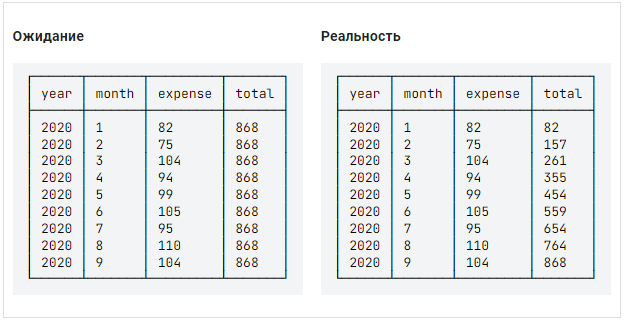

Запрос без фрейма все равно посчитал кумулятивные расходы — в точности как запрос с фреймом. Так произошло из-за наличия сортировки в окне. Правило такое:

если в окне есть `order by` и используется функция агрегации и не указано определение фрейма, то используется фрейм по умолчанию.

Фрейм по умолчанию в нашем запросе распространяется от первой записи до текущей. Поэтому результаты совпадают с запросом, где фрейм был указан явно `rows between unbounded preceding and current row`. Лучше всегда указывать фрейм явно, даже если есть `order by` и дефолтный фрейм подходит.

### Функции для скользящих агрегатов

Скользящие агрегаты используют те же самые функции, что и агрегаты обычные:

- `min() / max()`

- `count(), avg(), sum()`

- `group_concat()`

Отличие только в наличии фрейма у скользящих агрегатов.

## Статистика

Когда речь идет о числовых показателях (зарплата сотрудника, температура воздуха, время ответа сервиса), нам часто интересно понять место отдельного значения в ряду других — чтобы понять, насколько оно «хорошее» или «плохое».

### cume_dist()

Возьмем зарплату каждого сотрудника и определим, какой процент людей получает столько же или меньше:

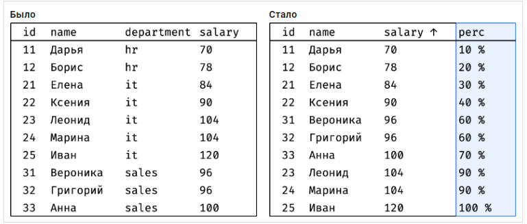

Рассчитать такое в SQL поможет функция `cume_dist()`:

```sql
select name,
       salary,
       cume_dist() over w as perc
from employees
    window w as (order by salary)
order by
    salary,
    id;
```

```
┌──────────┬────────┬───────┐
│   name   │ salary │ perc  │
├──────────┼────────┼───────┤
│ Дарья    │ 70     │ 0.1   │
│ Борис    │ 78     │ 0.2   │
│ Елена    │ 84     │ 0.3   │
│ Ксения   │ 90     │ 0.4   │
│ Вероника │ 96     │ 0.6   │
│ Григорий │ 96     │ 0.6   │
│ Анна     │ 100    │ 0.7   │
│ Леонид   │ 104    │ 0.9   │
│ Марина   │ 104    │ 0.9   │
│ Иван     │ 120    │ 1.0   │
└──────────┴────────┴───────┘
```

Вот что делает `cume_dist()` :

1. Располагает записи в порядке, указанном в order by окна (в нашем случае — по возрастанию зарплаты).
2. Находит текущую запись в общем ряду (зарплату текущего сотрудника среди всех зарплат).
3. Считает, сколько записей ≤ текущей по значению столбца из order by (сколько людей получают такую же или меньшую зарплату).
4. Делит на общее количество записей (на количество сотрудников).

```
cume_dist = количество записей ≤ текущей / общее количество записей
```

В результате `cume_dist` возвращает процент записей со значением ≤ текущего (процент людей, которые получают такую же или меньшую зарплату).

### percent_rank()

Зададимся похожим вопросом: какой процент людей получает *строго меньше*, чем конкретный сотрудник? В ответе на это вопрос поможет функция `percent_rank()`:

```sql
select name,
       salary,
       round(percent_rank() over w, 2) as perc
from employees
    window w as (order by salary)
order by
    salary,
    id;
```

```
┌──────────┬────────┬───────┐
│   name   │ salary │ perc  │
├──────────┼────────┼───────┤
│ Дарья    │ 70     │ 0.0   │
│ Борис    │ 78     │ 0.11  │
│ Елена    │ 84     │ 0.22  │
│ Ксения   │ 90     │ 0.33  │
│ Вероника │ 96     │ 0.44  │
│ Григорий │ 96     │ 0.44  │
│ Анна     │ 100    │ 0.67  │
│ Леонид   │ 104    │ 0.78  │
│ Марина   │ 104    │ 0.78  │
│ Иван     │ 120    │ 1.0   │
└──────────┴────────┴───────┘
```

`percent_rank()` делает почти то же самое, что и `cume_dist()` только `percent_rank()` считает процент записей, у которых значение столбца из `order by` строго меньше текущего.

`cume_dist()` и `percent_rank()` рядом:

```sql
select name,
       salary,
       cume_dist() over w              as cd,
       round(percent_rank() over w, 2) as pr
from employees
    window w as (order by salary)
order by
    salary,
    id;
```

```
┌──────────┬────────┬─────┬──────┐
│   name   │ salary │ cd  │  pr  │
├──────────┼────────┼─────┼──────┤
│ Дарья    │ 70     │ 0.1 │ 0.0  │
│ Борис    │ 78     │ 0.2 │ 0.11 │
│ Елена    │ 84     │ 0.3 │ 0.22 │
│ Ксения   │ 90     │ 0.4 │ 0.33 │
│ Вероника │ 96     │ 0.6 │ 0.44 │
│ Григорий │ 96     │ 0.6 │ 0.44 │
│ Анна     │ 100    │ 0.7 │ 0.67 │
│ Леонид   │ 104    │ 0.9 │ 0.78 │
│ Марина   │ 104    │ 0.9 │ 0.78 │
│ Иван     │ 120    │ 1.0 │ 1.0  │
└──────────┴────────┴─────┴──────┘
```

`cume_dist()` и `percent_rank()` во многом похожи на функцию ранжирования `rank()`:

- `rank()` считает абсолютный ранг строки (ее место относительно других строк согласно order by окна)

- `cume_dist()` и `percent_rank()` считают относительный ранг (в процентах относительно других строк).

Как и `rank()`, `cume_dist()` и `percent_rank()` имеют смысл только при заданном `order by` окна. Как и `rank()`, они поддерживают секции (`partition by`) и не поддерживают фреймы.

### Сводные значения

Чтобы упростить себе жизнь, аналитики любят описывать весь набор данных одним или несколькими числами. Такие числа называются *сводными значениями* или *статистиками*.

Пожалуй, самая популярная статистика — это *среднее арифметическое* значение (average).

Допустим, сотрудники компании арендовали кафе для корпоратива. Если бы мы вздумали проанализировать доходы посетителей кафе в этот момент, увидели бы следующую картину:

```
70 78 84 90 96 96 100 104 104
```

Средний доход посетителя кафе составляет `sum(salary) / 9 ≈ 91`. Достаточно адекватная оценка, которая действительно описывает «среднего» посетителя.

Но тут в кафе входит Иван. Оказывается, с сегодняшнего дня он работает вице-президентом крупной корпорации. Доход Ивана теперь составляет 1700. И вот что случилось со средним доходом посетителя:

```
sum(salary) / 10 ≈ 252
```

Средний доход теперь равен 252. Но хорошо ли он описывает типичного посетителя? 

Среднее арифметическое — не всегда адекватный показатель: оно подвержено влиянию экстремально малых и больших значений (таких как Иван в нашем примере). Достаточно одного или нескольких «выбросов», чтобы испортить всю картину и дать ложное представление о среднем значении.

### Медиана

Чтобы посчитать среднее значение, устойчивое к выбросам, вместо среднего арифметического используют *медиану* (median).

Чтобы получить медиану, нужно упорядочить элементы по возрастанию и взять тот, что посередине. В нашем примере с доходами посетителей бара:

```
70 78 84 90 96 96 100 104 104 1700
            ↑   ↑
```

Здесь два «срединных» значения (пятое и шестое). В таких случаях медиану считают как среднее арифметическое между ними, но у нас значения одинаковые, так что и считать нечего: медиана равна 96.

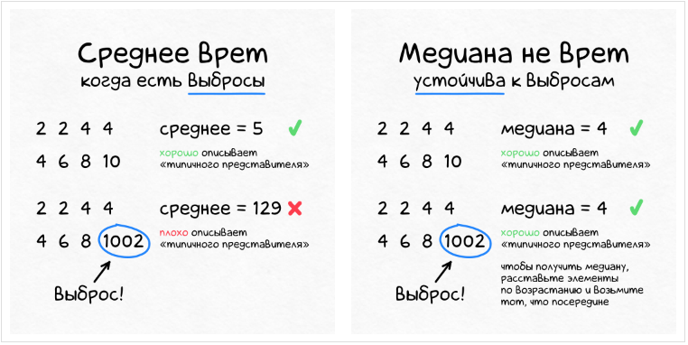

### Процентили

Мы выяснили, что медиана дохода составляет 96. Это полезное знание: оно описывает всех людей в баре одним числом — *усредненным* доходом. Другой интересный вопрос, который часто возникает: как охарактеризовать *большинство* посетителей?

Можно ли сказать, что у большинства посетителей доход не больше 96? Точно нет: по определению медианы, у половины доход меньше 96, а у половины больше. Чтобы говорить о большинстве, используют *процентили* (percentile).

Процентиль характеризует конкретный процент выборки. Вот некоторые распространенные процентили:

- если 25-й процентиль = X, то у 25% элементов значение не более X;
- если 50-й процентиль = X, то у 50% элементов значение не более X;
- если 75-й процентиль = X, то у 75% элементов значение не более X;
- если 90-й процентиль = X, то у 90% элементов значение не более X.

В нашем примере с доходами посетителей бара:

```
70 78 84 90 96 96 100 104 104 1700
```

- 25-й процентиль = 84 (у 25% людей доход не более 84);
- 50-й процентиль = 96 (у 50% людей доход не более 96);
- 75-й процентиль = 104 (у 75% людей доход не более 104);
- 90-й процентиль = 104 (у 90% людей доход не более 104).

50-й процентиль и медиана — это одно и то же.

Чтобы охарактеризовать «большинство», обычно используют 90-й, 95-й или 99-й процентиль.


К сожалению в SQL синтаксис перцентилей не самый простой и так не работает:

```sql
select round(avg(salary))     as average,
       percentile(salary, 50) as median,
       percentile(salary, 90) as p90
from employees;
```

```
┌─────────┬────────┬─────┐
│ average │ median │ p90 │
├─────────┼────────┼─────┤
│ 94      │ 96     │ 106 │
└─────────┴────────┴─────┘
```

Вместо этого имеем такой синтаксис:

```sql
select
  round(avg(salary)) as average,
  percentile_disc(0.50) within group (order by salary) as median,
  percentile_disc(0.90) within group (order by salary) as p90
from employees;
```

Столбец, по которому рассчитывается процентиль, указывается не аргументом функции, а отдельным блоком `within group`, внутри которого задан `order by`. Порог процентиля указывается не в % (50, 90), а десятичной дробью (0.5, 0.9).

процентиль здесь не оконная функция. Пока мы вычисляем его как обычную функцию агрегации (как `avg()` или `sum()` без окна), пусть и со странным синтаксисом.

Помимо `percentile_disc()` существует функция `percentile_cont()`:

- `percentile_disc` рассматривает набор данных как дискретный (то есть состоящий из отдельных значений). Всегда возвращает конкретное значение из тех, что есть в таблице.
- `percentile_cont` рассматривает набор данных как непрерывный (как будто значения в наборе — это выборка из некоторого непрерывного распределения данных). Рассчитывает процентиль аналитически по формуле.

Пример:

```sql
select
  '25' as perc,
  percentile_disc(0.25) within group (order by salary) as disc,
  percentile_cont(0.25) within group (order by salary) as cont
from employees
union all
select
  '50',
  percentile_disc(0.50) within group (order by salary),
  percentile_cont(0.50) within group (order by salary)
from employees
union all
select
 '75',
  percentile_disc(0.75) within group (order by salary),
  percentile_cont(0.75) within group (order by salary)
from employees
union all
select
  '90',
  percentile_disc(0.90) within group (order by salary),
  percentile_cont(0.90) within group (order by salary)
from employees;
```

```
┌───────┬───────┬───────┐
│ perc  │ disc  │ cont  │
├───────┼───────┼───────┤
│ 25    │ 84    │ 85.5  │
│ 50    │ 96    │ 96    │
│ 75    │ 104   │ 103   │
│ 90    │ 104   │ 105.6 │
└───────┴───────┴───────┘
```

`percentile_disc` выдал только те значения зарплаты, которые встречаются в столбце `salary`, а `percentile_cont` к ним не привязывался. При этом в целом значения disc и cont достаточно близки. Как правило, чем больше в наборе данных значений, тем ближе они будут.

С поддержкой в разных СУБД все не очень хорошо:

- SQLite и MySQL вовсе не поддерживают percentile_disc / percentile_cont.
- PostgreSQL поддерживает частично, без «окон» (об этом чуть позже).
- MS SQL и Oracle поддерживают полноценно, с «окнами».

### Процентиль как оконная функция

Процентиль как функция агрегации задается так:

```sql
percentile_disc(PERCENT) within group (order by COLUMN)
```

Где `PERCENT` — порог процентиля (десятичная дробь от 0 до 1), а `COLUMN` — столбец, по которому считается процентиль.

С таким синтаксисом мы легко подсчитаем медиану зарплаты по всем сотрудникам. Но что делать, если нас интересует медиана по каждому департаменту?

Для среднего арифметического мы бы использовали `avg()` поверх окна с секциями по департаментам:

```sql
select name,
       department,
       salary,
       round(avg(salary) over w) as dep_avg
from employees
    window w as (partition by department)
order by
    department,
    id;
```

```
┌──────────┬────────────┬────────┬─────────┐
│   name   │ department │ salary │ dep_avg │
├──────────┼────────────┼────────┼─────────┤
│ Дарья    │ hr         │ 70     │ 74      │
│ Борис    │ hr         │ 78     │ 74      │
│ Елена    │ it         │ 84     │ 100     │
│ Ксения   │ it         │ 90     │ 100     │
│ Леонид   │ it         │ 104    │ 100     │
│ Марина   │ it         │ 104    │ 100     │
│ Иван     │ it         │ 120    │ 100     │
│ Вероника │ sales      │ 96     │ 97      │
│ Григорий │ sales      │ 96     │ 97      │
│ Анна     │ sales      │ 100    │ 97      │
└──────────┴────────────┴────────┴─────────┘
```

Аналогично можно использовать и `percentile_disc()`:

```sql
select name,
       department, 
       salary,
       percentile_disc(0.5) within group (order by salary)
       over (partition by department) as dep_p50
from employees
order by 
    department, 
    id;
```

```
┌──────────┬────────────┬────────┬─────────┐
│   name   │ department │ salary │ dep_p50 │
├──────────┼────────────┼────────┼─────────┤
│ Дарья    │ hr         │ 70     │ 70      │
│ Борис    │ hr         │ 78     │ 70      │
│ Елена    │ it         │ 84     │ 104     │
│ Ксения   │ it         │ 90     │ 104     │
│ Леонид   │ it         │ 104    │ 104     │
│ Марина   │ it         │ 104    │ 104     │
│ Иван     │ it         │ 120    │ 104     │
│ Вероника │ sales      │ 96     │ 96      │
│ Григорий │ sales      │ 96     │ 96      │
│ Анна     │ sales      │ 100    │ 96      │
└──────────┴────────────┴────────┴─────────┘
```

Единственная часть «окошек», которую поддерживает процентиль — секции (`partition by`). Сортировка не поддерживается (она уже задана в `within group`), фреймы тоже. Полный синтаксис выглядит так:

```sql
percentile_disc(PERCENT) within group (order by COLUMN) 
over (partition by OTHER_COLUMNS)
```

К сожалению, секции поддерживаются только в MS SQL и Oracle. В PostgreSQL использовать процентили как оконные функции не получится.

### Статистические функции

Оконные функции для расчета статистик:

| Функция              | Описание                                                 |
| -------------------- | -------------------------------------------------------- |
| `cume_dist()`        | Считает процент строк, которые меньше либо равны текущей |
| `percent_rank()`     | Считает процент строк, которые строго меньше текущей     |
| `percentile_disc(N)` | Считает N-й процентиль дискретного распределения         |
| `percentile_cont(N)` | Считает N-й процентиль непрерывного распределения        |

`cume_dist()` и `percent_rank()` поддерживают сортировку и секции в окне, а `percentile_disc()` и `percentile_cont()` — только секции.

Все статистические функции не поддерживают фреймы.

## Резюме

Задачи, решаемые с помощью оконных функций в SQL:

1. Ранжирование (всевозможные рейтинги).
2. Сравнение со смещением (соседние элементы и границы).
3. Агрегация (количество, сумма и среднее).
4. Скользящие агрегаты (сумма и среднее в динамике).
5. Статистика (относительные ранги и сводные показатели).

Оконные функции вычисляют результат по строкам, которые попали в окно. Определение окна указывает, как выглядит окно:

1. Из каких секций состоит (`partition by`).
2. Как отсортированы строки внутри секции (`order by`).
3. Как выглядит фрейм внутри секции (`rows between`).

```sql
window w as (
  partition by ...
  order by ...
  rows between ... and ...
)
```

`partition by` поддерживается всеми оконными функциями и всегда необязательно. Если не указать — будет одна секция.

`order by` поддерживается всеми оконными функциями (кроме процентилей). Для функций ранжирования и смещения оно обязательно, для агрегации — нет. Если не указать `order by` для функции агрегации — она посчитает обычный агрегат, если указать — скользящий.

Фрейм поддерживается только некоторыми функциями:

- `first_value()`, `last_value()`, `nth_value()`;
- функции агрегации.

### Функции ранжирования

- ⚪ — необязательно
- 🔵 — обязательно
- 🔴 — не поддерживается

| Функция        | Секции | Сортировка | Фрейм | Описание                |
| -------------- | ------ | ---------- | ----- | ----------------------- |
| `row_number()` | ⚪      | 🔵         | 🔴    | порядковый номер строки |
| `dense_rank()` | ⚪      | 🔵         | 🔴    | ранг строки             |
| `rank()`       | ⚪      | 🔵         | 🔴    | ранг  с пропусками      |
| `ntile(n)`     | ⚪      | 🔵         | 🔴    | номер группы            |

### Функции смещения

- ⚪ — необязательно
- 🔵 — обязательно
- 🔴 — не поддерживается

| Функция               | Секции | Сортировка | Фрейм | Описание                            |
| --------------------- | ------ | ---------- | ----- | ----------------------------------- |
| `lag(value, n)`       | ⚪      | 🔵         | 🔴    | значение из n-й строки назад        |
| `lead(value, n)`      | ⚪      | 🔵         | 🔴    | значение из n-й строки вперед       |
| `first_value(value)`  | ⚪      | 🔵         | 🔵    | значение из первой строки фрейма    |
| `last_value(value)`   | ⚪      | 🔵         | 🔵    | значение из последней строки фрейма |
| `nth_value(value, n)` | ⚪      | 🔵         | 🔵    | значение из n-й строки фрейма       |

### Функции агрегации

- ⚪ — необязательно
- 🔵 — обязательно
- 🔴 — не поддерживается

| Функция                  | Секции | Сортировка | Фрейм | Описание                                  |
| ------------------------ | ------ | ---------- | ----- | ----------------------------------------- |
| `min(value)`             | ⚪      | ⚪          | ⚪     | минимальное из секции или фрейма          |
| `max(value)`             | ⚪      | ⚪          | ⚪     | максимальное из секции или фрейма         |
| `count(value)`           | ⚪      | ⚪          | ⚪     | количество по секции или фрейму           |
| `avg(value)`             | ⚪      | ⚪          | ⚪     | среднее по секции или фрейму              |
| `sum(value)`             | ⚪      | ⚪          | ⚪     | сумма по секции или фрейму                |
| `group_concat(val, sep)` | ⚪      | ⚪          | ⚪     | строковое соединение по секции или фрейму |

###### Функции статистики

- ⚪ — необязательно
- 🔵 — обязательно
- 🔴 — не поддерживается 

| Функция              | Секции | Сортировка   | Фрейм | Описание                                         |
| -------------------- | ------ | ------------ | ----- | ------------------------------------------------ |
| `cume_dist()`        | ⚪      | 🔵           | 🔴    | процент строк, которые меньше либо равны текущей |
| `percent_rank()`     | ⚪      | 🔵           | 🔴    | процент строк, которые строго меньше текущей     |
| `percentile_disc(n)` | ⚪      | within group | 🔴    | N-й процентиль дискретного распределения         |
| `percentile_cont(n)` | ⚪      | within group | 🔴    | N-й процентиль непрерывного распределения        |

Целевой столбец для `percentile_disc()` и `percentile_cont()` задается не аргументом функции, а блоком `within group`:

```sql
percentile_disc(PERCENT) within group (order by COLUMN) 
over (partition by OTHER_COLUMNS)
```

Поддержка в СУБД:

- SQLite и MySQL вовсе не поддерживают percentile_disc / percentile_cont.
- PostgreSQL поддерживает частично, без секций.
- MS SQL и Oracle поддерживают полноценно, с секциями.

# Фреймы

## ROWS и GROUPS

### ROWS-фреймы

Фрейм — это группа записей, с которой в данный момент работает оконная функция:

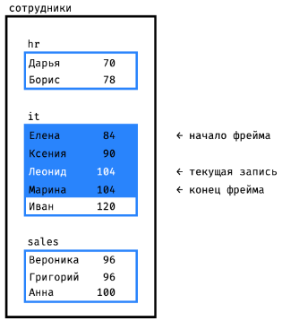

В общем виде определение фрейма выглядит так:

```sql
ROWS BETWEEN frame_start AND frame_end
```

Начало фрейма (frame_start) может быть:

- `current row` — начиная с текущей строки;
- `N preceding` — начиная с N-й строки перед текущей;
- `N following` — начиная с N-й строки после текущей;
- `unbounded preceding` — начиная с границы секции.

Аналогично, конец фрейма (frame_end) может быть:

- `current row` — до текущей строки;
- `N preceding` — до N-й строки перед текущей;
- `N following` — до N-й строки после текущей;
- `unbounded following` — до границы секции.

Например, фрейм на картинке выше можно описать так:

```sql
rows between 2 preceding and 1 following
rows between unbounded preceding and 1 following
```

Только у некоторых функций фрейм настраивается:

- функции смещения `first_value()`, `last_value()`, `nth_value()`;
- все функции агрегации: `count()`, `avg()`, `sum()`, ...

У прочих функций фрейм всегда равен секции (а если секция не задана — окну в целом).

### GROUPS-фреймы

До сих пор мы пользовались таким определением фрейма:

```sql
ROWS BETWEEN frame_start AND frame_end
```

На самом деле, кроме фрейма по строкам (ROWS) бывают еще фреймы по группам (GROUPS) и диапазону (RANGE):

```sql
ROWS BETWEEN frame_start AND frame_end --фрейм по строкам
GROUPS BETWEEN frame_start AND frame_end --фрейм по группам
RANGE BETWEEN frame_start AND frame_end --фрейм по диапазону
```

Начнем с фрейма по группам и разберем его на примере. Допустим, мы взяли окно с сортировкой по департаменту и фреймом от начала окна до текущей записи:

```sql
window w as (
  order by department
  rows between unbounded preceding and current row
)
```

Теперь посчитаем количество записей нарастающим итогом:

```sql
select name,
       department,
       count(*) over w as cnt
from employees
    window w as (
        order by department
        rows between unbounded preceding and current row
        )
order by
    department,
    id;
```

```
┌──────────┬────────────┬─────┐
│   name   │ department │ cnt │
├──────────┼────────────┼─────┤
│ Дарья    │ hr         │ 1   │
│ Борис    │ hr         │ 2   │
│ Елена    │ it         │ 3   │
│ Ксения   │ it         │ 4   │
│ Леонид   │ it         │ 5   │
│ Марина   │ it         │ 6   │
│ Иван     │ it         │ 7   │
│ Вероника │ sales      │ 8   │
│ Григорий │ sales      │ 9   │
│ Анна     │ sales      │ 10  │
└──────────┴────────────┴─────┘
```

А теперь заменим `rows` на `groups` в определении фрейма:

```sql
select name,
       department,
       count(*) over w as cnt
from employees
    window w as (
        order by department
        groups between unbounded preceding and current row
        )
order by
    department,
    id;
```

```
┌──────────┬────────────┬─────┐
│   name   │ department │ cnt │
├──────────┼────────────┼─────┤
│ Дарья    │ hr         │ 2   │
│ Борис    │ hr         │ 2   │
│ Елена    │ it         │ 7   │
│ Ксения   │ it         │ 7   │
│ Леонид   │ it         │ 7   │
│ Марина   │ it         │ 7   │
│ Иван     │ it         │ 7   │
│ Вероника │ sales      │ 10  │
│ Григорий │ sales      │ 10  │
│ Анна     │ sales      │ 10  │
└──────────┴────────────┴─────┘
```

Разница в том, что rows-фрейм оперирует индивидуальными записями, а groups-фрейм — группами записей, у которых одинаковое значение столбца order by (в данном случае — одинаковый департамент):

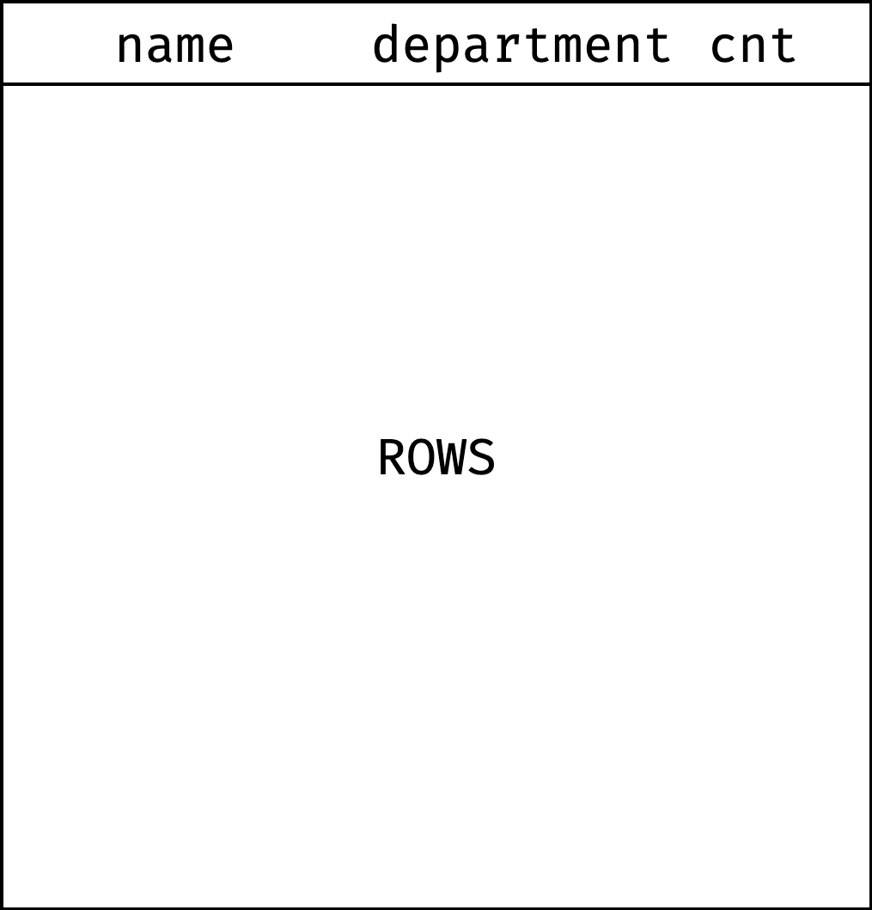

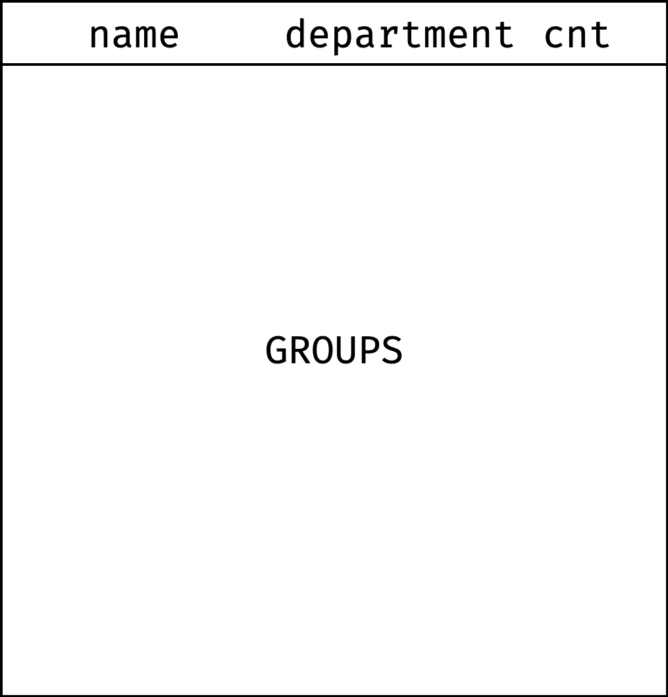

В обоих случаях запрос на каждом шаге считает количество записей нарастающим итогом: от начала до конца фрейма. Но у ROWS фрейм заканчивается на текущей *записи*, а у GROUPS — на последней записи текущей *группы*. Поскольку групп всего три (hr — 2 записи, it — 5 записей, sales — 3 записи), то фрейм смещается «рывками»:

- count(*) для hr → 2 записи
- count(*) для hr + it → 7 записей
- count(*) для hr + it + sales → 10 записей

Инструкции для границ группового фрейма используются такие же, как для строкового, но смысл их отличается:

- `current row` — текущая группа (а не текущая строка);
- `N preceding / following` — N-я группа относительно текущей (а не N-я строка);
- `unbounded preceding / following` — граница секции (как у строкового фрейма).

Групповые фреймы поддерживаются в PostgreSQL, SQLite и Oracle 21c+, но не в MySQL и SQL Server.

### Резюме

Рассмотрели строковые (rows) и групповые (groups) фреймы:

- rows-фрейм оперирует отдельными записями;
- groups-фрейм оперирует группами записей (группа включает все строки с одинаковым значением столбцов из order by).

Групповые фреймы есть смысл использовать, если в `order by` окна указан неуникальный набор столбцов. Например, `order by department` или `order by city` создает группы строк с одинаковым департаментом или городом — и тут групповой фрейм уместен.

А `order by department, id` задает уникальную сортировку (не может быть двух строк с одинаковым значением id) — так что здесь groups не имеет смысла.

## RANGE

### RANGE-фреймы

Последний тип фрейма - фрйм по диапазону.

```sql
range between frame_start and frame_end
```

Если rows-фрейм оперирует строками, а groups — группами строк с одинаковыми значениями, то range — группами строк, которые попадают в диапазон. Например, возьмем такое окно:

```sql
window w as (
  order by salary
  range between 10 preceding and 10 following
)
```

Фрейм для записи со значением salary = X будет включать сотрудников с диапазоном зарплат от X-10 до X+10 включительно. Например, для Григория с зарплатой 96К ₽ — сотрудников с з/п от 86К до 106К ₽:

```
┌──────────┬────────┐
│   name   │ salary │
├──────────┼────────┤
│ Дарья    │ 70     │
│ Борис    │ 78     │
│ Елена    │ 84     │
│ Ксения   │ 90     │ -- начало фрейма
│ Вероника │ 96     │
│ Григорий │ 96     │ -- текущая запись
│ Анна     │ 100    │
│ Леонид   │ 104    │
│ Марина   │ 104    │ -- конец фрейма
│ Иван     │ 120    │
└──────────┴────────┘
```

Если рассчитать фрейм для каждой записи, получится так:

```text
┌──────────┬────────┐
│   name   │ salary │ -- какую з/п включает фрейм
├──────────┼────────┤
│ Дарья    │ 70     │ -- 60-80   Дарья, Борис
│ Борис    │ 78     │ -- 68-88   Дарья, Борис, Елена
│ Елена    │ 84     │ -- 74-94   Борис, Елена, Ксения
│ Ксения   │ 90     │ -- 80-100  Елена, Ксения, Вероника, Григорий, Анна
│ Вероника │ 96     │ -- 86-106  Ксения, Вероника, Григорий, Анна, Леонид, Марина
│ Григорий │ 96     │ -- 86-106  Ксения, Вероника, Григорий, Анна, Леонид, Марина
│ Анна     │ 100    │ -- 90-110  Ксения, Вероника, Григорий, Анна, Леонид, Марина
│ Леонид   │ 104    │ -- 94-114  Вероника, Григорий, Анна, Леонид, Марина
│ Марина   │ 104    │ -- 94-114  Вероника, Григорий, Анна, Леонид, Марина
│ Иван     │ 120    │ -- 110-120 Иван
└──────────┴────────┘
```

Проверим - посчитаем количество сотрудников по каждому диапазону:

```sql
select name,
       salary,
       count(*) over w as cnt
from employees
    window w as (
        order by salary
        range between 10 preceding and 10 following
        )
order by
    salary,
    id;
```

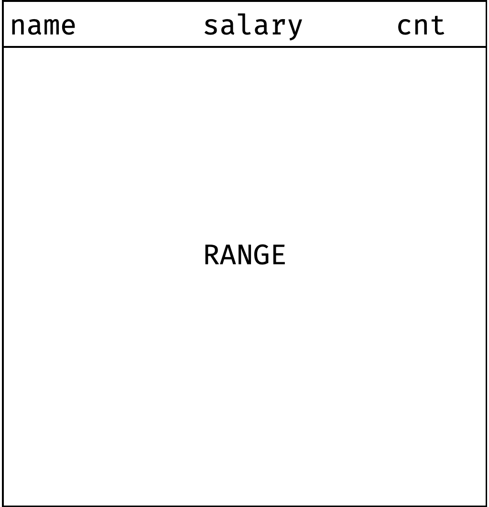

```text
┌──────────┬────────┬─────┐
│   name   │ salary │ cnt │
├──────────┼────────┼─────┤
│ Дарья    │ 70     │ 2   │ -- 60-80   Дарья, Борис
│ Борис    │ 78     │ 3   │ -- 68-88   Дарья, Борис, Елена
│ Елена    │ 84     │ 3   │ -- 74-94   Борис, Елена, Ксения
│ Ксения   │ 90     │ 5   │ -- 80-100  Елена, Ксения, Вероника, Григорий, Анна
│ Вероника │ 96     │ 6   │ -- 86-106  Ксения, Вероника, Григорий, Анна, Леонид, Марина
│ Григорий │ 96     │ 6   │ -- 86-106  Ксения, Вероника, Григорий, Анна, Леонид, Марина
│ Анна     │ 100    │ 6   │ -- 90-110  Ксения, Вероника, Григорий, Анна, Леонид, Марина
│ Леонид   │ 104    │ 5   │ -- 94-114  Вероника, Григорий, Анна, Леонид, Марина
│ Марина   │ 104    │ 5   │ -- 94-114  Вероника, Григорий, Анна, Леонид, Марина
│ Иван     │ 120    │ 1   │ -- 110-120 Иван
└──────────┴────────┴─────┘
```

У диапазонных фреймов несколько особенностей:

1. **Только один столбец в order by**

Поскольку range-фрейм динамически рассчитывается по вхождению в диапазон between .. and .., то в order by должен быть ровно один столбец. Так не получится:

```sql
window w as (
  order by salary, city
  range between 10 preceding and 10 following
)
```

2. **Только числа или даты для N preceding / following**

Условия `N preceding` и `N following` работают только для числовых столбцов и столбцов с датами. Например, такой фрейм лишен смысла:

```sql
window w as (
  order by department
  range between 10 preceding and 10 following
)
```

3. **Current row - как у groups-фрейма**

Условие `current row` для range-фрейма работает так же, как для groups-фрейма — включает строки с одинаковым значением столбца из order by. Условия `unbounded preceding` и `unbounded following` для всех типов фреймов работают одинаково — включает строки от начала секции (unbounded preceding) и до конца секции (unbounded following).

### Границы фрейма

Все типы фреймов - rows, groups и range - используют одни и те же конструкции, чтобы задать границы:

- unbounded preceding / following

- N preceding / following

- current row

Но трактовка этих инструкций может отличаться в зависимости от типа фрейма.

Инструкции `unbounded preceding` и `unbounded following` всегда означают границы секции:

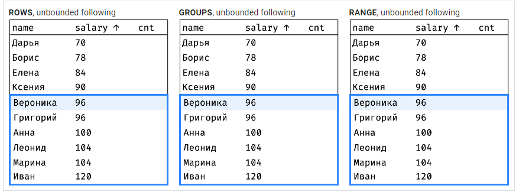

`current row` для строковых фреймов означает текущую запись, а для груповых и диапазонных — текущую запись и все равные ей (по значениям из order by):

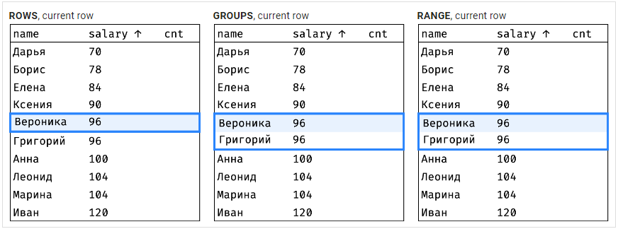

`N preceding` и `N following` означают:

- для строковых фреймов — количество записей до / после текущей;
- для групповых фреймов — количество групп до / после текущей;
- для диапазонных фреймов — диапазон значений относительно текущей записи.

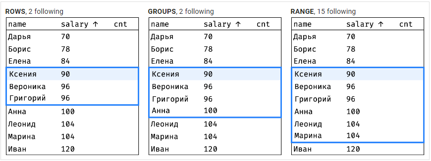

### Фрейм по умолчанию

Возьмем запрос, который считает зарплату по организации нарастающим итогом:

```sql
select name,
       salary,
       sum(salary) over w as "sum"
from employees
    window w as (
        order by salary
        )
order by
    salary,
    id;
```

```text
┌──────────┬────────┬─────┐
│   name   │ salary │ sum │
├──────────┼────────┼─────┤
│ Дарья    │ 70     │ 70  │
│ Борис    │ 78     │ 148 │
│ Елена    │ 84     │ 232 │
│ Ксения   │ 90     │ 322 │
│ Вероника │ 96     │ 514 │
│ Григорий │ 96     │ 514 │
│ Анна     │ 100    │ 614 │
│ Леонид   │ 104    │ 822 │
│ Марина   │ 104    │ 822 │
│ Иван     │ 120    │ 942 │
└──────────┴────────┴─────┘
```

Тут сразу возникает пара вопросов:

1. Мы не указали фрейм. Как тогда работает запрос?
2. Почему для Вероники и Григория (а также Леонида и Марины) показывается одинаковая сумма?

Ответ на оба вопроса один. Если фрейм не указан явно, используется такой:

```sql
RANGE BETWEEN unbounded preceding AND current row
```

Дефолтный фрейм охватывает записи от начала секции до конца текущей группы (группа образована из записей с одинаковыми значениями order by). Вот как выглядят фреймы для Вероники и Леонида:

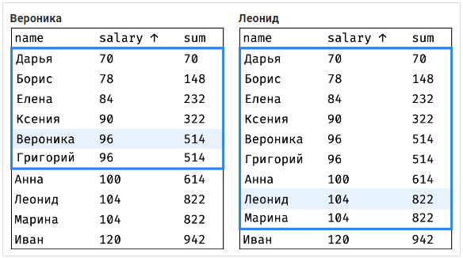

Выбор RANGE вместо ROWS в качестве фрейма по умолчанию может показаться странным. Глядя на запрос с суммой нарастающим итогом, никак не ожидаешь, что он посчитает одинаковую сумму для разных строчек. Поэтому рекомендуется не полагаться на дефолтное поведение и **всегда явно указывать фрейм** в запросе.

Все сказанное относится только к функциям, у которых фрейм настраивается:

- функции смещения `first_value()`, `last_value()`, `nth_value()`;
- все функции агрегации: `count()`, `avg()`, `sum()`, ...

У прочих функций фрейм всегда равен секции.

## EXCLUDE

Как мы выяснили на предыдущих уроках, фреймы бывают трех типов: строковые, групповые и диапазонные. Теперь определение фрейма выглядит так:

```sql
{ ROWS | GROUPS | RANGE } BETWEEN frame_start AND frame_end
```

Обычно этого достаточно. Но иногда хочется исключить из фрейма часть записей.

Допустим, мы хотим понять, как изменится средняя зарплата по организации, если уволить того или иного сотрудника. Как посчитать среднюю зарплату, мы знаем:

```sql
select name,
       salary,
       round(avg(salary) over w) as "avg"
from employees
    window w as ()
order by
    salary,
    id;
```

```text
┌──────────┬────────┬──────┐
│   name   │ salary │ avg  │
├──────────┼────────┼──────┤
│ Дарья    │ 70     │ 94.0 │
│ Борис    │ 78     │ 94.0 │
│ Елена    │ 84     │ 94.0 │
│ Ксения   │ 90     │ 94.0 │
│ Вероника │ 96     │ 94.0 │
│ Григорий │ 96     │ 94.0 │
│ Анна     │ 100    │ 94.0 │
│ Леонид   │ 104    │ 94.0 │
│ Марина   │ 104    │ 94.0 │
│ Иван     │ 120    │ 94.0 │
└──────────┴────────┴──────┘
```

Но как теперь для каждого сотрудника посчитать среднее, исключая его самого?

Для начала перепишем определение окна с явным указанием фрейма:

```sql
window w as (
  rows between unbounded preceding and unbounded following
)
```

А теперь исключим из фрейма текущую запись с помощью инструкции `EXCLUDE`:

```sql
window w as (
  rows between unbounded preceding and unbounded following
  exclude current row
)
```

Вот как поменялась ситуация на примере Вероники: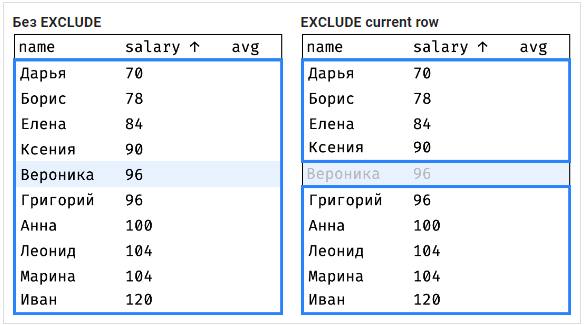

Теперь фрейм включает все записи, кроме текущей. А функция `avg()` считает среднюю зарплату для всех коллег сотрудника, исключая его самого. Ровно то, что нам нужно!

Запрос целиком и результат:

```sql
select name,
       salary,
       round(avg(salary) over w) as "avg"
from employees
    window w as (
        rows between unbounded preceding and unbounded following
        exclude current row
        )
order by
    salary,
    id;
```

```text
┌──────────┬────────┬──────┐
│   name   │ salary │ avg  │
├──────────┼────────┼──────┤
│ Дарья    │ 70     │ 97.0 │
│ Борис    │ 78     │ 96.0 │
│ Елена    │ 84     │ 95.0 │
│ Ксения   │ 90     │ 95.0 │
│ Вероника │ 96     │ 94.0 │
│ Григорий │ 96     │ 94.0 │
│ Анна     │ 100    │ 94.0 │
│ Леонид   │ 104    │ 93.0 │
│ Марина   │ 104    │ 93.0 │
│ Иван     │ 120    │ 91.0 │
└──────────┴────────┴──────┘
```

`EXCLUDE` поддерживается в PostgreSQL, SQLite и Oracle 21c+, но не в MySQL и SQL Server.

### Виды исключений

Стандарт SQL предусматривает четыре разновидности EXCLUDE:

- EXCLUDE NO OTHERS. Ничего не исключать. Вариант по умолчанию: если явно не указать exclude, сработает именно он.
- EXCLUDE CURRENT ROW. Исключить текущую запись (как мы сделали на предыдущем шаге с сотрудником).
- EXCLUDE GROUP. Исключить текущую запись и все равные ей (по значению столбцов из order by).
- EXCLUDE TIES. Оставить текущую запись, но исключить равные ей.

На примере Вероники (окно отсортировано по зарплате):

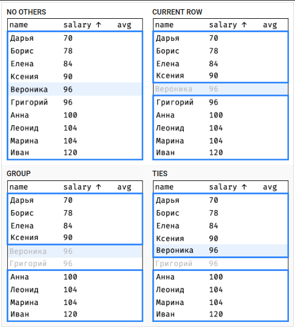

### EXCLUDE GROUP / TIES

Вернемся к запросу о средней зарплате. Вариант с `exclude current row` отвечал на вопрос:

> Как изменится средняя зарплата по организации, если уволить конкретного сотрудника?

```text
-- exclude current row
-- столбец frame показывает содержимое фрейма для каждой записи
-- столбец exc показывает, кого исключили
┌────┬──────────┬────────┬──────┬────────────────────────────────────┬─────┐
│ id │   name   │ salary │ avg  │               frame                │ exc │
├────┼──────────┼────────┼──────┼────────────────────────────────────┼─────┤
│ 11 │ Дарья    │ 70     │ 97.0 │ 12, 21, 22, 31, 32, 33, 23, 24, 25 │ 11  │
│ 12 │ Борис    │ 78     │ 96.0 │ 11, 21, 22, 31, 32, 33, 23, 24, 25 │ 12  │
│ 21 │ Елена    │ 84     │ 95.0 │ 11, 12, 22, 31, 32, 33, 23, 24, 25 │ 21  │
│ 22 │ Ксения   │ 90     │ 95.0 │ 11, 12, 21, 31, 32, 33, 23, 24, 25 │ 22  │
│ 31 │ Вероника │ 96     │ 94.0 │ 11, 12, 21, 22, 32, 33, 23, 24, 25 │ 31  │
│ 32 │ Григорий │ 96     │ 94.0 │ 11, 12, 21, 22, 31, 33, 23, 24, 25 │ 32  │
│ 33 │ Анна     │ 100    │ 94.0 │ 11, 12, 21, 22, 31, 32, 23, 24, 25 │ 33  │
│ 23 │ Леонид   │ 104    │ 93.0 │ 11, 12, 21, 22, 31, 32, 33, 24, 25 │ 23  │
│ 24 │ Марина   │ 104    │ 93.0 │ 11, 12, 21, 22, 31, 32, 33, 23, 25 │ 24  │
│ 25 │ Иван     │ 120    │ 91.0 │ 11, 12, 21, 22, 31, 32, 33, 23, 24 │ 25  │
└────┴──────────┴────────┴──────┴────────────────────────────────────┴─────┘
```

Если использовать `exclude group` — получим ответ на вопрос:

> Как изменится средняя зарплата по организации, если уволить конкретного сотрудника и всех, кто получает столько же, сколько и он?

```text
-- exclude group
┌────┬──────────┬────────┬──────┬────────────────────────────────────┬────────┐
│ id │   name   │ salary │ avg  │               frame                │  exc   │
├────┼──────────┼────────┼──────┼────────────────────────────────────┼────────┤
│ 11 │ Дарья    │ 70     │ 97.0 │ 12, 21, 22, 31, 32, 33, 23, 24, 25 │ 11     │
│ 12 │ Борис    │ 78     │ 96.0 │ 11, 21, 22, 31, 32, 33, 23, 24, 25 │ 12     │
│ 21 │ Елена    │ 84     │ 95.0 │ 11, 12, 22, 31, 32, 33, 23, 24, 25 │ 21     │
│ 22 │ Ксения   │ 90     │ 95.0 │ 11, 12, 21, 31, 32, 33, 23, 24, 25 │ 22     │
│ 31 │ Вероника │ 96     │ 94.0 │ 11, 12, 21, 22, 33, 23, 24, 25     │ 31, 32 │
│ 32 │ Григорий │ 96     │ 94.0 │ 11, 12, 21, 22, 33, 23, 24, 25     │ 31, 32 │
│ 33 │ Анна     │ 100    │ 94.0 │ 11, 12, 21, 22, 31, 32, 23, 24, 25 │ 33     │
│ 23 │ Леонид   │ 104    │ 92.0 │ 11, 12, 21, 22, 31, 32, 33, 25     │ 23, 24 │
│ 24 │ Марина   │ 104    │ 92.0 │ 11, 12, 21, 22, 31, 32, 33, 25     │ 23, 24 │
│ 25 │ Иван     │ 120    │ 91.0 │ 11, 12, 21, 22, 31, 32, 33, 23, 24 │ 25     │
└────┴──────────┴────────┴──────┴────────────────────────────────────┴────────┘
```

Если же использовать `exclude ties` — получим ответ на вопрос:

> Как изменится средняя зарплата по организации, если уволить всех, кто получает столько же, сколько конкретный сотрудник, но не увольнять его самого?

```text
-- exclude ties
┌────┬──────────┬────────┬──────┬────────────────────────────────────────┬─────┐
│ id │   name   │ salary │ avg  │                 frame                  │ exc │
├────┼──────────┼────────┼──────┼────────────────────────────────────────┼─────┤
│ 11 │ Дарья    │ 70     │ 94.0 │ 11, 12, 21, 22, 31, 32, 33, 23, 24, 25 │     │
│ 12 │ Борис    │ 78     │ 94.0 │ 11, 12, 21, 22, 31, 32, 33, 23, 24, 25 │     │
│ 21 │ Елена    │ 84     │ 94.0 │ 11, 12, 21, 22, 31, 32, 33, 23, 24, 25 │     │
│ 22 │ Ксения   │ 90     │ 94.0 │ 11, 12, 21, 22, 31, 32, 33, 23, 24, 25 │     │
│ 31 │ Вероника │ 96     │ 94.0 │ 11, 12, 21, 22, 31, 33, 23, 24, 25     │ 32  │
│ 32 │ Григорий │ 96     │ 94.0 │ 11, 12, 21, 22, 32, 33, 23, 24, 25     │ 31  │
│ 33 │ Анна     │ 100    │ 94.0 │ 11, 12, 21, 22, 31, 32, 33, 23, 24, 25 │     │
│ 23 │ Леонид   │ 104    │ 93.0 │ 11, 12, 21, 22, 31, 32, 33, 23, 25     │ 24  │
│ 24 │ Марина   │ 104    │ 93.0 │ 11, 12, 21, 22, 31, 32, 33, 24, 25     │ 23  │
│ 25 │ Иван     │ 120    │ 94.0 │ 11, 12, 21, 22, 31, 32, 33, 23, 24, 25 │     │
└────┴──────────┴────────┴──────┴────────────────────────────────────────┴─────┘
```

### Тип фрейма и вид исключения

В exclude фигурируют понятия *текущей записи* (current row) и *группы* (group). Похожее разделение мы видели в типах фреймов: строковые фреймы оперируют записями (rows), а групповые — группами (groups).

Но! Исключения и типы фреймов никак между собой не связаны:

- Какой бы тип фрейма вы не использовали (rows, groups, range) — `exclude current row` исключает только текущую запись, не группу.
- Какой бы тип фрейма вы не использовали — `exclude group` исключает всю группу.

## FILTER

Теперь руководство размышляет: как изменится общий фонд оплаты труда, если кого-то одного уволить, а остальным зато поднять зарплату на 10%?

Это предположение легко выразить в SQL:

```sql
select name,
       department,
       salary,
       sum(salary) over ()      as "база",
       sum(salary) over w       as "+0%",
       sum(salary * 1.1) over w as "+10%"
from employees
    window w as (
        rows between unbounded preceding and unbounded following exclude current row
        )
order by
    id;
```

```text
-- столбец "база" показывает ФОТ без увольнений
-- столбец "+0%" показывает ФОТ с увольнением
--   без повышения з/п
-- столбец "+10%" показывает ФОТ с увольнением 
--   и повышением остальных з/п на 10%
┌──────────┬────────────┬────────┬──────┬─────┬───────┐
│   name   │ department │ salary │ база │ +0% │ +10%  │
├──────────┼────────────┼────────┼──────┼─────┼───────┤
│ Дарья    │ hr         │ 70     │ 942  │ 872 │ 959.2 │
│ Борис    │ hr         │ 78     │ 942  │ 864 │ 950.4 │
│ Елена    │ it         │ 84     │ 942  │ 858 │ 943.8 │
│ Ксения   │ it         │ 90     │ 942  │ 852 │ 937.2 │
│ Леонид   │ it         │ 104    │ 942  │ 838 │ 921.8 │
│ Марина   │ it         │ 104    │ 942  │ 838 │ 921.8 │
│ Иван     │ it         │ 120    │ 942  │ 822 │ 904.2 │
│ Вероника │ sales      │ 96     │ 942  │ 846 │ 930.6 │
│ Григорий │ sales      │ 96     │ 942  │ 846 │ 930.6 │
│ Анна     │ sales      │ 100    │ 942  │ 842 │ 926.2 │
└──────────┴────────────┴────────┴──────┴─────┴───────┘
```

Пока директор думает, хватит ли денег на вариант «+10%», какая-то светлая голова предлагает — что если уволить всех айтишников, а остальным поднять аж на 50%? А ИТ можно на аутсорс отдать. Ох, заманчивый вариант, надо проверить.

Можно, конечно, сделать отдельный запрос с условием `department <> 'it'`, а затем соединить результат с предыдущим по `id` сотрудника. Но есть вариант проще — благодаря инструкции `FILTER`:

```sql
select
    ...
  sum(salary*1.5)
    filter(where department <> 'it')
    over () as "+50% без ИТ"
from employees
order by id;
```

FILTER работает как обычное условие WHERE, но фильтрует не все записи запроса, а только фрейм для конкретной оконной функции. В нашем случае — игнорирует сотрудников ИТ-департамента при подсчете суммарной зарплаты в столбце «+50% без ИТ».

Запрос целиком и результат:

```sql
select name,
       department,
       salary,
       sum(salary) over ()      as "база",
       sum(salary) over w       as "+0%",
       sum(salary * 1.1) over w as "+10%",
       sum(salary * 1.5)
           filter (where department <> 'it')
               over ()          as "+50% без ИТ"
from employees
    window w as (
        rows between unbounded preceding and unbounded following exclude current row
        )
order by
    id;
```

```text
┌──────────┬────────────┬────────┬──────┬─────┬───────┬─────────────┐
│   name   │ department │ salary │ база │ +0% │ +10%  │ +50% без ИТ │
├──────────┼────────────┼────────┼──────┼─────┼───────┼─────────────┤
│ Дарья    │ hr         │ 70     │ 942  │ 872 │ 959.2 │ 660.0       │
│ Борис    │ hr         │ 78     │ 942  │ 864 │ 950.4 │ 660.0       │
│ Елена    │ it         │ 84     │ 942  │ 858 │ 943.8 │ 660.0       │
│ Ксения   │ it         │ 90     │ 942  │ 852 │ 937.2 │ 660.0       │
│ Леонид   │ it         │ 104    │ 942  │ 838 │ 921.8 │ 660.0       │
│ Марина   │ it         │ 104    │ 942  │ 838 │ 921.8 │ 660.0       │
│ Иван     │ it         │ 120    │ 942  │ 822 │ 904.2 │ 660.0       │
│ Вероника │ sales      │ 96     │ 942  │ 846 │ 930.6 │ 660.0       │
│ Григорий │ sales      │ 96     │ 942  │ 846 │ 930.6 │ 660.0       │
│ Анна     │ sales      │ 100    │ 942  │ 842 │ 926.2 │ 660.0       │
└──────────┴────────────┴────────┴──────┴─────┴───────┴─────────────┘
```

FILTER поддерживается в PostgreSQL и SQLite, но не в Oracle, MySQL и SQL Server.

### CASE как альтернатива FILTER

Вернемся к расчетам об увольнениях и повышениях. Поразмыслив, директор пришел к выводу, что увольнять весь ИТ-департамент — это чересчур. Теперь его интересует такой вариант:

- увольняем кого-то из сотрудников;
- остальным повышаем з/п на 10%;
- а айтишникам з/п не повышаем (и так большая)

Вопрос - как изменится ФОТ в этом случае?

Здесь не получится использовать `filter`, потому что он совсем отсеивает айтишников, а нам нужно учесть их зарплаты в ФОТ, но без 10% повышения. Придется воспользоваться вложенной конструкций `case`:

```sql
select
    ...
  sum(
    case when department = 'it' then salary else salary*1.1 end
  ) over w as "+10% кроме ИТ"
from employees
    window w as (...)
order by id;
```

Выражение `case` внутри `sum()` выдает обычную зарплату для айтишников и +10% для всех остальных - это именно то, что просил директор.
Запрос целиком и результат:

```sql
select name,
       department,
       salary,
       sum(salary) over ()      as "база",
       sum(salary) over w       as "+0%",
       sum(salary * 1.1) over w as "+10%",
       sum(
               case when department = 'it' then salary else salary * 1.1 end
           ) over w             as "+10% кроме ИТ"
from employees
    window w as (
        rows between unbounded preceding and unbounded following exclude current row
        )
order by
    id;
```

```text
┌──────────┬────────────┬────────┬──────┬─────┬───────┬───────────────┐
│   name   │ department │ salary │ база │ +0% │ +10%  │ +10% кроме ИТ │
├──────────┼────────────┼────────┼──────┼─────┼───────┼───────────────┤
│ Дарья    │ hr         │ 70     │ 942  │ 872 │ 959.2 │ 909.0         │
│ Борис    │ hr         │ 78     │ 942  │ 864 │ 950.4 │ 900.2         │
│ Елена    │ it         │ 84     │ 942  │ 858 │ 943.8 │ 902.0         │
│ Ксения   │ it         │ 90     │ 942  │ 852 │ 937.2 │ 896.0         │
│ Леонид   │ it         │ 104    │ 942  │ 838 │ 921.8 │ 882.0         │
│ Марина   │ it         │ 104    │ 942  │ 838 │ 921.8 │ 882.0         │
│ Иван     │ it         │ 120    │ 942  │ 822 │ 904.2 │ 866.0         │
│ Вероника │ sales      │ 96     │ 942  │ 846 │ 930.6 │ 880.4         │
│ Григорий │ sales      │ 96     │ 942  │ 846 │ 930.6 │ 880.4         │
│ Анна     │ sales      │ 100    │ 942  │ 842 │ 926.2 │ 876.0         │
└──────────┴────────────┴────────┴──────┴─────┴───────┴───────────────┘
```

В общем случае конструкция `case` выглядит так:

```sql
CASE
  WHEN условие1 THEN результат1
  WHEN условие2 THEN результат2
  ...
  WHEN условиеN THEN результатN
  ELSE результат_иначе
END
```

CASE — универсальный и более гибкий способ фильтрации записей фрейма, чем FILTER. К тому же его поддерживают все СУБД (в отличие от FILTER). Так что можно использовать FILTER в PostgreSQL и SQLite для простых ситуаций, а для более сложных или в других СУБД — CASE.

## Резюме

В общем случае определение фрейма выглядит так:

```sql
{ ROWS | GROUPS | RANGE } BETWEEN frame_start AND frame_end [ EXCLUDE exclusion ]
```

Фрейм по умолчанию:

```sql
RANGE BETWEEN unbounded preceding AND current row EXCLUDE no others
```

Только у некоторых функций фрейм настраивается:

- функции смещения `first_value()`, `last_value()`, `nth_value()`;
- все функции агрегации: `count()`, `avg()`, `sum()`, ...
У остальных функций фрейм всегда равен секции.

Тип фрейма

- Строковые (rows) оперируют отдельными записями.
- Групповые (groups) оперируют группами записей с одинаковым набором значений столбцов из order by;
- Диапазонные (range) оперируют группами записей, у которых значение столбца из order by попадает в указанный диапазон.
- 
Границы фрейма (frame_start / frame_end)

```sql
unbounded preceding
N preceding
current row
N following
unbounded following
```

Инструкции `unbounded preceding` и `unbounded following` всегда означают границы секции. `current row` для строковых фреймов означает текущую запись, а для груповых и диапазонных — текущую запись и все равные ей (по значениям из order by).`N preceding` и `N following` означают:

- для строковых фреймов — количество записей до / после текущей;
- для групповых фреймов — количество групп до / после текущей;
- для диапазонных фреймов — диапазон значений относительно текущей записи.

Исключения (exclusion)

- NO OTHERS. Ничего не исключать. Вариант по умолчанию.
- CURRENT ROW. Исключить текущую запись.
- GROUP. Исключить текущую запись и все равные ей (по значению столбцов из order by).
- TIES. Оставить текущую запись, но исключить равные ей.

Фильтрация

Отфильтровать фрейм для отдельной оконной функции можно через инструкцию FILTER или вложенный CASE:

```sql
func(column) FILTER (WHERE condition) OVER window

func(
  CASE WHEN condition THEN expression ELSE other END
) OVER window
```

# Практика

## Финансы

### Сначала агрегация, затем окна

Чтобы составить отчет, данные часто приходится агрегировать. При этом на каком-то этапе должны отработать оконные функции. Как совместить агрегацию с окнами? Давайте разбираться.

Допустим, мы хотим посмотреть, как выручка за каждый год соотносится с выручкой за два года.

Сначала считаем агрегаты по годам:

```sql
select year,
       sum(revenue) as revenue
from sales
group by
    year;
```

```text
┌──────┬─────────┐
│ year │ revenue │
├──────┼─────────┤
│ 2019 │ 722460  │
│ 2020 │ 1244940 │
└──────┴─────────┘
```

Теперь с помощью оконных функций считаем общую выручку на агрегированных результатах:

```sql
with data as (select year,
                     sum(revenue) as revenue
              from sales
              group by year)

select year,
       revenue,
       sum(revenue) over () as total
from data
order by
    year;
```

```text
┌──────┬─────────┬─────────┐
│ year │ revenue │  total  │
├──────┼─────────┼─────────┤
│ 2019 │ 722460  │ 1967400 │
│ 2020 │ 1244940 │ 1967400 │
└──────┴─────────┴─────────┘
```

В простых случаях можно совместить оба запроса в один:

```sql
select year,
       sum(revenue)              as revenue,
       sum(sum(revenue)) over () as total
from sales
group by
    year
order by
    year;
```

```text
┌──────┬─────────┬─────────┐
│ year │ revenue │  total  │
├──────┼─────────┼─────────┤
│ 2019 │ 722460  │ 1967400 │
│ 2020 │ 1244940 │ 1967400 │
└──────┴─────────┴─────────┘
```

Принцип тот же самый. Сначала агрегируем данные, затем применяем "окошки" на результате.

### Сначала окна, затем отсев

Допустим, мы хотим посмотреть, как соотносится месячная выручка по тарифам silver и gold.

Для начала, вытащим «серебряную» и «золотую» выручки в отдельные столбцы через `case`:

```sql
select month,
       (case when plan = 'silver' then revenue end) as silver,
       (case when plan = 'gold' then revenue end)   as gold
from sales
where year = 2020
  and plan in ('gold', 'silver')
order by
    month,
    plan;
```

```text
┌───────┬────────┬───────┐
│ month │ silver │ gold  │
├───────┼────────┼───────┤
│ 1     │        │ 14400 │
│ 1     │ 27000  │       │
│ 2     │        │ 29040 │
│ 2     │ 61200  │       │
│ 3     │        │ 31200 │
│ 3     │ 42000  │       │
│ ...   │ ...    │ ...   │
└───────┴────────┴───────┘
```

Все хорошо, только нужные нам значения оказались в разных строчках: сначала всегда идет gold, затем silver. Подтянем показатель gold в строчку к silver с помощью функции `lag()`:

```sql
select month,
       (case when plan = 'silver' then revenue end)            silver,
       lag(case when plan = 'gold' then revenue end) over w as gold
from sales
where year = 2020
  and plan in ('gold', 'silver')
    window w as (
        partition by month
        order by plan
        )
order by
    month,
    plan;
```

```text
┌───────┬────────┬───────┐
│ month │ silver │ gold  │
├───────┼────────┼───────┤
│ 1     │        │       │
│ 1     │ 27000  │ 14400 │
│ 2     │        │       │
│ 2     │ 61200  │ 29040 │
│ 3     │        │       │
│ 3     │ 42000  │ 31200 │
│ ...   │ ...    │ ...   │
└───────┴────────┴───────┘
```

Стало еще лучше. Теперь бы только убрать пустые строки из ответа.
Для этого поместим промежуточный запрос в табличное выражение и отфильтруем его:

```sql
with data as (select month,
                     (case when plan = 'silver' then revenue end)              silver,
                     lag((case when plan = 'gold' then revenue end)) over w as gold
              from sales
              where year = 2020
                and plan in ('gold', 'silver')
                  window w as (
                      partition by month
                      order by plan
                      ))

select month, silver, gold
from data
where silver is not null;
```

Тем самым убрали строки, где в silver (а заодно gold) находятся значения null:

```text
┌───────┬────────┬───────┐
│ month │ silver │ gold  │
├───────┼────────┼───────┤
│ 1     │ 27000  │ 14400 │
│ 2     │ 61200  │ 29040 │
│ 3     │ 42000  │ 31200 │
│ 4     │ 42000  │ 43200 │
│ 5     │ 39000  │ 34560 │
│ 6     │ 52800  │ 44880 │
│ 7     │ 46800  │ 40320 │
│ 8     │ 33000  │ 28800 │
│ 9     │ 54000  │ 28800 │
│ 10    │ 57000  │ 36000 │
│ 11    │ 62700  │ 51840 │
│ 12    │ 66000  │ 28800 │
└───────┴────────┴───────┘
```

### Агрегация и NULL

Рассмотрим ту же задачу: узнать, как соотносится месячная выручка по тарифам silver и gold.

Вернемся к самому первому запросу, который вытаскивает серебрянную и золотую выручки в отдельные столбцы через `case`:

```sql
select month,
       (case when plan = 'silver' then revenue end) as silver,
       (case when plan = 'gold' then revenue end)   as gold
from sales
where year = 2020
  and plan in ('gold', 'silver')
order by
    month,
    plan;
```

```text
┌───────┬────────┬───────┐
│ month │ silver │ gold  │
├───────┼────────┼───────┤
│ 1     │        │ 14400 │
│ 1     │ 27000  │       │
│ 2     │        │ 29040 │
│ 2     │ 61200  │       │
│ 3     │        │ 31200 │
│ 3     │ 42000  │       │
│ ...   │ ...    │ ...   │
└───────┴────────┴───────┘
```

На предыдущем шаге мы использовали окна, чтобы подтянуть показатель gold в строчку к silver. Но можно обойтись и без них.

Идея следующая:

- поместим промежуточный запрос в табличное выражение;
- сгруппируем результаты по месяцам;
- для каждого месяца возьмем максимальное значение silver и gold.

```sql
with data as (select month,
                     (case when plan = 'silver' then revenue end) as silver,
                     (case when plan = 'gold' then revenue end)   as gold
              from sales
              where year = 2020
                and plan in ('gold', 'silver'))

select month,
       max(silver) as silver,
       max(gold)   as gold
from data
group by
    month
order by
    month;
```

Поскольку `max()` всегда выбирает не null, он схлопывает две строчки по каждому месяцу в одну:

```text
┌───────┬────────┬───────┐
│ month │ silver │ gold  │
├───────┼────────┼───────┤
│ 1     │ 27000  │ 14400 │
│ 2     │ 61200  │ 29040 │
│ 3     │ 42000  │ 31200 │
│ 4     │ 42000  │ 43200 │
│ 5     │ 39000  │ 34560 │
│ 6     │ 52800  │ 44880 │
│ 7     │ 46800  │ 40320 │
│ 8     │ 33000  │ 28800 │
│ 9     │ 54000  │ 28800 │
│ 10    │ 57000  │ 36000 │
│ 11    │ 62700  │ 51840 │
│ 12    │ 66000  │ 28800 │
└───────┴────────┴───────┘
```

Точно такой же результат, как и выше, но без использования окон.

Итого, мы рассмотрели три приема:

- сначала агрегация, затем окна;
- сначала окна, затем отсев;
- агрегация для схлопывания null-значений.

## Кластеризация

При анализе данных бывает удобно разбить датасет на группы близких значений. Частный случай такой задачи — поиск островов в данных (islands).

Остров — это последовательность идущих подряд значений. Например, есть числа:

```sql
select * from numbers;
```

```text
┌─────┐
│ num │
├─────┤
│ 51  │
│ 52  │
│ 53  │
│ 55  │
│ 56  │
│ 59  │
└─────┘
```

Они идут не подряд, а с промежутками, и образуют три острова:

- (51, 52, 53)
- (55, 56)
- (59)

Хотелось бы автоматически найти все острова и количество значений в каждом. Это несложная задача для императивных языков программирования вроде Python, но нетривиальная для SQL. Однако, решаемая — с помощью оконных функций.

Хотелось бы автоматически найти все острова и количество значений в каждом. Это несложная задача для императивных языков программирования вроде Python, но нетривиальная для SQL. Однако, решаемая — с помощью оконных функций.

>Оконные функции намного чаще используют для аналитических запросов, чем для кластеризации. Возможно, что в жизни такие задачи никогда не встретятся. Но их иногда любят спрашивать на собеседованиях.

### Идентифицируем острова

Для начала пронумеруем записи по возрастанию значений:

```sql
select num,
       row_number() over w as rownum
from numbers
    window w as (order by num);
```

```text
┌─────┬────────┐
│ num │ rownum │
├─────┼────────┤
│ 51  │ 1      │
│ 52  │ 2      │
│ 53  │ 3      │
│ 55  │ 4      │
│ 56  │ 5      │
│ 59  │ 6      │
└─────┴────────┘
```

Сам по себе номер строки не слишком интересен, но у него есть полезное свойство — пока значения `num` идут подряд, разность `num-rownum` постоянна:

```sql
select num,
       row_number() over w       as rownum,
       num - row_number() over w as group_id
from numbers
    window w as (order by num);
```

```text
┌─────┬────────┬──────────┐
│ num │ rownum │ group_id │
├─────┼────────┼──────────┤
│ 51  │ 1      │ 50       │
│ 52  │ 2      │ 50       │
│ 53  │ 3      │ 50       │
│ 55  │ 4      │ 51       │
│ 56  │ 5      │ 51       │
│ 59  │ 6      │ 53       │
└─────┴────────┴──────────┘
```

Раз `num-rownum` не меняется для идущих подряд значений `num` — эту разность можно считать идентификатором острова (`group_id`). Осталось только сгруппировать по нему, чтобы получить границы островов и количество записей в каждом:

```sql
with ngroups as (select num,
                        num - row_number() over w as group_id
                 from numbers
                     window w as (order by num))
select min(num) as n_start,
       max(num) as n_end,
       count(*) as n_count
from ngroups
group by
    group_id;
```

```text
┌─────────┬───────┬─────────┐
│ n_start │ n_end │ n_count │
├─────────┼───────┼─────────┤
│ 51      │ 53    │ 3       │
│ 55      │ 56    │ 2       │
│ 59      │ 59    │ 1       │
└─────────┴───────┴─────────┘
```

Получились те же самые группы, что мы раньше идентифицировали вручную:

- `51-53` (3 значения)
- `55-56` (2 значения)
- `59` (1 значение)
