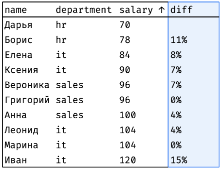
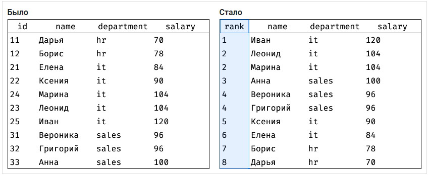
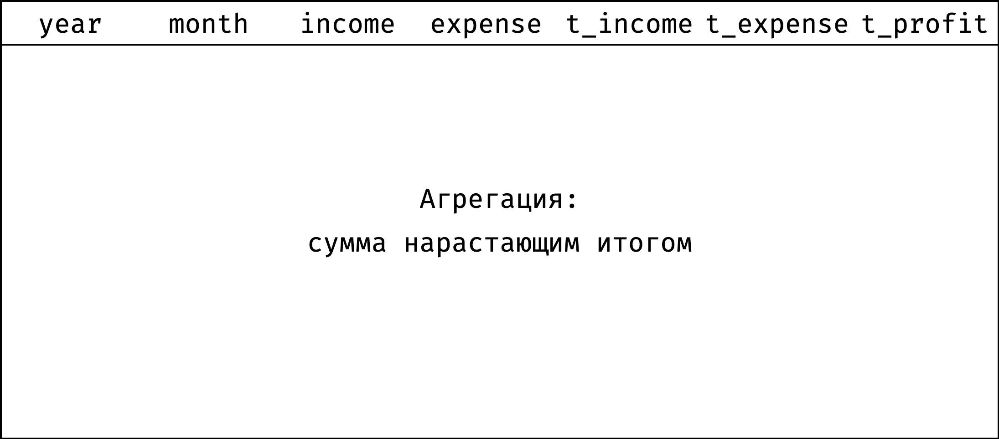
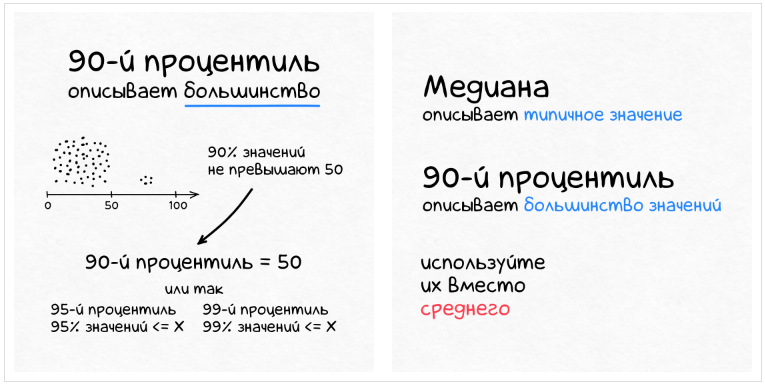

# Введение

Оконные функции помогают делать аналитические отчеты без участия экселя. Опишем основные возможности на примере таблицы:

```
┌────┬──────────┬────────┬────────────┬────────┐
│ id │   name   │  city  │ department │ salary │
├────┼──────────┼────────┼────────────┼────────┤
│ 11 │ Дарья    │ Самара │ hr         │ 70     │
│ 12 │ Борис    │ Самара │ hr         │ 78     │
│ 21 │ Елена    │ Самара │ it         │ 84     │
│ 22 │ Ксения   │ Москва │ it         │ 90     │
│ 23 │ Леонид   │ Самара │ it         │ 104    │
│ 24 │ Марина   │ Москва │ it         │ 104    │
│ 25 │ Иван     │ Москва │ it         │ 120    │
│ 31 │ Вероника │ Москва │ sales      │ 96     │
│ 32 │ Григорий │ Самара │ sales      │ 96     │
│ 33 │ Анна     │ Москва │ sales      │ 100    │
└────┴──────────┴────────┴────────────┴────────┘
```

## Ранжирование

### Общий рейтинг зарплат:


У некоторых сотрудников одинаковые зарплаты - поэтому они получили один и тот же ранг.

### Рейтинг зарплат по департаментам:


### Группы по зарплате:

Разобьем сотрудников на три группы в зависимости от размера зарплаты: высокооплачиваемые, средние, низкооплачиваемые.


### Самые "дорогие" коллеги

Найдем самых высокооплачиваемых людей по каждому департаменту:


## Сравнение со смещением

Сравнение со смещением - это когда мы смотрим, в чем разница между соседними значениями. Например, сравниваем страны, которые занимают 5 и 6 место в мировом рейтинге ВВП - сильно ли отличаются? А если сравнить 1 и 6 место?

Сюда же попадают задачи, в которых мы сравниваем значение из набора с границами набора. Например, есть 100 лучших теннисисток мира. Мария Саккари занимает в рейтинге 20 место. Как ее показатели соотносятся с Эшли Бартли, которая занимает 1 место? А с Лин Чжоу, которая занимает 100 место?

### Разница по зарплате с предыдущим

Упорядочим сотрудников по возрастанию зарплаты и проверим, велик ли разрыв между соседями:



Столбец `diff` показывает, на сколько процентов зарплата сотрудника отличается от предыдущего коллеги.

### Диапазон зарплат в департаменте

Посмотрим, как зарплата сотрудника соотносится с минимальной и максимальной зарплатой в его департаменте:


Для каждого сотрудника столбец `low` показывает минимальную зарплату родного департамента, а столбец `high` - максимальную.

## Агрегация

Агрегация - подсчет суммарных или средних показателей. Например, средняя зарплата по каждому региону или количество золотых медалей у каждой страны в зачете Олимпийских игр.

### Сравнение с фондом оплаты труда

У каждого департамента есть фонд оплаты труда - денежная сумма, которая ежемесячно уходит на выплату зарплат сотрудникам. Посмотрим, какой процент от этого фонда составляет зарплата каждого сотрудника:


Столбец `fund` показывает фонд оплаты труда отдела, а `perc` - долю зарплаты сотрудника от этого фонда.

### Сравнение со средней зарплатой

Интересно, велик ли разброс зарплат в департаментах. Чтобы узнать это, необходимо посчитать отклонение зарплаты каждого сотрудника от средней по департаменту:


## Скользящие агрегаты

Скользящие агрегаты - те же сумма и среднее, только рассчитывают их не по всем элементам набора, а более хитрым способом.

Для примера возьмем таблицу с доходами и расходами одного сотрудника (пусть Марины) за 9 месяцев:

```
┌──────┬───────┬────────┬─────────┐
│ year │ month │ income │ expense │
├──────┼───────┼────────┼─────────┤
│ 2020 │ 1     │ 94     │ 82      │
│ 2020 │ 2     │ 94     │ 75      │
│ 2020 │ 3     │ 94     │ 104     │
│ 2020 │ 4     │ 100    │ 94      │
│ 2020 │ 5     │ 100    │ 99      │
│ 2020 │ 6     │ 100    │ 105     │
│ 2020 │ 7     │ 100    │ 95      │
│ 2020 │ 8     │ 100    │ 110     │
│ 2020 │ 9     │ 104    │ 104     │
└──────┴───────┴────────┴─────────┘
```

### Скользящее среднее по расходам

Судя по данным, доходы у Марины растут: 94К в январе → 104К в сентябре. А вот растут ли расходы? Сходу сложно сказать, месяц на месяц не приходится. Чтобы сгладить эти скачки, используют «скользящее среднее» — для каждого месяца рассчитывают средний расход с учетом предыдущего и следующего месяца. Например:

- скользящее среднее за февраль = (январь + февраль + март) / 3;
- за март = (февраль + март + апрель) / 3;
- за апрель = (март + апрель + май) / 3;
- и так далее.

Скользящее среднее по всем месяцам:


Отсюда видно, что расходы растут.

### Прибыль нарастающим итогом

Благодаря скользящему среднему, мы выяснили, что растут и доходы, и расходы. А как они соотносятся друг с другом? Хочется понять, находится ли человек «в плюсе» или «в минусе» с учетом всех заработанных и потраченных денег.

Причем важно понимать не на конец года, а на каждый месяц. Потому что если по итогам года у Марины все ОК, а в июне ушла в минус — это потенциальная проблема (у компаний такую ситуацию называют «кассовым разрывом»).

Поэтому посчитаем доходы и расходы по месяцам нарастающим итогом (кумулятивно):

- кумулятивный доход за январь = январь;
- за февраль = январь + февраль;
- за март = январь + февраль + март;
- за апрель = январь + февраль + март + апрель;
- и так далее.


Теперь видно, что дела у Марины идут неплохо. В некоторых месяцах расходы превышают доходы, но благодаря накоплениям кассового разрыва не происходит.

# Окна и функции

## Ранжирование

Составим рейтинг сотрудников по размеру зп:



Сотрудники с одинаковой зарплатой получили один и тот же ранг. 

Переход от было к стало:

1. Отсортируем таблицу по убыванию зарплаты

```sql
select null as rank,
       name,
       department,
       salary
from employees
order by salary desc, id;
```

```
┌──────┬──────────┬────────────┬────────┐
│ rank │   name   │ department │ salary │
├──────┼──────────┼────────────┼────────┤
│      │ Иван     │ it         │ 120    │
│      │ Леонид   │ it         │ 104    │
│      │ Марина   │ it         │ 104    │
│      │ Анна     │ sales      │ 100    │
│      │ Вероника │ sales      │ 96     │
│      │ Григорий │ sales      │ 96     │
│      │ Ксения   │ it         │ 90     │
│      │ Елена    │ it         │ 84     │
│      │ Борис    │ hr         │ 78     │
│      │ Дарья    │ hr         │ 70     │
└──────┴──────────┴────────────┴────────┘
```

2. Пройдем от первой строки до последней и проставим ранг каждой записи. Начнем с 1 и будем увеличивать на 1 каждый раз, когда значение `salary` меньше, чем у предыдущей записи:


Чтобы проставить ранг, достаточно на каждом шаге смотреть только на значение `salary` , выделенные синей рамкой. Назовем эти значения *окном*.

Опишем содержимое окна словами:

- это значения столбца `salary`

- упорядоченные от большего к меньшему

То же самое на SQL выглядит так:

```sql
window w as (order by salary desc)
```

- `window` - ключевое слово, которое показывает, что дальше будет определение окна

- `w` - название окна (может быть любым)

- `(order by salary desc)` - описание окна (значения столбца `salary упорядоченные по убыванию`)

Задача - посчитать ранг по окну `w`. На SQL это записывается как `dense_rank() over w`. 

`dense_rank()` - *оконная функция*, которая считает ранг по указанному *окну*. Логика `dense_rank()` такая же, как была у нас при ручном подсчете - начать с 1 и увеличивать ранг каждый раз, когда очередное значение из окна отличается от предыдущего.

Добавим окно и оконную функцию в исходный запрос:

```sql
select
  dense_rank() over w as rank,
  name, department, salary
from employees
window w as (order by salary desc)
order by rank, id;
```

```
┌──────┬──────────┬────────────┬────────┐
│ rank │   name   │ department │ salary │
├──────┼──────────┼────────────┼────────┤
│ 1    │ Иван     │ it         │ 120    │
│ 2    │ Леонид   │ it         │ 104    │
│ 2    │ Марина   │ it         │ 104    │
│ 3    │ Анна     │ sales      │ 100    │
│ 4    │ Вероника │ sales      │ 96     │
│ 4    │ Григорий │ sales      │ 96     │
│ 5    │ Ксения   │ it         │ 90     │
│ 6    │ Елена    │ it         │ 84     │
│ 7    │ Борис    │ hr         │ 78     │
│ 8    │ Дарья    │ hr         │ 70     │
└──────┴──────────┴────────────┴────────┘
```

Вот как движок выполняет такой запрос:

1. Берет таблицу, указанную в `from`

2. Выбирает из нее все записи

3. Для каждой записи рассчитывает значение `dense_rank()` с помощью окна `w`

4. Сортирует результат как указано в `order by`

Конструкция `window` сама по себе ничего не делает с результатами запроса. Она только определяет окно, которое можно использовать в запросе. Если убрать вызов `dense_rank()`, запрос отработает, как будто нет никаких окон. Окно начинает работать только тогда, когда в `select` появляется оконная функция, которая его использует.

**В некоторых СУБД (Oracle и MS SQL Server) не поддерживается конструкция `window`, в них "окно" указывается внутри `over`.**

### Сортировка окна и сортировка результатов

Если из запроса:

```sql
select dense_rank() over w as rank,
       name,
       department,
       salary
from employees
    window w as (order by salary desc)
order by rank, id;
```

убрать `order by`, но оставить в окне:

```sql
select dense_rank() over w as rank,
       name,
       department,
       salary
from employees
    window w as (order by salary desc);
```

то ничего не изменится. Но убирать его просто так нельзя, потому что `order by` в окне задает сортировку окна, а `order by` в запросе - сортировку результатов уже после того, как отработало и окно, и все прочие результаты запроса (`join, where, group by`). 

Допустим, мы хотим проставить ранг по убыванию зарплаты, а отсортировать - наоборот, по возрастанию:

```sql
select dense_rank() over w as rank,
       name,
       department,
       salary
from employees
    window w as (order by salary desc)
order by salary asc;
```

```
┌──────┬──────────┬────────────┬────────┐
│ rank │   name   │ department │ salary │
├──────┼──────────┼────────────┼────────┤
│ 8    │ Дарья    │ hr         │ 70     │
│ 7    │ Борис    │ hr         │ 78     │
│ 6    │ Елена    │ it         │ 84     │
│ 5    │ Ксения   │ it         │ 90     │
│ 4    │ Вероника │ sales      │ 96     │
│ 4    │ Григорий │ sales      │ 96     │
│ 3    │ Анна     │ sales      │ 100    │
│ 2    │ Леонид   │ it         │ 104    │
│ 2    │ Марина   │ it         │ 104    │
│ 1    │ Иван     │ it         │ 120    │
└──────┴──────────┴────────────┴────────┘
```

Видно, что ранг проставился по сортировке окна (`salary desc`), а результат упорядочен по сортировке основного запроса (`salary asc`).

Если вообще не указать `order by` запроса — порядок записей будет не определен.

### Однозначность сортировки

В запросе было указано `order by rank, id`, но зачем нужен `id`? Он нужен для того, чтобы знать, как сортировать сотрудников с одинаковым рангом. Без `id` порядок записей не определен, и СУБД может расположить их в любом порядке. А с `id` все однозначно - внутри одного ранга порядок будет по `id`.

### Несколько окон

Что делать, если необходимо использовать несколько окон в запросе? Можно перечислить их через запятую в разделе `window`:

```sql
select ...
from ...
where ...
window
  w1 as (...),
  w2 as (...),
  w3 as (...);
```

Пример:

Отранжируем сотрудников по зарплате в прямом и обратом порядке:

```sql
select dense_rank() over w1 as r_asc,
       dense_rank() over w2 as r_desc,
       name,
       salary
from employees
    window
        w1 as (order by salary asc),
        w2 as (order by salary desc)
order by salary, id;ary, id;
```

```
┌───────┬────────┬──────────┬────────┐
│ r_asc │ r_desc │   name   │ salary │
├───────┼────────┼──────────┼────────┤
│ 1     │ 8      │ Дарья    │ 70     │
│ 2     │ 7      │ Борис    │ 78     │
│ 3     │ 6      │ Елена    │ 84     │
│ 4     │ 5      │ Ксения   │ 90     │
│ 5     │ 4      │ Вероника │ 96     │
│ 5     │ 4      │ Григорий │ 96     │
│ 6     │ 3      │ Анна     │ 100    │
│ 7     │ 2      │ Леонид   │ 104    │
│ 7     │ 2      │ Марина   │ 104    │
│ 8     │ 1      │ Иван     │ 120    │
└───────┴────────┴──────────┴────────┘
```

### Рейтинг зарплат по департаментам

Составим рейтинг сотрудников по размеру заработной платы независимо по каждому департаменту:


Переход от было к стало:

1. Сортируем таблицу по департаментам, а внутри департамента - по убыванию зарплаты

```sql
select null as rank,
       name,
       department,
       salary
from employees
order by department, salary desc, id;
```

```
┌──────┬──────────┬────────────┬────────┐
│ rank │   name   │ department │ salary │
├──────┼──────────┼────────────┼────────┤
│      │ Борис    │ hr         │ 78     │
│      │ Дарья    │ hr         │ 70     │
│      │ Иван     │ it         │ 120    │
│      │ Леонид   │ it         │ 104    │
│      │ Марина   │ it         │ 104    │
│      │ Ксения   │ it         │ 90     │
│      │ Елена    │ it         │ 84     │
│      │ Анна     │ sales      │ 100    │
│      │ Вероника │ sales      │ 96     │
│      │ Григорий │ sales      │ 96     │
└──────┴──────────┴────────────┴────────┘
```

Теперь пройдем от первой строчки до последней и проставим ранг каждой записи. Начнем с 1 и будем увеличивать ранг каждый раз, когда значение `salary` меньше, чем у предыдущей записи. При переходе от департамента к департаменту будем сбрасывать ранг обратно на 1:


Чтобы проставить ранг, достаточно на каждом шаге смотреть только на значения из столбца `salary`, выделенные синей рамкой. Это и есть *окно* в данном случае.

Видно, что окно меняется в зависимости от того, к какому департаменту относится текущая запись. Опишем словами:

1. Окно разбито на несколько независимых секций - по одной на департамент

2. Внутри секции записи упорядочены по убыванию зарплаты

То же самое на SQL:

```sql
window w as(
    portition by department
    order by salary desc
)
```

- `partition by department` указывает на то, что окно разбивается на секции в соответствии с департаментом

- `order by salary desc` задает сортировку внутри секции

Функция расчета ранга остается прежней - `dense_rank()`.

Добавим окно и оконную функцию в исходный запрос:

```sql
select dense_rank() over w as rank,
       name,
       department,
       salary
from employees
    window w as (
        partition by department
        order by salary desc
        )
order by department, rank, id;
```

```
┌──────┬──────────┬────────────┬────────┐
│ rank │   name   │ department │ salary │
├──────┼──────────┼────────────┼────────┤
│ 1    │ Борис    │ hr         │ 78     │
│ 2    │ Дарья    │ hr         │ 70     │
├──────┼──────────┼────────────┼────────┤
│ 1    │ Иван     │ it         │ 120    │
│ 2    │ Леонид   │ it         │ 104    │
│ 2    │ Марина   │ it         │ 104    │
│ 3    │ Ксения   │ it         │ 90     │
│ 4    │ Елена    │ it         │ 84     │
├──────┼──────────┼────────────┼────────┤
│ 1    │ Анна     │ sales      │ 100    │
│ 2    │ Вероника │ sales      │ 96     │
│ 2    │ Григорий │ sales      │ 96     │
└──────┴──────────┴────────────┴────────┘
```

Вот как движок рассчитывает ранг для каждой записи:


### Группы по зарплате

Разобьем сотрудников на три группы в зависимости от размера зарплаты:

- Высокооплачиваемые

- средние

- низкооплачиваемые


Переход от было к стало:

1. Отсортируем таблицу по убыванию зарплаты

```sql
select null as tile,
       name,
       department,
       salary
from employees
order by salary desc, id;
```

```
┌──────┬──────────┬────────────┬────────┐
│ tile │   name   │ department │ salary │
├──────┼──────────┼────────────┼────────┤
│      │ Иван     │ it         │ 120    │
│      │ Леонид   │ it         │ 104    │
│      │ Марина   │ it         │ 104    │
│      │ Анна     │ sales      │ 100    │
│      │ Вероника │ sales      │ 96     │
│      │ Григорий │ sales      │ 96     │
│      │ Ксения   │ it         │ 90     │
│      │ Елена    │ it         │ 84     │
│      │ Борис    │ hr         │ 78     │
│      │ Дарья    │ hr         │ 70     │
└──────┴──────────┴────────────┴────────┘
```

Всего 10 записей, 3 группы — значит, две группы по 3 записи и одна 4 записи. Например, так:

```
┌──────┬──────────┬────────────┬────────┐
│ tile │   name   │ department │ salary │
├──────┼──────────┼────────────┼────────┤
│      │ Иван     │ it         │ 120    │
│      │ Леонид   │ it         │ 104    │
│      │ Марина   │ it         │ 104    │
│      │ Анна     │ sales      │ 100    │
├──────┼──────────┼────────────┼────────┤
│      │ Вероника │ sales      │ 96     │
│      │ Григорий │ sales      │ 96     │
│      │ Ксения   │ it         │ 90     │
├──────┼──────────┼────────────┼────────┤
│      │ Елена    │ it         │ 84     │
│      │ Борис    │ hr         │ 78     │
│      │ Дарья    │ hr         │ 70     │
└──────┴──────────┴────────────┴────────┘
```

Чтобы провести границы между группами, придется анализировать все зарплаты, отсортированные по убиванию. Поэтому окно будет таким:

```sql
window w as (order by salary desc)
```

А функция потребуется другая - `ntile(n)`, где `n` - количество групп. В нашем случае:

```sql
select ntile(3) over w as tile,
       name,
       department,
       salary
from employees
    window w as (order by salary desc)
order by
    salary desc,
    id;
```

```
┌──────┬──────────┬────────────┬────────┐
│ tile │   name   │ department │ salary │
├──────┼──────────┼────────────┼────────┤
│ 1    │ Иван     │ it         │ 120    │
│ 1    │ Леонид   │ it         │ 104    │
│ 1    │ Марина   │ it         │ 104    │
│ 1    │ Анна     │ sales      │ 100    │
├──────┼──────────┼────────────┼────────┤
│ 2    │ Вероника │ sales      │ 96     │
│ 2    │ Григорий │ sales      │ 96     │
│ 2    │ Ксения   │ it         │ 90     │
├──────┼──────────┼────────────┼────────┤
│ 3    │ Елена    │ it         │ 84     │
│ 3    │ Борис    │ hr         │ 78     │
│ 3    │ Дарья    │ hr         │ 70     │
└──────┴──────────┴────────────┴────────┘
```

`ntile(n)` разбивает все записи на `n` групп и возвращает номер группы для каждой записи. Если общее количество записей (у нас 10) не делится на размер группы (мы указали 3), то в первых **K** групп из **N**, где **N** параметр `ntile()` будет ровно на 1 строку больше, если количество строк не делится на **N** и дает остаток **K**)

`ntile(n)` всегда старается разбить данные так, чтобы группы были одинакового размера. Поэтому записи с одинаковым значением могут попасть в соседние группы:

```sql
select ntile(2) over w as tile,
       name,
       department,
       salary
from employees
    window w as (order by salary desc, id)
order by
    salary desc,
    tile;
```

```
┌──────┬──────────┬────────────┬────────┐
│ tile │   name   │ department │ salary │
├──────┼──────────┼────────────┼────────┤
│ 1    │ Иван     │ it         │ 120    │
│ ...                                   │
│ 1    │ Вероника │ sales      │ 96     │ <--
├──────┼──────────┼────────────┼────────┤
│ 2    │ Григорий │ sales      │ 96     │ <--
│ ...                                   │
│ 2    │ Дарья    │ hr         │ 70     │
└──────┴──────────┴────────────┴────────┘
```

### Функция ранжирования

Оконные функции ранжирования:

| Функция        | Описание                                                                             |
| -------------- | ------------------------------------------------------------------------------------ |
| `row_number()` | порядковый номер строки в секции окна                                                |
| `dense_rank()` | ранг строки                                                                          |
| `rank()`       | тоже ранг, но с пропусками                                                           |
| `ntile(n)`     | разбивает все строки на `n` групп и возвращает номер группы, в которую попала строка |

`row_number()` нумерует строки в порядке, указанном в `order by`.

`rank()` похож на `dense_rank()` разница в том, что `rank()` может пропускать номера:


`dense_rank()` назначает Анне третье место, а `rank()` — четвертое, потому что второе-третье уже заняты Леонидом и Мариной. Аналогично с Ксенией после Вероники и Григория.

## Смещение

### Сравнение со смещением

Сравнение со смещением - это когда смотрят на разницу между соседними значениями. Сюда же попадают задачи, в которых мы сравниваем значение из набора с границами набора.

### Разница по зарплате с предыдущим

Упорядочим сотрудников по возрастанию зарплаты и проверим, велик ли разрыв между соседями:


Столбец `diff` показывает, на сколько процентов зарплата сотрудника отличается от предыдущего коллеги.

Переход от было к стало:

1. Сортируем таблицу по возрастанию зарплаты

```sql
select name,
       department,
       salary,
       null as prev
from employees
order by
    salary,
    id;
```

```
┌──────────┬────────────┬────────┬──────┐
│   name   │ department │ salary │ prev │
├──────────┼────────────┼────────┼──────┤
│ Дарья    │ hr         │ 70     │      │
│ Борис    │ hr         │ 78     │      │
│ Елена    │ it         │ 84     │      │
│ Ксения   │ it         │ 90     │      │
│ Вероника │ sales      │ 96     │      │
│ Григорий │ sales      │ 96     │      │
│ Анна     │ sales      │ 100    │      │
│ Леонид   │ it         │ 104    │      │
│ Марина   │ it         │ 104    │      │
│ Иван     │ it         │ 120    │      │
└──────────┴────────────┴────────┴──────┘
```

Теперь пройдем от первой строки до последней, на каждом шаге подтягивая зарплату предыдущего сотрудника:


Видно, что в данном случае окно скользит. Но у такого окна сложный синтаксис, поэтому оно рассматривается дальше.

Вместо этого возьмем просто окно - все записи, упорядоченные по возрастанию `salary`.

```sql
window w as (order by salary)
```

А чтобы на каждом шаге подтягивать зарплату предыдущего сотрудника, будем использовать оконную функцию `lag(attribute, n)`. Функция `lag()` возвращает значение из указанного столбца, отстоящее от текущего на указанное количество записей назад.

Добавляем окно и оконную функцию в исходный запрос:

```sql
select id,
       name,
       department,
       salary,
       lag(salary, 1) over w as prev
from employees
    window w as (order by salary, id)
order by
    salary,
    id;
```

```
┌────┬──────────┬────────────┬────────┬──────┐
│ id │   name   │ department │ salary │ prev │
├────┼──────────┼────────────┼────────┼──────┤
│ 11 │ Дарья    │ hr         │ 70     │      │
│ 12 │ Борис    │ hr         │ 78     │ 70   │
│ 21 │ Елена    │ it         │ 84     │ 78   │
│ 22 │ Ксения   │ it         │ 90     │ 84   │
│ 31 │ Вероника │ sales      │ 96     │ 90   │
│ 32 │ Григорий │ sales      │ 96     │ 96   │
│ 33 │ Анна     │ sales      │ 100    │ 96   │
│ 23 │ Леонид   │ it         │ 104    │ 100  │
│ 24 │ Марина   │ it         │ 104    │ 104  │
│ 25 │ Иван     │ it         │ 120    │ 104  │
└────┴──────────┴────────────┴────────┴──────┘
```

Теперь остается посчитать разницу между `prev` и `salary` в процентах:

```sql
with emp as (select id,
                    name,
                    department,
                    salary,
                    lag(salary, 1) over w as prev
             from employees
                 window w as (order by salary, id))
select name,
       department,
       salary,
       round((salary - prev) * 100.0 / prev) as diff
from emp
order by
    salary,
    id;salary, id;
```

```
┌──────────┬────────────┬────────┬──────┐
│   name   │ department │ salary │ diff │
├──────────┼────────────┼────────┼──────┤
│ Дарья    │ hr         │ 70     │      │
│ Борис    │ hr         │ 78     │ 11.0 │
│ Елена    │ it         │ 84     │ 8.0  │
│ Ксения   │ it         │ 90     │ 7.0  │
│ Вероника │ sales      │ 96     │ 7.0  │
│ Григорий │ sales      │ 96     │ 0.0  │
│ Анна     │ sales      │ 100    │ 4.0  │
│ Леонид   │ it         │ 104    │ 4.0  │
│ Марина   │ it         │ 104    │ 0.0  │
│ Иван     │ it         │ 120    │ 15.0 │
└──────────┴────────────┴────────┴──────┘
```

Можно избавиться от промежуточной таблицы `emp`, подставив вместо `prev` вызов оконной функции:

```sql
select name,
       department,
       salary,
       round(
               (salary - lag(salary, 1) over w) * 100.0 / lag(salary, 1) over w
           ) as diff
from employees
    window w as (order by salary, id)
order by
    salary,
    id;
```

Здесь мы заменили `prev` → `lag(salary, 1) over w`. Конструкцию вида `function_name(...) over window_name` движок заменяет на конкретное значение, которое вернула функция. Так что оконную функцию можно вызывать прямо внутри вычислений, и вы не раз встретите такие запросы в документации и примерах.

### Диапазон зарплат в департаменте

Посмотрим, как зарплата сотрудника соотносится с минимальной и максимальной зарплатой в его департаменте:


Для каждого сотрудника столбец `low` показывает минимальную зарплату родного департамента, а столбец `high` — максимальную.

Переход от было к стало:

1. Сортируем таблицу по департаментам, а внутри каждого департамента - по возрастанию зарплаты

```sql
select name,
       department,
       salary,
       null as low,
       null as high
from employees
order by
    department,
    salary,
    id;
```

```
┌──────────┬────────────┬────────┬─────┬──────┐
│   name   │ department │ salary │ low │ high │
├──────────┼────────────┼────────┼─────┼──────┤
│ Дарья    │ hr         │ 70     │     │      │
│ Борис    │ hr         │ 78     │     │      │
│ Елена    │ it         │ 84     │     │      │
│ Ксения   │ it         │ 90     │     │      │
│ Леонид   │ it         │ 104    │     │      │
│ Марина   │ it         │ 104    │     │      │
│ Иван     │ it         │ 120    │     │      │
│ Вероника │ sales      │ 96     │     │      │
│ Григорий │ sales      │ 96     │     │      │
│ Анна     │ sales      │ 100    │     │      │
└──────────┴────────────┴────────┴─────┴──────┘
```

Теперь пройдем от первой строчки до последней, на каждом шаге «подтягивая» наименьшую и наибольшую зарплаты в отделе:


Окно состоит из трех секций. Секция на каждом шаге охватывает весь департамент сотрудника. Записи упорядочены по возрастанию зарплаты внутри департамента, чтобы минимальная и максимальная зарплаты всегда находились на границах секции:

```sql
window w as (
  partition by department
  order by salary
)
```

`lag()` и `lead()` в данном случае не подойдут, потому что они заглядывают на определенное количество записей назад или вперед. 

Нам же нужны такие параметры:

- `low` - зарплата первого сотрудника, входящего в секцию окна

- `high` - зарплата последнего сотрудника, входящего в секцию окна

Для них можно воспользоваться специальным оконными функциями:

```sql
first_value(salary) over w as low,
last_value(salary) over w as high
```

Добавляем окно и оконную функцию в исходный запрос:

```sql
select name,
       department,
       salary,
       first_value(salary) over w as low,
       last_value(salary) over w  as high
from employees
    window w as (
        partition by department
        order by salary
        )
order by
    department,
    salary,
    id;
```

```
┌──────────┬────────────┬────────┬─────┬──────┐
│   name   │ department │ salary │ low │ high │
├──────────┼────────────┼────────┼─────┼──────┤
│ Дарья    │ hr         │ 70     │ 70  │ 70   │
│ Борис    │ hr         │ 78     │ 70  │ 78   │
├──────────┼────────────┼────────┼─────┼──────┤
│ Елена    │ it         │ 84     │ 84  │ 84   │
│ Ксения   │ it         │ 90     │ 84  │ 90   │
│ Леонид   │ it         │ 104    │ 84  │ 104  │
│ Марина   │ it         │ 104    │ 84  │ 104  │
│ Иван     │ it         │ 120    │ 84  │ 120  │
├──────────┼────────────┼────────┼─────┼──────┤
│ Вероника │ sales      │ 96     │ 96  │ 96   │
│ Григорий │ sales      │ 96     │ 96  │ 96   │
│ Анна     │ sales      │ 100    │ 96  │ 100  │
└──────────┴────────────┴────────┴─────┴──────┘
```

Для `low` все отработало как нужно, а для `high` нет. Ниже разбор почему так.

### Окно, секция, фрейм

До сих пор все было логично:

- есть окно, которое состоит из одной или нескольких секций

- внутри секции записи упорядочены по конкретному столбцу

На предыдущем шаге мы разделили окно на три секции - по департаментам, и упорядочили записи в секциях по зарплате:

```sql
window w as (
  partition by department
  order by salary
)
```

Допустим, движок выполняет запрос, и текущая запись — Леонид из it-отдела. Мы ожидаем, что `first_value()` вернет первую запись it-секции (`salary = 84`), а `last_value()` — последнюю (`salary = 120`):


Вместо этого `last_value()` возвращает `salary = 104`:


Дело в том, что функции `first_value()` и `last_value()` работают не просто с секцией окна, они работают с **фреймом** внутри секции:


Фрейм находится в той же секции, где текущая запись (Леонид):

- начало фрейма = начало секции (Елена)

- конец фрейма = последняя запись со значением `salary`, равным текущей записи (Марина)

Секция фиксирована, фрейм же зависит от текущей записи и постоянно меняется:

**Секция**


**Фрейм**


`first_value()` возвращает первую строчку фрейма, а не секции. Но поскольку начало фрейма совпадает с началом секции, функция отрабатывает как мы ожидали.

`last_value()` возвращает последнюю строчку фрейма, а не секции. Именно поэтому в нашем запросе она вернула не максимальную зарплату для каждого отдела, а какую-то ерунду.

Чтобы `last_value()` работала как мы ожидаем, придется «прибить» границы фрейма к границам секции. Тогда для каждой секции фрейм будет в точности совпадать с ней:


Подытожим принцип, по которому работают `first_value()` и `last_value()`:

1. Есть *окно*, которое состоит из одной или нескольких *секций* (`partition by department`).
2. Внутри секции записи упорядочены по конкретному столбцу (`order by salary`).
3. У каждой записи в секции свой *фрейм*. По умолчанию начало фрейма совпадает с началом секции, а конец для каждой записи свой.
4. Конец фрейма можно приклеить к концу секции, чтобы фрейм в точности совпадал с секцией.
5. Функция `first_value()` возвращает значение из первой строки фрейма.
6. Функция `last_value()` возвращает значение из последней строки фрейма.

Теперь разберемся, как прибить фрейм к окну — и закончим с запросом по диапазону зарплат в департаментах.

### Диапазон зарплат в департаменте, окончание

Чтобы фрейм в точности совпадал с секцией (департаментом) нужно изменить определение окна так:

```sql
window w as (
  partition by department
  order by salary
  rows between unbounded preceding and unbounded following
)
```

Благодаря конструкции `rows between` фрейм совпадает с секцией. Подробнее эта конструкция рассматривается позже.

Окончательный вид нашего запроса:

```sql
select name,
       department,
       salary,
       first_value(salary) over w as low,
       last_value(salary) over w  as high
from employees
    window w as (
        partition by department
        order by salary
        rows between unbounded preceding and unbounded following
        )
order by
    department,
    salary,
    id;
```

```
┌──────────┬────────────┬────────┬─────┬──────┐
│   name   │ department │ salary │ low │ high │
├──────────┼────────────┼────────┼─────┼──────┤
│ Дарья    │ hr         │ 70     │ 70  │ 78   │
│ Борис    │ hr         │ 78     │ 70  │ 78   │
├──────────┼────────────┼────────┼─────┼──────┤
│ Елена    │ it         │ 84     │ 84  │ 120  │
│ Ксения   │ it         │ 90     │ 84  │ 120  │
│ Леонид   │ it         │ 104    │ 84  │ 120  │
│ Марина   │ it         │ 104    │ 84  │ 120  │
│ Иван     │ it         │ 120    │ 84  │ 120  │
├──────────┼────────────┼────────┼─────┼──────┤
│ Вероника │ sales      │ 96     │ 96  │ 100  │
│ Григорий │ sales      │ 96     │ 96  │ 100  │
│ Анна     │ sales      │ 100    │ 96  │ 100  │
└──────────┴────────────┴────────┴─────┴──────┘
```

### Функции смещения

| Функция               | Описание                                                              |
| --------------------- | --------------------------------------------------------------------- |
| `lag(value, offset)`  | значение value из строки, отстоящей на offset строк назад от текущей  |
| `lead(value, offset)` | значение value из строки, отстоящей на offset строк вперед от текущей |
| `first_value(value)`  | значение value из первой строки фрейма                                |
| `last_value(value)`   | значение value из последней строки фрейма                             |
| `nth_value(value, n)` | значение value из `n`-й строки фрейма                                 |

## Агрегация

Агрегация - подсчет суммарных или средних показателей. Например средняя зарплата по региону.

### Сравнение с фондом оплаты труда

У каждого департамента есть фонд оплаты труда — денежная сумма, которая ежемесячно уходит на выплату зарплат сотрудникам. Посмотрим, какой процент от этого фонда составляет зарплата каждого сотрудника:


Столбец `fund` показывает фонд оплаты труда отдела, а `perc` — долю зарплаты сотрудника от этого фонда.

Переход от было к стало:

1. Отсортируем таблицу по департаментам

```sql
select name,
       department,
       salary,
       null as fund,
       null as perc
from employees
order by
    department,
    salary,
    id;
```

```
┌──────────┬────────────┬────────┬──────┬──────┐
│   name   │ department │ salary │ fund │ perc │
├──────────┼────────────┼────────┼──────┼──────┤
│ Дарья    │ hr         │ 70     │      │      │
│ Борис    │ hr         │ 78     │      │      │
│ Елена    │ it         │ 84     │      │      │
│ Ксения   │ it         │ 90     │      │      │
│ Леонид   │ it         │ 104    │      │      │
│ Марина   │ it         │ 104    │      │      │
│ Иван     │ it         │ 120    │      │      │
│ Вероника │ sales      │ 96     │      │      │
│ Григорий │ sales      │ 96     │      │      │
│ Анна     │ sales      │ 100    │      │      │
└──────────┴────────────┴────────┴──────┴──────┘
```

2. Проходим от первой строки до последней и считаем:
- `fund` - сумма зарплат по департаменту в целом (одинакова для всех сотрудников департамента)

- `perc` - доля зарплаты сотрудника от ФОТ


Окно состоит из секций по департаментам. При этом порядок записей в секции неважен: мы считаем сумму значений `salary`, а она не зависит от порядка.

```sql
window w as (
  partition by department
)
```

Для расчета `fund` подойдет обычная функция `sum()` — ее можно использовать поверх окна. А `perc` посчитаем как `salary / fund`:

```sql
select name,
       department,
       salary,
       sum(salary) over w                         as fund,
       round(salary * 100.0 / sum(salary) over w) as perc
from employees
    window w as (partition by department)
order by
    department,
    salary,
    id;
```

```
┌──────────┬────────────┬────────┬──────┬──────┐
│   name   │ department │ salary │ fund │ perc │
├──────────┼────────────┼────────┼──────┼──────┤
│ Дарья    │ hr         │ 70     │ 148  │ 47.0 │
│ Борис    │ hr         │ 78     │ 148  │ 53.0 │
├──────────┼────────────┼────────┼──────┼──────┤
│ Елена    │ it         │ 84     │ 502  │ 17.0 │
│ Ксения   │ it         │ 90     │ 502  │ 18.0 │
│ Леонид   │ it         │ 104    │ 502  │ 21.0 │
│ Марина   │ it         │ 104    │ 502  │ 21.0 │
│ Иван     │ it         │ 120    │ 502  │ 24.0 │
├──────────┼────────────┼────────┼──────┼──────┤
│ Вероника │ sales      │ 96     │ 292  │ 33.0 │
│ Григорий │ sales      │ 96     │ 292  │ 33.0 │
│ Анна     │ sales      │ 100    │ 292  │ 34.0 │
└──────────┴────────────┴────────┴──────┴──────┘
```

Функция `sum()` считает сумму значений по всей секции, которой принадлежит текущая строка.

### Фильтрация и порядок выполнения

Вернемся к запросу, который считал фонд оплаты труда по департаменту:

```sql
select name,
       department,
       salary,
       sum(salary) over w as fund
from employees
    window w as (partition by department)
order by
    department,
    salary,
    id;
```

```
┌──────────┬────────────┬────────┬──────┐
│   name   │ department │ salary │ fund │
├──────────┼────────────┼────────┼──────┤
│ Дарья    │ hr         │ 70     │ 148  │
│ Борис    │ hr         │ 78     │ 148  │
│ Елена    │ it         │ 84     │ 502  │
│ Ксения   │ it         │ 90     │ 502  │
│ Леонид   │ it         │ 104    │ 502  │
│ Марина   │ it         │ 104    │ 502  │
│ Иван     │ it         │ 120    │ 502  │
│ Вероника │ sales      │ 96     │ 292  │
│ Григорий │ sales      │ 96     │ 292  │
│ Анна     │ sales      │ 100    │ 292  │
└──────────┴────────────┴────────┴──────┘
```

Допустим, мы хотим оставить в отчете только самарских сотрудников. Добавим фильтр:

```sql
select name,
       department,
       salary,
       sum(salary) over w as fund
from employees 
where
    city = 'Самара'
    window w as (partition by department)
order by
    department,
    salary,
    id;
```

```
┌──────────┬────────┬──────┐
│   name   │ salary │ fund │
├──────────┼────────┼──────┤
│ Дарья    │ 70     │ 148  │
│ Борис    │ 78     │ 148  │
│ Елена    │ 84     │ 188  │
│ Леонид   │ 104    │ 188  │
│ Григорий │ 96     │ 96   │
└──────────┴────────┴──────┘
```

Фильтр сработал. Вот только значения `fund` отличаются от ожидаемых:


Все дело в порядке выполнения операций. Вот в какой последовательности действует движок, когда выполняет запрос:

1. Взять нужные таблицы (`from`) и соединить их при необходимости (`join`).
2. Отфильтровать строки (`where`).
3. Сгруппировать строки (`group by`).
4. Отфильтровать результат группировки (`having`).
5. Взять конкретные столбцы из результата (`select`).
6. **Рассчитать значения оконных функций** (`function() over window`).
7. Отсортировать то, что получилось (`order by`).

Таким образом, окна отрабатывают предпоследним шагом, уже после фильтрации и группировки результатов. Поэтому в нашем запросе `fund` отражает не сумму всех зарплат по департаменту, а сумму только по самарским сотрудникам.

Решение — использовать подзапрос с окном и фильтровать его в основном запросе:

```sql
with emp as (select name,
                    city,
                    salary,
                    sum(salary) over w as fund
             from employees
                 window w as (partition by department)
             order by department, salary, id)
select name, salary, fund
from emp
where city = 'Самара';
```

```
┌──────────┬────────┬──────┐
│   name   │ salary │ fund │
├──────────┼────────┼──────┤
│ Дарья    │ 70     │ 148  │
│ Борис    │ 78     │ 148  │
│ Елена    │ 84     │ 502  │
│ Леонид   │ 104    │ 502  │
│ Григорий │ 96     │ 292  │
└──────────┴────────┴──────┘
```

### Описание окна

До сих пор мы описывали окно в блоке `window` и ссылались на него в выражении `over`:

```sql
select name,
       department,
       salary,
       count(*) over w    as emp_count,
       sum(salary) over w as fund
from employees
    window w as (partition by department)
order by
    department,
    salary,
    id;
```

```
┌──────────┬────────────┬────────┬───────────┬──────┐
│   name   │ department │ salary │ emp_count │ fund │
├──────────┼────────────┼────────┼───────────┼──────┤
│ Дарья    │ hr         │ 70     │ 2         │ 148  │
│ Борис    │ hr         │ 78     │ 2         │ 148  │
│ Елена    │ it         │ 84     │ 5         │ 502  │
│ Ксения   │ it         │ 90     │ 5         │ 502  │
│ Леонид   │ it         │ 104    │ 5         │ 502  │
│ Марина   │ it         │ 104    │ 5         │ 502  │
│ Иван     │ it         │ 120    │ 5         │ 502  │
│ Вероника │ sales      │ 96     │ 3         │ 292  │
│ Григорий │ sales      │ 96     │ 3         │ 292  │
│ Анна     │ sales      │ 100    │ 3         │ 292  │
└──────────┴────────────┴────────┴───────────┴──────┘
```

Это не единственный способ. SQL разрешает вообще не использовать `window` и описывать окно прямо внутри `over`:

```sql
select name,
       department,
       salary,
       count(*) over (partition by department)    as emp_count,
       sum(salary) over (partition by department) as fund
from employees
order by
    department,
    salary,
    id;
```

Вариант с `window` легче читается и окно более явно переиспользуется.

Определение окна также может быть пустым:

```sql
select name,
       department,
       salary,
       count(*) over ()    as emp_count,
       sum(salary) over () as fund
from employees
order by
    department,
    salary,
    id;
```

Такое окно включает все строки, так что `emp_count` покажет общее количество сотрудников, а `fund` — общий фонд оплаты труда по всем записям `employees`.

### Функции агрегации

| Функция                          | Описание                                                                                                 |
| -------------------------------- | -------------------------------------------------------------------------------------------------------- |
| `min(value)`                     | минимальное `value` среди строк, входящих в окно                                                         |
| `max(value)`                     | максимальное `value`                                                                                     |
| `count(value)`                   | количество `value`, не равных `null`                                                                     |
| `avg(value)`                     | среднее значение по всем `value`                                                                         |
| `sum(value)`                     | сумма значений `value`                                                                                   |
| `group_concat(value, separator)` | строка, которая соединяет значения `value` через разделитель `separator` поддерживается в SQLite и MySQL |
| `string_agg(value, separator)`   | аналог `group_concat()` в PostgreSQL и MS SQL                                                            |

## Скользящие агрегаты

Скользящие агрегаты — это те же сумма и среднее, только скользящие (sic!).

### Скользящее среднее по расходам

Рассчитаем скользящее среднее по расходам:


Столбец `roll_avg` показывает скользящее среднее по расходам за три месяца (предыдущий, текущий, следующий).

Переход от было к стало:

1. Отсортируем таблицу по месяцам

```sql
select year,
       month,
       expense,
       null as roll_avg
from expenses
order by
    year,
    month;
```

```
┌──────┬───────┬─────────┬──────────┐
│ year │ month │ expense │ roll_avg │
├──────┼───────┼─────────┼──────────┤
│ 2020 │ 1     │ 82      │          │
│ 2020 │ 2     │ 75      │          │
│ 2020 │ 3     │ 104     │          │
│ 2020 │ 4     │ 94      │          │
│ 2020 │ 5     │ 99      │          │
│ 2020 │ 6     │ 105     │          │
│ 2020 │ 7     │ 95      │          │
│ 2020 │ 8     │ 110     │          │
│ 2020 │ 9     │ 104     │          │
└──────┴───────┴─────────┴──────────┘
```

2. Теперь пройдем от первой строчки до последней. На каждом шаге будем считать среднее по предыдущему, текущему и следующему значению из столбца `expense`:


Рамка на каждом шаге сдвигается вниз, скользит — так и получается скользящее среднее. Чтобы описать на SQL, придется вспомнить концепцию фреймов, с которой мы познакомились на уроке о смещении:

1. Окно состоит из одной или нескольких секций (в нашем случае секция одна — все записи `expenses`).

2. Внутри секции записи упорядочены по конкретным столбцам (`order by year, month`).

3. У каждой записи свой фрейм.

Фрейм на каждом шаге охватывает три записи — текущую, предыдущую и следующую. Вот как это записать в SQL:

```sql
window w as (
  order by year, month
  rows between 1 preceding and 1 following
)
```

Вторая строчка - это определение фрейма: «выбрать строки от 1 предыдущей до 1 следующей». 

Для средней по расходам используем `avg()`:

```sql
avg(expense) over w
```

3. Добавляем округление и используем окно в исходном запросе:

```sql
select year,
       month,
       expense,
       round(avg(expense) over w) as roll_avg
from expenses
    window w as (
        order by year, month
        rows between 1 preceding and 1 following
        )
order by
    year,
    month;
```

```
┌──────┬───────┬─────────┬──────────┐
│ year │ month │ expense │ roll_avg │
├──────┼───────┼─────────┼──────────┤
│ 2020 │ 1     │ 82      │ 79.0     │
│ 2020 │ 2     │ 75      │ 87.0     │
│ 2020 │ 3     │ 104     │ 91.0     │
│ 2020 │ 4     │ 94      │ 99.0     │
│ 2020 │ 5     │ 99      │ 99.0     │
│ 2020 │ 6     │ 105     │ 100.0    │
│ 2020 │ 7     │ 95      │ 103.0    │
│ 2020 │ 8     │ 110     │ 103.0    │
│ 2020 │ 9     │ 104     │ 107.0    │
└──────┴───────┴─────────┴──────────┘
```

Скользящее среднее по расходам готово.

### Фрейм

В общем случае определение фрейма выглядит так:

```sql
rows between X preceding and Y following
```

где `X` - количество строк перед текущей, а `Y` - количество строк после текущей.

Если вместо `X` или `Y` указать `unbounded` - это будет значить, что нужно брать фрейм по размеру секции.

Также вместо `X preceding` или `Y following` можно указать `current row` - тогда фрейм будет ограничен текущей записью.

Фрейм никогда не выходит за границы секции, если столкнулся с ней - обрезается.

### Прибыль нарастающим итогом

Благодаря скользящему среднему мы выяснили, что в таблице `expenses` растут и доходы, и расходы. Теперь посчитаем доходы и расходы по месяцам нарастающим итогом (кумулятивно).


`t_income` показывает доходы нарастающим итогом, `t_expense` - расходы, а `t_profit` - прибыль

$$
t_{profit} = t_{income} - t_{expense}
$$

1. Отсортируем таблицу по месяцам

```sql
select year,
       month,
       income,
       expense,
       null as t_income,
       null as t_expense,
       null as t_profit
from expenses
order by
    year,
    month;
```

2. Пройдем от первой строчки до последней. На каждом шаге будем считать суммарные показатели от начала таблицы до текущей строки



Фрейм такого типа выглядит следующим образом:

```sql
window w as (
    order by year, month
    rows between unbounded preceding and current row
)
```

3. Все вместе:

```sql
select year,
       month,
       income,
       expense,
       sum(income) over w                           as t_income,
       sum(expense) over w                          as t_expense,
       (sum(income) over w) - (sum(expense) over w) as t_profit
from expenses
    window w as (
        order by year, month
        rows between unbounded preceding and current row
        )
order by
    year,
    month;
```

```
┌──────┬───────┬────────┬─────────┬──────────┬───────────┬──────────┐
│ year │ month │ income │ expense │ t_income │ t_expense │ t_profit │
├──────┼───────┼────────┼─────────┼──────────┼───────────┼──────────┤
│ 2020 │ 1     │ 94     │ 82      │ 94       │ 82        │ 12       │
│ 2020 │ 2     │ 94     │ 75      │ 188      │ 157       │ 31       │
│ 2020 │ 3     │ 94     │ 104     │ 282      │ 261       │ 21       │
│ 2020 │ 4     │ 100    │ 94      │ 382      │ 355       │ 27       │
│ 2020 │ 5     │ 100    │ 99      │ 482      │ 454       │ 28       │
│ 2020 │ 6     │ 100    │ 105     │ 582      │ 559       │ 23       │
│ 2020 │ 7     │ 100    │ 95      │ 682      │ 654       │ 28       │
│ 2020 │ 8     │ 100    │ 110     │ 782      │ 764       │ 18       │
│ 2020 │ 9     │ 104    │ 104     │ 886      │ 868       │ 18       │
└──────┴───────┴────────┴─────────┴──────────┴───────────┴──────────┘
```

### Фрейм по умолчанию

Возьмем запрос, который считает расходы нарастающим итогом:

```sql
select year,
       month,
       expense,
       sum(expense) over w as total
from expenses
    window w as (
        order by year, month
        rows between unbounded preceding and current row
        )
order by
    year,
    month;
```

```
┌──────┬───────┬─────────┬───────┐
│ year │ month │ expense │ total │
├──────┼───────┼─────────┼───────┤
│ 2020 │ 1     │ 82      │ 82    │
│ 2020 │ 2     │ 75      │ 157   │
│ 2020 │ 3     │ 104     │ 261   │
│ 2020 │ 4     │ 94      │ 355   │
│ 2020 │ 5     │ 99      │ 454   │
│ 2020 │ 6     │ 105     │ 559   │
│ 2020 │ 7     │ 95      │ 654   │
│ 2020 │ 8     │ 110     │ 764   │
│ 2020 │ 9     │ 104     │ 868   │
└──────┴───────┴─────────┴───────┘
```

Уберем из него определение фрейма:

```sql
select year,
       month,
       expense,
       sum(expense) over w as total
from expenses
    window w as (
        order by year, month
        )
order by
    year,
    month;
```

Ожидаем, что в `total` теперь всегда будет одно и то же число — суммарные расходы за 9 месяцев. А вместо этого видим вот что:


Запрос без фрейма все равно посчитал кумулятивные расходы — в точности как запрос с фреймом. Так произошло из-за наличия сортировки в окне. Правило такое:

если в окне есть `order by` и используется функция агрегации и не указано определение фрейма, то используется фрейм по умолчанию.

Фрейм по умолчанию в нашем запросе распространяется от первой записи до текущей. Поэтому результаты совпадают с запросом, где фрейм был указан явно `rows between unbounded preceding and current row`. Лучше всегда указывать фрейм явно, даже если есть `order by` и дефолтный фрейм подходит.

### Функции для скользящих агрегатов

Скользящие агрегаты используют те же самые функции, что и агрегаты обычные:

- `min() / max()`

- `count(), avg(), sum()`

- `group_concat()`

Отличие только в наличии фрейма у скользящих агрегатов.

## Статистика

Когда речь идет о числовых показателях (зарплата сотрудника, температура воздуха, время ответа сервиса), нам часто интересно понять место отдельного значения в ряду других — чтобы понять, насколько оно «хорошее» или «плохое».

### cume_dist()

Возьмем зарплату каждого сотрудника и определим, какой процент людей получает столько же или меньше:


Рассчитать такое в SQL поможет функция `cume_dist()`:

```sql
select name,
       salary,
       cume_dist() over w as perc
from employees
    window w as (order by salary)
order by
    salary,
    id;
```

```
┌──────────┬────────┬───────┐
│   name   │ salary │ perc  │
├──────────┼────────┼───────┤
│ Дарья    │ 70     │ 0.1   │
│ Борис    │ 78     │ 0.2   │
│ Елена    │ 84     │ 0.3   │
│ Ксения   │ 90     │ 0.4   │
│ Вероника │ 96     │ 0.6   │
│ Григорий │ 96     │ 0.6   │
│ Анна     │ 100    │ 0.7   │
│ Леонид   │ 104    │ 0.9   │
│ Марина   │ 104    │ 0.9   │
│ Иван     │ 120    │ 1.0   │
└──────────┴────────┴───────┘
```

Вот что делает `cume_dist()` :

1. Располагает записи в порядке, указанном в order by окна (в нашем случае — по возрастанию зарплаты).
2. Находит текущую запись в общем ряду (зарплату текущего сотрудника среди всех зарплат).
3. Считает, сколько записей ≤ текущей по значению столбца из order by (сколько людей получают такую же или меньшую зарплату).
4. Делит на общее количество записей (на количество сотрудников).

```
cume_dist = количество записей ≤ текущей / общее количество записей
```

В результате `cume_dist` возвращает процент записей со значением ≤ текущего (процент людей, которые получают такую же или меньшую зарплату).

### percent_rank()

Зададимся похожим вопросом: какой процент людей получает *строго меньше*, чем конкретный сотрудник? В ответе на это вопрос поможет функция `percent_rank()`:

```sql
select name,
       salary,
       round(percent_rank() over w, 2) as perc
from employees
    window w as (order by salary)
order by
    salary,
    id;
```

```
┌──────────┬────────┬───────┐
│   name   │ salary │ perc  │
├──────────┼────────┼───────┤
│ Дарья    │ 70     │ 0.0   │
│ Борис    │ 78     │ 0.11  │
│ Елена    │ 84     │ 0.22  │
│ Ксения   │ 90     │ 0.33  │
│ Вероника │ 96     │ 0.44  │
│ Григорий │ 96     │ 0.44  │
│ Анна     │ 100    │ 0.67  │
│ Леонид   │ 104    │ 0.78  │
│ Марина   │ 104    │ 0.78  │
│ Иван     │ 120    │ 1.0   │
└──────────┴────────┴───────┘
```

`percent_rank()` делает почти то же самое, что и `cume_dist()` только `percent_rank()` считает процент записей, у которых значение столбца из `order by` строго меньше текущего.

`cume_dist()` и `percent_rank()` рядом:

```sql
select name,
       salary,
       cume_dist() over w              as cd,
       round(percent_rank() over w, 2) as pr
from employees
    window w as (order by salary)
order by
    salary,
    id;
```

```
┌──────────┬────────┬─────┬──────┐
│   name   │ salary │ cd  │  pr  │
├──────────┼────────┼─────┼──────┤
│ Дарья    │ 70     │ 0.1 │ 0.0  │
│ Борис    │ 78     │ 0.2 │ 0.11 │
│ Елена    │ 84     │ 0.3 │ 0.22 │
│ Ксения   │ 90     │ 0.4 │ 0.33 │
│ Вероника │ 96     │ 0.6 │ 0.44 │
│ Григорий │ 96     │ 0.6 │ 0.44 │
│ Анна     │ 100    │ 0.7 │ 0.67 │
│ Леонид   │ 104    │ 0.9 │ 0.78 │
│ Марина   │ 104    │ 0.9 │ 0.78 │
│ Иван     │ 120    │ 1.0 │ 1.0  │
└──────────┴────────┴─────┴──────┘
```

`cume_dist()` и `percent_rank()` во многом похожи на функцию ранжирования `rank()`:

- `rank()` считает абсолютный ранг строки (ее место относительно других строк согласно order by окна)

- `cume_dist()` и `percent_rank()` считают относительный ранг (в процентах относительно других строк).

Как и `rank()`, `cume_dist()` и `percent_rank()` имеют смысл только при заданном `order by` окна. Как и `rank()`, они поддерживают секции (`partition by`) и не поддерживают фреймы.

### Сводные значения

Чтобы упростить себе жизнь, аналитики любят описывать весь набор данных одним или несколькими числами. Такие числа называются *сводными значениями* или *статистиками*.

Пожалуй, самая популярная статистика — это *среднее арифметическое* значение (average).

Допустим, сотрудники компании арендовали кафе для корпоратива. Если бы мы вздумали проанализировать доходы посетителей кафе в этот момент, увидели бы следующую картину:

```
70 78 84 90 96 96 100 104 104
```

Средний доход посетителя кафе составляет `sum(salary) / 9 ≈ 91`. Достаточно адекватная оценка, которая действительно описывает «среднего» посетителя.

Но тут в кафе входит Иван. Оказывается, с сегодняшнего дня он работает вице-президентом крупной корпорации. Доход Ивана теперь составляет 1700. И вот что случилось со средним доходом посетителя:

```
sum(salary) / 10 ≈ 252
```

Средний доход теперь равен 252. Но хорошо ли он описывает типичного посетителя? 

Среднее арифметическое — не всегда адекватный показатель: оно подвержено влиянию экстремально малых и больших значений (таких как Иван в нашем примере). Достаточно одного или нескольких «выбросов», чтобы испортить всю картину и дать ложное представление о среднем значении.

### Медиана

Чтобы посчитать среднее значение, устойчивое к выбросам, вместо среднего арифметического используют *медиану* (median).

Чтобы получить медиану, нужно упорядочить элементы по возрастанию и взять тот, что посередине. В нашем примере с доходами посетителей бара:

```
70 78 84 90 96 96 100 104 104 1700
            ↑   ↑
```

Здесь два «срединных» значения (пятое и шестое). В таких случаях медиану считают как среднее арифметическое между ними, но у нас значения одинаковые, так что и считать нечего: медиана равна 96.


### Процентили

Мы выяснили, что медиана дохода составляет 96. Это полезное знание: оно описывает всех людей в баре одним числом — *усредненным* доходом. Другой интересный вопрос, который часто возникает: как охарактеризовать *большинство* посетителей?

Можно ли сказать, что у большинства посетителей доход не больше 96? Точно нет: по определению медианы, у половины доход меньше 96, а у половины больше. Чтобы говорить о большинстве, используют *процентили* (percentile).

Процентиль характеризует конкретный процент выборки. Вот некоторые распространенные процентили:

- если 25-й процентиль = X, то у 25% элементов значение не более X;
- если 50-й процентиль = X, то у 50% элементов значение не более X;
- если 75-й процентиль = X, то у 75% элементов значение не более X;
- если 90-й процентиль = X, то у 90% элементов значение не более X.

В нашем примере с доходами посетителей бара:

```
70 78 84 90 96 96 100 104 104 1700
```

- 25-й процентиль = 84 (у 25% людей доход не более 84);
- 50-й процентиль = 96 (у 50% людей доход не более 96);
- 75-й процентиль = 104 (у 75% людей доход не более 104);
- 90-й процентиль = 104 (у 90% людей доход не более 104).

50-й процентиль и медиана — это одно и то же.

Чтобы охарактеризовать «большинство», обычно используют 90-й, 95-й или 99-й процентиль.



К сожалению в SQL синтаксис перцентилей не самый простой и так не работает:

```sql
select round(avg(salary))     as average,
       percentile(salary, 50) as median,
       percentile(salary, 90) as p90
from employees;
```

```
┌─────────┬────────┬─────┐
│ average │ median │ p90 │
├─────────┼────────┼─────┤
│ 94      │ 96     │ 106 │
└─────────┴────────┴─────┘
```

Вместо этого имеем такой синтаксис:

```sql
select
  round(avg(salary)) as average,
  percentile_disc(0.50) within group (order by salary) as median,
  percentile_disc(0.90) within group (order by salary) as p90
from employees;
```

Столбец, по которому рассчитывается процентиль, указывается не аргументом функции, а отдельным блоком `within group`, внутри которого задан `order by`. Порог процентиля указывается не в % (50, 90), а десятичной дробью (0.5, 0.9).

процентиль здесь не оконная функция. Пока мы вычисляем его как обычную функцию агрегации (как `avg()` или `sum()` без окна), пусть и со странным синтаксисом.

Помимо `percentile_disc()` существует функция `percentile_cont()`:

- `percentile_disc` рассматривает набор данных как дискретный (то есть состоящий из отдельных значений). Всегда возвращает конкретное значение из тех, что есть в таблице.
- `percentile_cont` рассматривает набор данных как непрерывный (как будто значения в наборе — это выборка из некоторого непрерывного распределения данных). Рассчитывает процентиль аналитически по формуле.

Пример:

```sql
select
  '25' as perc,
  percentile_disc(0.25) within group (order by salary) as disc,
  percentile_cont(0.25) within group (order by salary) as cont
from employees
union all
select
  '50',
  percentile_disc(0.50) within group (order by salary),
  percentile_cont(0.50) within group (order by salary)
from employees
union all
select
 '75',
  percentile_disc(0.75) within group (order by salary),
  percentile_cont(0.75) within group (order by salary)
from employees
union all
select
  '90',
  percentile_disc(0.90) within group (order by salary),
  percentile_cont(0.90) within group (order by salary)
from employees;
```

```
┌───────┬───────┬───────┐
│ perc  │ disc  │ cont  │
├───────┼───────┼───────┤
│ 25    │ 84    │ 85.5  │
│ 50    │ 96    │ 96    │
│ 75    │ 104   │ 103   │
│ 90    │ 104   │ 105.6 │
└───────┴───────┴───────┘
```

`percentile_disc` выдал только те значения зарплаты, которые встречаются в столбце `salary`, а `percentile_cont` к ним не привязывался. При этом в целом значения disc и cont достаточно близки. Как правило, чем больше в наборе данных значений, тем ближе они будут.

С поддержкой в разных СУБД все не очень хорошо:

- SQLite и MySQL вовсе не поддерживают percentile_disc / percentile_cont.
- PostgreSQL поддерживает частично, без «окон» (об этом чуть позже).
- MS SQL и Oracle поддерживают полноценно, с «окнами».

### Процентиль как оконная функция

Процентиль как функция агрегации задается так:

```sql
percentile_disc(PERCENT) within group (order by COLUMN)
```

Где `PERCENT` — порог процентиля (десятичная дробь от 0 до 1), а `COLUMN` — столбец, по которому считается процентиль.

С таким синтаксисом мы легко подсчитаем медиану зарплаты по всем сотрудникам. Но что делать, если нас интересует медиана по каждому департаменту?

Для среднего арифметического мы бы использовали `avg()` поверх окна с секциями по департаментам:

```sql
select name,
       department,
       salary,
       round(avg(salary) over w) as dep_avg
from employees
    window w as (partition by department)
order by
    department,
    id;
```

```
┌──────────┬────────────┬────────┬─────────┐
│   name   │ department │ salary │ dep_avg │
├──────────┼────────────┼────────┼─────────┤
│ Дарья    │ hr         │ 70     │ 74      │
│ Борис    │ hr         │ 78     │ 74      │
│ Елена    │ it         │ 84     │ 100     │
│ Ксения   │ it         │ 90     │ 100     │
│ Леонид   │ it         │ 104    │ 100     │
│ Марина   │ it         │ 104    │ 100     │
│ Иван     │ it         │ 120    │ 100     │
│ Вероника │ sales      │ 96     │ 97      │
│ Григорий │ sales      │ 96     │ 97      │
│ Анна     │ sales      │ 100    │ 97      │
└──────────┴────────────┴────────┴─────────┘
```

Аналогично можно использовать и `percentile_disc()`:

```sql
select name,
       department, 
       salary,
       percentile_disc(0.5) within group (order by salary)
       over (partition by department) as dep_p50
from employees
order by 
    department, 
    id;
```

```
┌──────────┬────────────┬────────┬─────────┐
│   name   │ department │ salary │ dep_p50 │
├──────────┼────────────┼────────┼─────────┤
│ Дарья    │ hr         │ 70     │ 70      │
│ Борис    │ hr         │ 78     │ 70      │
│ Елена    │ it         │ 84     │ 104     │
│ Ксения   │ it         │ 90     │ 104     │
│ Леонид   │ it         │ 104    │ 104     │
│ Марина   │ it         │ 104    │ 104     │
│ Иван     │ it         │ 120    │ 104     │
│ Вероника │ sales      │ 96     │ 96      │
│ Григорий │ sales      │ 96     │ 96      │
│ Анна     │ sales      │ 100    │ 96      │
└──────────┴────────────┴────────┴─────────┘
```

Единственная часть «окошек», которую поддерживает процентиль — секции (`partition by`). Сортировка не поддерживается (она уже задана в `within group`), фреймы тоже. Полный синтаксис выглядит так:

```sql
percentile_disc(PERCENT) within group (order by COLUMN) 
over (partition by OTHER_COLUMNS)
```

К сожалению, секции поддерживаются только в MS SQL и Oracle. В PostgreSQL использовать процентили как оконные функции не получится.

### Статистические функции

Оконные функции для расчета статистик:

| Функция              | Описание                                                 |
| -------------------- | -------------------------------------------------------- |
| `cume_dist()`        | Считает процент строк, которые меньше либо равны текущей |
| `percent_rank()`     | Считает процент строк, которые строго меньше текущей     |
| `percentile_disc(N)` | Считает N-й процентиль дискретного распределения         |
| `percentile_cont(N)` | Считает N-й процентиль непрерывного распределения        |

`cume_dist()` и `percent_rank()` поддерживают сортировку и секции в окне, а `percentile_disc()` и `percentile_cont()` — только секции.

Все статистические функции не поддерживают фреймы.

## Резюме

Задачи, решаемые с помощью оконных функций в SQL:

1. Ранжирование (всевозможные рейтинги).
2. Сравнение со смещением (соседние элементы и границы).
3. Агрегация (количество, сумма и среднее).
4. Скользящие агрегаты (сумма и среднее в динамике).
5. Статистика (относительные ранги и сводные показатели).

Оконные функции вычисляют результат по строкам, которые попали в окно. Определение окна указывает, как выглядит окно:

1. Из каких секций состоит (`partition by`).
2. Как отсортированы строки внутри секции (`order by`).
3. Как выглядит фрейм внутри секции (`rows between`).

```sql
window w as (
  partition by ...
  order by ...
  rows between ... and ...
)
```

`partition by` поддерживается всеми оконными функциями и всегда необязательно. Если не указать — будет одна секция.

`order by` поддерживается всеми оконными функциями (кроме процентилей). Для функций ранжирования и смещения оно обязательно, для агрегации — нет. Если не указать `order by` для функции агрегации — она посчитает обычный агрегат, если указать — скользящий.

Фрейм поддерживается только некоторыми функциями:

- `first_value()`, `last_value()`, `nth_value()`;
- функции агрегации.

### Функции ранжирования

- ⚪ — необязательно
- 🔵 — обязательно
- 🔴 — не поддерживается

| Функция        | Секции | Сортировка | Фрейм | Описание                |
| -------------- | ------ | ---------- | ----- | ----------------------- |
| `row_number()` | ⚪      | 🔵         | 🔴    | порядковый номер строки |
| `dense_rank()` | ⚪      | 🔵         | 🔴    | ранг строки             |
| `rank()`       | ⚪      | 🔵         | 🔴    | ранг  с пропусками      |
| `ntile(n)`     | ⚪      | 🔵         | 🔴    | номер группы            |

### Функции смещения

- ⚪ — необязательно
- 🔵 — обязательно
- 🔴 — не поддерживается

| Функция               | Секции | Сортировка | Фрейм | Описание                            |
| --------------------- | ------ | ---------- | ----- | ----------------------------------- |
| `lag(value, n)`       | ⚪      | 🔵         | 🔴    | значение из n-й строки назад        |
| `lead(value, n)`      | ⚪      | 🔵         | 🔴    | значение из n-й строки вперед       |
| `first_value(value)`  | ⚪      | 🔵         | 🔵    | значение из первой строки фрейма    |
| `last_value(value)`   | ⚪      | 🔵         | 🔵    | значение из последней строки фрейма |
| `nth_value(value, n)` | ⚪      | 🔵         | 🔵    | значение из n-й строки фрейма       |

### Функции агрегации

- ⚪ — необязательно
- 🔵 — обязательно
- 🔴 — не поддерживается

| Функция                  | Секции | Сортировка | Фрейм | Описание                                  |
| ------------------------ | ------ | ---------- | ----- | ----------------------------------------- |
| `min(value)`             | ⚪      | ⚪          | ⚪     | минимальное из секции или фрейма          |
| `max(value)`             | ⚪      | ⚪          | ⚪     | максимальное из секции или фрейма         |
| `count(value)`           | ⚪      | ⚪          | ⚪     | количество по секции или фрейму           |
| `avg(value)`             | ⚪      | ⚪          | ⚪     | среднее по секции или фрейму              |
| `sum(value)`             | ⚪      | ⚪          | ⚪     | сумма по секции или фрейму                |
| `group_concat(val, sep)` | ⚪      | ⚪          | ⚪     | строковое соединение по секции или фрейму |

###### Функции статистики

- ⚪ — необязательно
- 🔵 — обязательно
- 🔴 — не поддерживается 

| Функция              | Секции | Сортировка   | Фрейм | Описание                                         |
| -------------------- | ------ | ------------ | ----- | ------------------------------------------------ |
| `cume_dist()`        | ⚪      | 🔵           | 🔴    | процент строк, которые меньше либо равны текущей |
| `percent_rank()`     | ⚪      | 🔵           | 🔴    | процент строк, которые строго меньше текущей     |
| `percentile_disc(n)` | ⚪      | within group | 🔴    | N-й процентиль дискретного распределения         |
| `percentile_cont(n)` | ⚪      | within group | 🔴    | N-й процентиль непрерывного распределения        |

Целевой столбец для `percentile_disc()` и `percentile_cont()` задается не аргументом функции, а блоком `within group`:

```sql
percentile_disc(PERCENT) within group (order by COLUMN) 
over (partition by OTHER_COLUMNS)
```

Поддержка в СУБД:

- SQLite и MySQL вовсе не поддерживают percentile_disc / percentile_cont.
- PostgreSQL поддерживает частично, без секций.
- MS SQL и Oracle поддерживают полноценно, с секциями.
